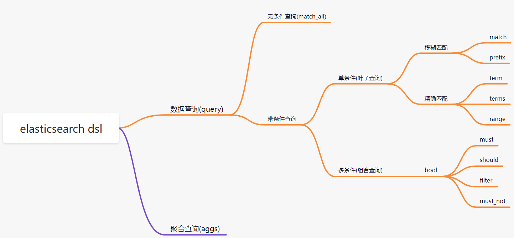

#Elasticsearch

## MySQL与Elasticsearch对比
| MySQL | Elasticsearch |
| - | - | 
| 数据库(databases)   |   索引库(index) |
|表结构(table)     |      映射(mapping) |
| 记录(row)        |       文档(document) |
| 字段(colume)      |      字段(field) |
| 查询语句(sql)      |      查询语句(dsl) |
## 动态映射

在关系数据库中，需要事先创建数据库，然后在该数据库下创建数据表，并创建 表字段、类型、长度、主键等，最后才能基于表插入数据。而Elasticsearch中不 需要定义Mapping映射（即关系型数据库的表、字段等），在文档写入 Elasticsearch时，会根据文档字段**自动识别类型**，这种机制称之为**动态映射**。

映射规则对应:
| 数据        | 对应的类型 |
| ----------- | ---------- |
| null        | 字段不添加 |
| true\|flase | boolean    |
| 字符串      | text       |
| 数值        | long       |
| 小数        | float      |
| 日期        | date       |

## 静态映射

静态映射是在Elasticsearch中也可以事先定义好映射，即手动映射，包含文档的各字段类型、分词器等，这称为**静态映射**。

## type分类如下
- 字符串: text(支持分词)和keyword(不支持分词)
- text: 该类型被用来索引长文本,在创建索引前会将这些文本进行分词, 分词,转化为词的组合, 建立索引; 允许es来检索这些词 text类型不能用来排序和聚合
- keyword: 该类型不能分词, 可以被用来检索过滤,排序和组合,keywoed类型不可用text进行模糊检索.
- 数值型: long, integer,short, byte, double, float
- 日期型: date
- 布尔型: boolean

## 分词器
#ik分词器
```
POST _analyze
{
  "analyzer": "ik_smart",
  "text": "我是中国人"
}


POST _analyze
{
  "analyzer": "ik_max_word",
  "text": "我是中国人"
}

# 默认分词器
POST _analyze
{
  "analyzer": "standard",
  "text": "我是中国人"
}
```


## 索引操作
```
#创建索引
#语法: PUT /{索引名称}
PUT /my_index

#查看所有索引
#语法: GET /_cat/indices?v
GET /_cat/indices?v

#查看单个索引
#语法: GET /{索引名称}
GET /my_index

#删除索引
#语法: DELETE /{索引名称}
DELETE /my_index
```


## 文档操作

```

#创建文档
#语法:
#PUT /{索引名称/{类型}/{id}
#{
#  jsonbody
#}
PUT /my_index/_doc/1
{
  "title": "小米手机",
  "category": "小米",
  "images": "http://www.gulixueyuan.com/xm.jpg",
  "price": 3999
  
}


#查看文档
#语法: GET /{索引名称}/{类型}/{id}
GET /my_index/_doc/1

#修改文档
#语法: 
#PUT /{索引名称}/{类型}/{id}
#{
#  jsonbody
#}
PUT /my_index/_doc/1
{
  "title": "小米手机",
  "category": "小米",
  "images": "http://www.gulixueyuan.com/xm.jpg",
  "price": 4500
}

#修改局部属性
#语法: 
#POST /{索引名称}/_update/{docId}
#{
#  "doc": {
#    "属性": "值"
#  }
#}
POST /my_index/_update/1
{
  "doc": {
    "price":"8000"
  }
}


#删除文档
#语法: DELETE /{索引名称}/{类型}/{id}
DELETE /my_index/_doc/1


#批量操作
#语法: 
#{"actionName":{"_index":"indexName", "_type":"typeName","_id":"id"}} 
#{"field1":"value1", "field2":"value2"} 
#actionName可以有CREATE, DELETE 等
#注意: 这个不能换行,就这样写成一坨执行才行


#批量创建
POST _bulk
{"create": {"_index": "my_index","_id": 2}}
{"id": 2,"title": "华为手机","images":"http://www.gulixueyuan.com/xm.jpg","price":5500}
{"create": {"_index": "my_index","_id": 3}}
{"id": 3,"title": "vivo手机","images":"http://www.gulixueyuan.com/xm.jpg","price":3600}

#批量删除
POST _bulk
{"delete": {"_index": "my_index", "_id": 2}}
{"delete": {"_index": "my_index", "_id": 3}}


# 映射mapping

#查看映射
#语法: GET /{索引名称}/_mapping
GET /my_index/_mapping

#动态映射
#在关系数据库中，需要事先创建数据库，然后在该数据库下创建数据表，并创建 表字段、类型、长度、主键等，最后才能基于表插入数据。而Elasticsearch中不 需要定义Mapping映射（即关系型数据库的表、字段等），在文档写入 Elasticsearch时，会根据文档字段自动识别类型，这种机制称之动态映射。

#静态映射
#静态映射是在Elasticsearch中也可以事先定义好映射，即手动映射，包含文档的各字段类型、分词器等，这称为静态映射。


#删除原创建索引
DELETE /my_index

#创建索引,并同时指定映射关系和分词器等
PUT /my_index
{
  "mappings": {
    "properties": {
      "title":{
        "type": "text",
        "index": true,
        "store": true,
        "analyzer": "ik_max_word",
        "search_analyzer": "ik_smart"
      },
      "category": {
        "type": "keyword",
        "index": true,
        "store": true
      },
      "images": {
        "type": "keyword",
        "index": true,
        "store": true
      },
      "price": {
        "type": "integer",
        "index": true,
        "store": true
      }
    }
  }
}

#type分类如下
#- 字符串: text(支持分词)和keyword(不支持分词)
#- text: 该类型被用来索引长文本,在创建索引前会将这些文本进行分词, 分词,转化为词的组合, 建立索引; 允许es来检索这些词 text类型不能用来排序和聚合
#- keyword: 该类型不能分词, 可以被用来检索过滤,排序和组合,keywoed类型不可用text进行模糊检索.
#- 数值型: long, integer,short, byte, double, float
#- 日期型: date
#- 布尔型: boolean
```

## DSL高级查询
Query DSL 概述: Domain Specific Language(领域专用语言),Elasticsearch提供了基于JSON的DSL来定义查询。
DSL概览:

 ```
#准备数据
POST _bulk
{"create":{"_index":"my_index","_id":1}}
{"id":1,"title":"华为笔记本电脑","category":"华为","images":"http://www.gulixueyuan.com/xm.jpg","price":5388}
{"create":{"_index":"my_index","_id":2}}
{"id":2,"title":"华为手机","category":"华为","images":"http://www.gulixueyuan.com/xm.jpg","price":5500}
{"create":{"_index":"my_index","_id":3}}
{"id":3,"title":"VIVO手机","category":"vivo","images":"http://www.gulixueyuan.com/xm.jpg","price":3600}


# DSL查询
# 查询所有文档(match_all)
POST /my_index/_search
{
  "query": {
    "match_all": {}
  }
}


#匹配查询(match)
POST /my_index/_search
{
  "query": {
    "match": {
      "title": "华为智能手机"
    }
  }
}

#补充条件删除
POST /my_index/_delete_by_query
{
  "query": {
    "match": {
      "title": "vivo"
    }
  }
}

#多字段匹配(multi_match)
POST /my_index/_search
{
  "query": {
    "multi_match": {
      "query": "华为智能手机",
      "fields": ["title","category"]
    }
  }
}

#前缀匹配(prefix)
POST /my_index/_search
{
  "query": {
    "prefix": {
      "title": {
        "value": "vivo"
      }
    }
  }
}


# 关键字精确查询(term)
# term 关键字不会进行分词
POST /my_index/_search
{
  "query": {
    "term": {
      "title": {
        "value": "华为手机"
      }
    }
  }
}

#多关键字精确查询(terms)
POST /my_index/_search
{
  "query": {
    "terms": {
      "title": ["华为手机","华为"]
      
    }
  }
}

#范围查询(range)
# gte: 大于等于
# lte: 小于等于
# gt: 大于
# lt: 小于
POST /my_index/_search
{
  "query": {
    "range": {
      "price": {
        "gte": 3000,
        "lte": 5000
      }
    }
  }
}

#返回指定字段
# query同级增加_source进行过滤
POST /my_index/_search
{
  "query": {
    "terms": {
      "title": ["华为手机","华为"]
    }
  },
  "_source": ["title","category"]
}


# 组合查询

# bool 各条件之间有and,or,或者not的关系
#  must: 各个条件都必须满足, 所有条件都是and的关系
#  should: 各个条件有一个满足即可, 即各条件是or的关系
#  must_not: 不满足所有条件, 即各条件是not的关系
#  filter: 与must效果相同, 但是他不计算得分, 效率更高点

# must
POST /my_index/_search
{
  "query": {
    "bool": {
      "must": [
        {
          "match": {
            "title": "vivo"
          }
        },
        {
          "range": {
            "price": {
              "gte": 3000,
              "lte": 5000
            }
          }
        }
      ]
    }
  }
}


# should
POST /my_index/_search
{
  "query": {
    "bool": {
      "should": [
        {
          "match": {
            "title": "华为"
          }
        },
        {
          "range": {
            "price": {
              "gte": 3000,
              "lte": 5000
            }
          }
        }
      ]
    }
  }
}


# 如果should和must同时存在, 他们之间是and关系
POST /my_index/_search
{
  "query": {
    "bool": {
      "should": [
        {
          "match": {
            "title": "华为"
          }
        },
        {
          "range": {
            "price": {
              "gte": 3000,
              "lte": 5000
            }
          }
        }
      ],
      "must": [
        {
          "match": {
            "title": "华为"
          }
        },
        {
          "range": {
            "price": {
              "gte": 3000,
              "lte": 5000
            }
          }
        }
      ]
    }
  }
}


# filter
# _score的分值为0
POST /my_index/_search
{
  "query": {
    "bool": {
      "filter": [
        {
          "match": {
            "title": "华为"
          }
        }
      ]
    }
  }
}


# 聚合查询
# 聚合允许使用者对es文档进行统计分析, 类似于关系型数据库中的group by, 当然还有很多其它的聚合, 例如取组最大值, 品均值等等.

# max
POST /my_index/_search
{
  "query": {
    "match_all": {}
  },
  "size": 0,
  "aggs": {
    "max_price": {
      "max": {
        "field": "price"
      }
    }
  }
}


# min
POST /my_index/_search
{
  "query": {
    "match_all": {}
  },
  "size": 0,
  "aggs": {
    "min_price": {
      "min": {
        "field": "price"
      }
    }
  }
}


# avg
POST /my_index/_search
{
  "query": {
    "match_all": {}
  },
  "size": 0,
  "aggs": {
    "avg_price": {
      "avg": {
        "field": "price"
      }
    }
  }
}

# sum
POST /my_index/_search
{
  "query": {
    "match_all": {}
  },
  "size": 0,
  "aggs": {
    "sum_price": {
      "sum": {
        "field": "price"
      }
    }
  }
}


# stats
POST /my_index/_search
{
  "query": {
    "match_all": {}
  },
  "size": 0,
  "aggs": {
    "stats_price": {
      "stats": {
        "field": "price"
      }
    }
  }
}

# terms
# 桶聚合相当于sql中的group by 语句
POST /my_index/_search
{
  "query": {
    "match_all": {}
  },
  "size": 0,
  "aggs": {
    "groupby_category": {
      "terms": {
        "field": "category",
        "size": 10
      }
    }
  }
}


# 还可以对桶继续下钻
POST /my_index/_search
{
  "query": {
    "match_all": {}
  },
  "size": 0,
  "aggs": {
    "groupby_category": {
      "terms": {
        "field": "category",
        "size": 10
      },
      "aggs": {
        "avg_price": {
          "avg": {
            "field": "price"
          }
        }
      }
    }
  }
}


# 进阶查询
# 排序

POST /my_index/_search
{
  "query": {
    "bool": {
      "must": [
        {
          "match": {
            "title": "华为"
          }
        }
      ]
    }
  },
  "sort": [
    {
      "price": {
        "order": "asc"
      }
    },
    {
      "_score": {
        "order": "desc"
      }
    }
  ]
}


# 分页查询
# from, size 分页
# 分页的两个关键属性: from, size
# from : 当前页的起始索引, 默认从0开始. from = (pageNum - 1)*size
# size : 每页显示多少条
POST /my_index/_search
{
  "query": {
    "match_all": {}
  },
  "from": 0,
  "size": 2
}


# scoll分页
# 滚动查询意思指的是如果获取的数据特别多，那我们可以分批获取数据，给服务器一个处理请求的时间，一次性查询出来数据，分批次进行获取，所以每次进行查询的时候都要传递一个系统的处理时间。类似关系型数据库中的游标。
# 第一次使用分页查询: 返回一个文档，剩余结果保存时间，该时间内，数据有变动不受影响。
POST /my_index/_search?scroll=1m
{
  "query": {
    "match_all": {}
  },
  "size": 1
}
#结果:滚动请求会返回一个scroll_id字段，使用此字段获取剩余的查询结果。

#接着就滚动查询，用第一次返回的_scroll_id接着查：
GET /_search/scroll?scroll=1m
{
  "scroll_id":"FGluY2x1ZGVfY29udGV4dF91dWlkDXF1ZXJ5QW5kRmV0Y2gBFDAwQmNFWVVCQ1g1M3Z3NkFzRW16AAAAAAAATasWN19sMzAySm9Ta2lnRDhoX1AtR1luUQ=="
}


# 高亮查询(highlight)
# 在进行关键字搜索时，搜索出的内容中的关键字会显示不同的颜色，称之为高亮。
POST /my_index/_search
{
  "query": {
    "match": {
      "title": "华为"
    }
  },
  "highlight": {
    "pre_tags": "<b style='color:red'>",
    "post_tags": "</b>",
    "fields": {
      "title": {}
    }
  }
}


#近似查询(fuzzy)
#返回包含与搜索字词相似的字词的文档。编辑距离是将一个术语转换为另一个术语所需的一个字符更改的次数。这些更改可以包括：
#- 更改字符（box → fox）
#- 删除字符（black → lack）
#- 插入字符（sic → sick）
#- 转置两个相邻字符（act → cat）
#为了找到相似的术语，fuzzy查询会在指定的编辑距离内创建一组搜索词的所有可能的变体或扩展。然后查询返回每个扩展的完全匹配。通过fuzziness修改编辑距离。一般使用默认值AUTO，根据术语的长度生成编辑距离。
#通过fuzziness修改编辑距离。一般使用默认值AUTO，根据术语的长度生成编辑距离。
# 0..2 必须完全匹配
# 3..5 允许一次编辑
#  >5  允许进行两次编辑
PUT /test

PUT /test/_doc/1
{
  "title":"hello world"
}

#fuzzy查询
GET /test/_search
{
  "query": {
    "fuzzy": {
      "title": {
        "value": "word"
      }
    }
  }
}
```

## java 查询ES
操作文档: 
https://www.elastic.co/guide/en/elasticsearch/client/java-rest/7.8/java-rest-high-search.html