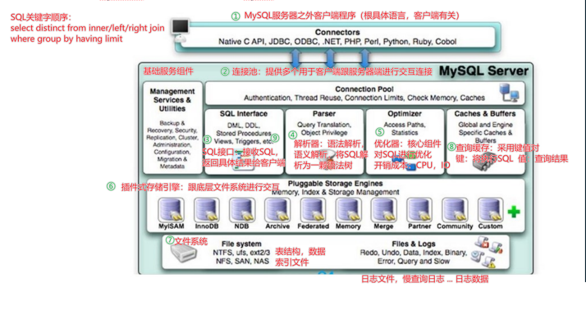

#MySQL逻辑架构

#### **第1层：连接层**

- 客户端访问 MySQL 服务器前，做的`第一件事就是建立 TCP 连接`。
- 经过三次握手建立连接成功后， MySQL 服务器对 TCP 传输过来的账号密码做`身份认证、权限获取`。
  - 用户名或密码不对`，会收到一个`Access denied for user`错误，客户端程序结束执行`
  - `用户名密码认证通过`，会从权限表`查出账号拥有的权限`与连接关联，之后的权限判断逻辑，都将依赖于此时读到的权限
- TCP 连接收到请求后，必须要分配给一个线程专门与这个客户端的交互。所以还会有个线程池，去走后面的流程。每一个连接从线程池中获取线程，省去了创建和销毁线程的开销。

#### **第2层：服务层**

**Management Serveices & Utilities： 系统管理和控制工具**

**SQL Interface：SQL接口：**

- `接收用户的SQL命令，并且返回用户需要查询的结果。`比如SELECT ... FROM就是调用SQL Interface 
- MySQL支持DML（数据操作语言）、DDL（数据定义语言）、存储过程、视图、触发器、自定义函数等多种SQL语言接口

**Parser：解析器：**

在SQL命令传递到解析器的时候会被解析器验证和解析。解析器中SQL 语句进行`词法分析、语法分析、语义分析`，并为其创建`语法树`。

- 词法分析：将整个语句拆分成一个个字段

- 语法分析：将词法分析拆分出的字段，按照MySQl语法规则，生成解析树

- 语义分析：`检查解析树是否合法`，比如查看表是否存在，列是否存在

典型的解析树如下：

**Optimizer：查询优化器：**

- SQL语句在语法解析后、查询前会使用查询优化器对查询进行优化，`确定SQL语句的执行路径，生成一个执行计划`。

**Caches & Buffers： 查询缓存组件：**

- MySQL内部维持着一些Cache和Buffer，比如Query Cache用来缓存一条SELECT语句的执行结果，如果能够在其中找到对应的查询结果，那么就不必再进行查询解析、查询优化和执行的整个过程了，直接将结果反馈给客户端。
- 这个缓存机制是由一系列小缓存组成的。比如表缓存，记录缓存，key缓存，权限缓存等 。
- 这个查询缓存可以在不同客户端之间共享 。 
- **问：大多数情况查询缓存就是个鸡肋，为什么呢？**
  - 只有相同的SQL语句才会命中查询缓存。两个查询请求在任何字符上的不同（例如：空格、注释、大小写），都会导致缓存不会命中。
  - 在两条查询之间 有 INSERT 、 UPDATE 、 DELETE 、 TRUNCATE TABLE 、 ALTER TABLE 、 DROP TABLE 或 DROP DATABASE 语句也会导致缓存失效
  - 因此 MySQL的查询缓存命中率不高。`所以在MySQL 8之后就抛弃了这个功能。`

#### **第3层：引擎层**

存储引擎层（ Storage Engines），`负责MySQL中数据的存储和提取，对物理服务器级别维护的底层数据执行操作，服务器通过API与存储引擎进行通信`。不同的存储引擎具有的功能不同，管理的表有不同的存储结构，采用的存取算法也不同，这样我们可以根据自己的实际需要进行选取。例如MyISAM引擎和InnoDB引擎。

#### **存储层**

所有的数据、数据库、表的定义、表的每一行的内容、索引，都是存在`文件系统` 上，以文件的方式存在，并完成与存储引擎的交互。