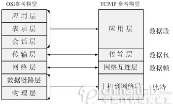
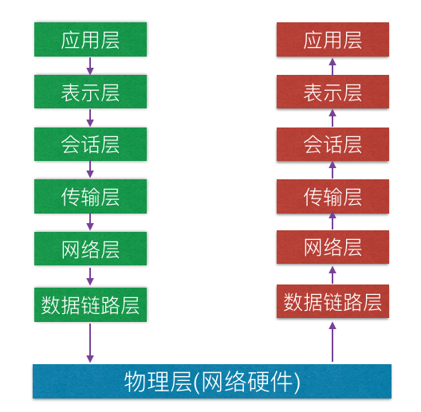

在互联网技术里，有两件事最为重要，一个是TCP/IP协议，它是万物互联的事实标准；另一个是Linux操作系统，它是推动互联网技术走向繁荣的基石。在网络编程中最重要的模型便是OSI七层网络模型和TCP/IP四层网络模型

* * *

一、网络模型
======

 

二、OSI七层网络模型
===========

1.介绍
----

七层模型，也称为OSI(Open System Interconnection)参考模型，是国际标准化(ISO)指定的一个用于计算机或通信系统间互联的标准体系。

建立七层模型的主要目的是为解决各种网络互联时遇到的兼容性问题。其最大的优点是将服务、接口和协议这三个概念明确地区分开来：服务说明某一层为上一层提供一些什么功能，接口说明上一层如何使用下层的服务，而协议则是如何实现本层的服务。如此各层之间就具有很强的独立性，互联网络中各实体采用什么样的协议是没有限制的，只要向上提供服务并且不改变相临层的接口就可以了。网络七层的划分也是为了使用网络的不同功能模块分担起不同的职责，也就带来如下好处：

*   减轻问题的复杂程度，一旦发生网络故障，可迅速定位故障所处层次
*   在各层分别定义标准接口，使具备相同对等层的不同网络设备能实现互操作。各层之间相对独立，一种高层次协议可放在多种低层次协议上运行。
*   能有效刺激网络技术革新，因为每次更新都可以在小范围内进行，不需要更改整个系统

2.各层功能
------

OSI的上面四层(应用层、表示层、会话层、传输层)为高层，为应用程序服务；下面三层([网络层](https://so.csdn.net/so/search?q=%E7%BD%91%E7%BB%9C%E5%B1%82&spm=1001.2101.3001.7020)、数据链路层、物理层)为低层，由操作系统支持。

应用层
---

是最靠近应用程序的OSI层。由用户使用相应的接口实现自己的服务。

协议有：HTTP FTP SMTP等

表示层
---

数据的表示、安全、压缩。可确保一个系统的应用层所发送的信息被另一个系统的应用层读取。格式有: JPEG、ASCII、加密格式等。

在表示层，数据按照网络能理解的方案进行格式化。管理数据的加密与解密。

会话层
---

建立、管理、终止会话，对应主机进程，指本地主机与远程主机正在进行的会话。负责在网络的两节点之间建立、维持和终止通信。

会话层的功能包括：建立通信链接，保持会话过程通信连接的畅通，同步两个节点之间的对话，决定通信是否被终端以及通信中断时从何处重新发送。

有人会把会话层称为网络通信得到“交通警察"。当通过拨号向你的ISP（因特网服务提供商）请求连接到因特网时，ISP服务器上的会话层向你与你的PC客户机上的会话层进行协商连接。若你的电话线偶然脱落时，会话层将会检测到连接中断并重新发起连接。会话层通过决定节点通信的优先级和通信时间的长短来设置通信期限。

传输层
---

定义传输数据的协议端口号，以及流控和差错校验。

协议有：TCP UDP等，数据包一旦离开网卡即进入网络传输层。定义了一些传输数据的协议和端口号，如：TCP（传输控制协议，传输效率低，可靠性强，用于传输可靠性要求高，数据量大的数据），UDP（用户数据报协议，用于传输可靠性要求不高，数据量小的数据）。主要是讲从下层接收的数据进行分段和传输，到达目的地后再进行重组。常常把这一层数据叫做段。

OSI模型中最终要的一层。传输协议同时进行浏览控制或是基于接收方可接收数据的快慢程度规定适当的发送速率。除此之外，传输层按照网络能处理的最大尺寸将较长的数据包进行强制分割。例如，以太网无法接收大于1500字节的数据包。发送方节点的传输层将数据分割成较小的数据片，同时对每一数据片安排一个序列号，以便数据到达接收方节点的传输层时，能以正确的顺序重组。该过程称作排序。

网络层
---

进行逻辑地址寻址，实现不同网络之间的路径选择等。协议有：ICMP IGMP IP ARP RARP等。

在位于不同地理位置的网络中的两个主机系统之间提供连接和路径选择。Internet的发展使得从世界各站点访问信息的用户量大大增加，网络层正式管理这种连接的层。

OSI模型的第三层，其主要功能是将网络地址翻译成对应的物理地址，并决定如何将数据从发送方路由到接收方。

网络层通过综合考虑发送优先权、网络拥塞程度、服务质量以及可选路由的花费来决定从一个网络中节点A到另一个网络节点B的最佳路径。由于网络层处理，并智能指导数据传送，路由器连接网络各段，所以路由器属于网络层。在网络中，”路由“是基于编址方案、使用模式以及可达性来指导数据的发送。

网络层用于本地LAN网段之上的计算机系统建立通信，它之所以可以这样做，是因为它有自已的路由地址结构，这种结构与第二层机器地址是分开的、独立的。这种协议称为路由或可路由协议。路由协议包括IP、Novell公司的IPX以及AppleTalk协议。

数据链路层
-----

建立逻辑连接、进行硬件地址寻址、差错校验等功能。将比特组合成字节进而组合成帧，用MAC地址访问介质，错误发现但不能纠正。

主要功能是如何在不可靠的物理线路上进行数据的可靠传递。为了保证传输，从网络层接收的数据被分割成特定的可被物理层传输的帧。帧是用来移动数据的结构包，它不仅包括原始数据，还包括发送方和接收方的物理地址以及检错和控制信息。其中的地址确定了帧将发往何处，而纠错和控制信息则确保帧无差错到达。如果在传送数据时，接收点检测到所传数据中有差错，就要通知发送方重发这一帧。

数据链路层在物理层提供比特流服务的基础上，建立相邻节点之间的数据链路，通过差错控制提供数据帧在信道上无差错的传输，并进行各电路上的动作系列。作用主要是物理地址寻址、数据的成帧、流量控制、数据的检错、重发等。

物理层
---

建立、维护、断开物理连接。

主要定义物理设备标准，如网线的接口类型，光纤的接口类型，各种传输介质的传输速率等。主要作用是传输比特流（就是有1、0转化为电力强弱来进行传输，到达目的地后在转化为1、0）。

* * *

总结
==

一个设备工作在那一层，关键看它工作时利用哪一层的数据头部信息。网桥工作时，是以MAC头部来决定转发端口的，因此显然它是数据链路层的设备。

物理层：网卡、网线，集线器，中继器，调制解调器

数据链路层：网桥，交换层

网络层：路由器

网关工作在第四层传输层及其以上

没有。

原文连接: http://t.csdn.cn/75Dp8