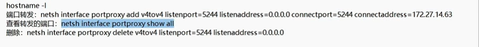

在虚拟机中查看ip

```
hostname -I
```

在windows的终端
开启端口转发
```
netsh interface portproxy add v4tov4 listenport=<监听端口> listenaddress=0.0.0.0 connectport=<转发端口> connectaddress=<转发到的虚拟机ip>
```

查看转发的端口
```
netsh interface portproxy show all
```

删除端口转发
```
netsh interface portproxy delete v4tov4 listenport=<监听端口> lstenaddress=0.0.0.0
```
