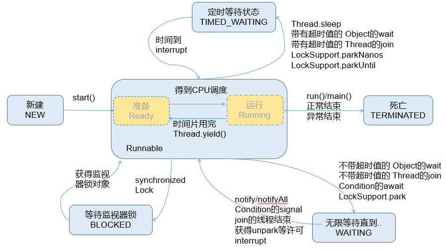

#线程的生命周期 

## 观点1：5种状态（JDK1.5之前）

  

简单来说，线程的生命周期有五种状态：新建（New）、就绪（Runnable）、运行（Running）、阻塞（Blocked）、死亡（Dead）。CPU需要在多条线程之间切换，于是线程状态会多次在运行、阻塞、就绪之间切换。

  

  

**1.** **新建**

  

当一个Thread类或其子类的对象被声明并创建时，新生的线程对象处于新建状。此时它和其他Java对象一样，仅仅由JVM为其分配了内存，并初始化了实例变量的值。此时的线程对象并没有任何线程的动态特征，程序也不会执行它的线程体run()。

  

**2.** **就绪**

  

但是当线程对象调用了start()方法之后，就不一样了，线程就从新建状态转为就绪状态。JVM会为其创建方法调用栈和程序计数器，当然，处于这个状态中的线程并没有开始运行，只是表示已具备了运行的条件，随时可以被调度。至于什么时候被调度，取决于JVM里线程调度器的调度。

  

注意：

程序只能对新建状态的线程调用start()，并且只能调用一次，如果对非新建状态的线程，如已启动的线程或已死亡的线程调用start()都会报错IllegalThreadStateException异常。

  

**3.** **运行**

  

如果处于就绪状态的线程获得了CPU，开始执行run()方法的线程体代码，则该线程处于运行状态。如果计算机只有一个CPU，在任何时刻只有一个线程处于运行状态，如果计算机有多个处理器，将会有多个线程并行(Parallel)执行。

  

当然，美好的时光总是短暂的，而且CPU讲究雨露均沾。对于抢占式策略的系统而言，系统会给每个可执行的线程一个小时间段来处理任务，当该时间用完，系统会剥夺该线程所占用的资源，让其回到就绪状态等待下一次被调度。此时其他线程将获得执行机会，而在选择下一个线程时，系统会适当考虑线程的优先级。

  

**4.** **阻塞**

  

当在运行过程中的线程遇到如下情况时，线程会进入阻塞状态：

  

-   线程调用了sleep()方法，主动放弃所占用的CPU资源；

-   线程试图获取一个同步监视器，但该同步监视器正被其他线程持有；

-   线程执行过程中，同步监视器调用了wait()，让它等待某个通知（notify）；

-   线程执行过程中，同步监视器调用了wait(time)

-   线程执行过程中，遇到了其他线程对象的加塞（join）；

-   线程被调用suspend方法被挂起（已过时，因为容易发生死锁）；

  

当前正在执行的线程被阻塞后，其他线程就有机会执行了。针对如上情况，当发生如下情况时会解除阻塞，让该线程重新进入就绪状态，等待线程调度器再次调度它：

  

-   线程的sleep()时间到；

-   线程成功获得了同步监视器；

-   线程等到了通知(notify)；

-   线程wait的时间到了

-   加塞的线程结束了；

-   被挂起的线程又被调用了resume恢复方法（已过时，因为容易发生死锁）；

  

**5.** **死亡**

  

线程会以以下三种方式之一结束，结束后的线程就处于死亡状态：

  

-   run()方法执行完成，线程正常结束

-   线程执行过程中抛出了一个未捕获的异常（Exception）或错误（Error）

-   直接调用该线程的stop()来结束该线程（已过时，因为容易发生死锁）

## 观点2：6种状态（JDK1.5之后）

  

在java.lang.Thread.State的枚举类中这样定义：

  

    public enum State {
        NEW,
        RUNNABLE,
        BLOCKED,
        WAITING,
        TIMED_WAITING,
        TERMINATED;
    }

  

首先它没有区分：就绪和运行状态，因为对于Java对象来说，只能标记为可运行，至于什么时候运行，不是JVM来控制的了，是OS来进行调度的，而且时间非常短暂，因此对于Java对象的状态来说，无法区分。只能我们人为的进行想象和理解。

  

其次根据Thread.State的定义，阻塞状态是分为三种的：BLOCKED、WAITING、TIMED_WAITING。

  

-   BLOCKED：是指互有竞争关系的几个线程，其中一个线程占有锁对象时，其他线程只能等待锁。只有获得锁对象的线程才能有执行机会。

-   TIMED_WAITING：当前线程执行过程中遇到Thread类的sleep或join，Object类的wait，LockSupport类的park方法，并且在调用这些方法时，设置了时间，那么当前线程会进入TIMED_WAITING，直到时间到，或被中断。

-   WAITING：当前线程执行过程中遇到遇到Object类的wait，Thread类的join，LockSupport类的park方法，并且在调用这些方法时，没有指定时间，那么当前线程会进入WAITING状态，直到被唤醒。

-   通过Object类的wait进入WAITING状态的要有Object的notify/notifyAll唤醒；

-   通过Condition的await进入WAITING状态的要有Conditon的signal方法唤醒；

-   通过LockSupport类的park方法进入WAITING状态的要有LockSupport类的unpark方法唤醒

-   通过Thread类的join进入WAITING状态，只有调用join方法的线程对象结束才能让当前线程恢复；

  

说明：当从WAITING或TIMED_WAITING恢复到Runnable状态时，如果发现当前线程没有得到监视器锁，那么会立刻转入BLOCKED状态。

  

  
