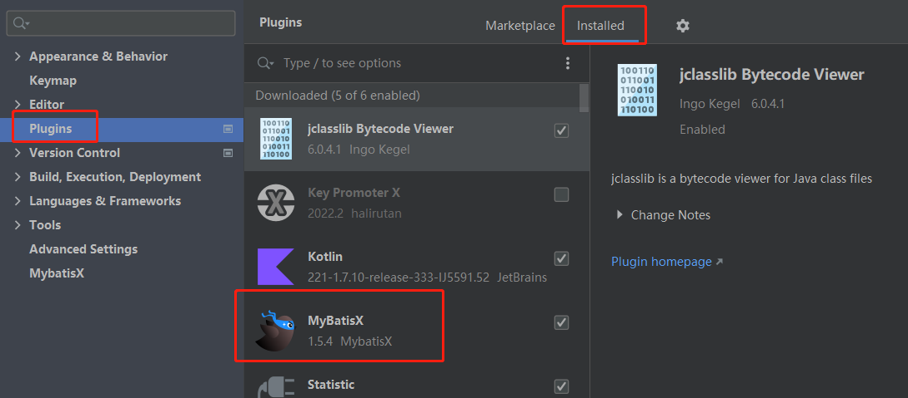

### 逆向工程

#### 创建项目

~~~xml
<dependency>
    <groupId>org.springframework.boot</groupId>
    <artifactId>spring-boot-starter-web</artifactId>
</dependency>
<dependency>
    <groupId>com.baomidou</groupId>
    <artifactId>mybatis-plus-boot-starter</artifactId>
    <version>3.4.2</version>
</dependency>

<dependency>
    <groupId>mysql</groupId>
    <artifactId>mysql-connector-java</artifactId>
    <scope>runtime</scope>
</dependency>
<dependency>
    <groupId>org.projectlombok</groupId>
    <artifactId>lombok</artifactId>
    <optional>true</optional>
</dependency>
<dependency>
    <groupId>org.springframework.boot</groupId>
    <artifactId>spring-boot-starter-test</artifactId>
    <scope>test</scope>
    <exclusions>
        <exclusion>
            <groupId>org.junit.vintage</groupId>
            <artifactId>junit-vintage-engine</artifactId>
        </exclusion>
    </exclusions>
</dependency>
~~~

#### 安装Mybatis x 插件

#### Idea连接数据库

#### MybatisX插件生成数据

#### 拷贝统一返回工具类

~~~java
package com.atguigu.goods0212.util;

import lombok.Data;

/**
 * 全局统一返回结果类
 *
 */
@Data
public class Result<T> {

    private Integer code;

    private String message;

    private T data;

    public Result(){}

    // 返回数据
    protected static <T> Result<T> build(T data) {
        Result<T> result = new Result<T>();
        if (data != null)
            result.setData(data);
        return result;
    }

    public static <T> Result<T> build(T body, ResultCodeEnum resultCodeEnum) {
        Result<T> result = build(body);
        result.setCode(resultCodeEnum.getCode());
        result.setMessage(resultCodeEnum.getMessage());
        return result;
    }

    public static<T> Result<T> ok(){
        return Result.ok(null);
    }

    /**
     * 操作成功
     * @param data
     * @param <T>
     * @return
     */
    public static<T> Result<T> ok(T data){
        Result<T> result = build(data);
        return build(data, ResultCodeEnum.SUCCESS);
    }

    public static<T> Result<T> fail(){
        return Result.fail(null);
    }

    /**
     * 操作失败
     * @param data
     * @param <T>
     * @return
     */
    public static<T> Result<T> fail(T data){
        Result<T> result = build(data);
        return build(data, ResultCodeEnum.FAIL);
    }

    public Result<T> message(String msg){
        this.setMessage(msg);
        return this;
    }

    public Result<T> code(Integer code){
        this.setCode(code);
        return this;
    }

    public boolean isOk() {
        if(this.getCode().intValue() == ResultCodeEnum.SUCCESS.getCode().intValue()) {
            return true;
        }
        return false;
    }
}

~~~

~~~java
package com.atguigu.goods0212.util;

import lombok.Getter;

/**
 * 统一返回结果状态信息类
 *
 */
@Getter
public enum ResultCodeEnum {

    SUCCESS(200,"成功"),
    FAIL(201, "失败"),
    SERVICE_ERROR(2012, "服务异常"),
    ILLEGAL_REQUEST( 204, "非法请求"),
    PAY_RUN(205, "支付中"),

    LOGIN_AUTH(208, "未登陆"),
    PERMISSION(209, "没有权限"),
    SECKILL_NO_START(210, "秒杀还没开始"),
    SECKILL_RUN(211, "正在排队中"),
    SECKILL_NO_PAY_ORDER(212, "您有未支付的订单"),
    SECKILL_FINISH(213, "已售罄"),
    SECKILL_END(214, "秒杀已结束"),
    SECKILL_SUCCESS(215, "抢单成功"),
    SECKILL_FAIL(216, "抢单失败"),
    SECKILL_ILLEGAL(217, "请求不合法"),
    SECKILL_ORDER_SUCCESS(218, "下单成功"),
    COUPON_GET(220, "优惠券已经领取"),
    COUPON_LIMIT_GET(221, "优惠券已发放完毕"),
    ;

    private Integer code;

    private String message;

    private ResultCodeEnum(Integer code, String message) {
        this.code = code;
        this.message = message;
    }
}

~~~

#### 编写controller

~~~java
package com.atguigu.goods0212.controller;

import com.atguigu.goods0212.model.TbUser;
import com.atguigu.goods0212.service.TbUserService;
import com.atguigu.goods0212.util.Result;
import org.springframework.beans.factory.annotation.Autowired;
import org.springframework.web.bind.annotation.PostMapping;
import org.springframework.web.bind.annotation.RequestBody;
import org.springframework.web.bind.annotation.RequestMapping;
import org.springframework.web.bind.annotation.RestController;

import java.util.Date;

@RestController
@RequestMapping("/user")
public class UserController {

    @Autowired
    private TbUserService tbUserService;

    @PostMapping("save")
    public Result saveUser(@RequestBody TbUser tbUser) {
        tbUser.setCreateTime(new Date());
        tbUserService.save(tbUser);
        return Result.ok();
    }

}

~~~

#### 修改配置文件

~~~java
# 应用名称
spring.application.name=goods-0212
# 应用服务 WEB 访问端口
server.port=8090
# 数据库驱动：
spring.datasource.driver-class-name=com.mysql.cj.jdbc.Driver
# 数据源名称
spring.datasource.name=defaultDataSource
# 数据库连接地址
spring.datasource.url=jdbc:mysql://192.168.200.128:3306/yiqing-goods?useUnicode=true&characterEncoding=UTF-8&useSSL=false&autoReconnect=true&failOverReadOnly=false&serverTimezone=CTT
# 数据库用户名&密码：
spring.datasource.username=root
spring.datasource.password=root
~~~

#### postman接口测试

~~~json
{
    "username": "zhangsan",
    "nickname": "张三",
    "email": "59201@qq.com",
    "avatar": "",
    "phoneNumber":"18200000000",
    "status":1,
    "type":1,
    "password":"123456"
}
~~~

#### 单元测试

~~~java

~~~

