#分布式事务

# 框架高级课程系列之分布式事务


# 第一章 前奏

## 1.1 什么是事务

#事务

**提供一种“要么什么都不做，要么做全套（All or Nothing）”机制。**

## 1.2 事务的作用

**保证数据一致性**

## 1.3 事务ACID四大特性

**A：原子性(Atomicity)**
一个事务(transaction)中的所有操作，要么全部完成，要么全部不完成，不会结束在中间某个环节。事务在执行过程中发生错误，会被回滚（Rollback）到事务开始前的状态，就像这个事务从来没有执行过一样。
**C：一致性(Consistency)**
事务的一致性指的是在一个事务执行之前和执行之后数据库都必须处于一致性状态。
如果事务成功地完成，那么系统中所有变化将正确地应用，系统处于有效状态。
如果在事务中出现错误，那么系统中的所有变化将自动地回滚，系统返回到原始状态。
**I：隔离性(Isolation)**
指的是在并发环境中，当不同的事务同时操纵相同的数据时，每个事务都有各自的完整数据空间。由并发事务所做的修改必须与任何其他并发事务所做的修改隔离。事务查看数据更新时，数据所处的状态要么是另一事务修改它之前的状态，要么是另一事务修改它之后的状态，事务不会查看到中间状态的数据。
**D：持久性(Durability)**
指的是只要事务成功结束，它对数据库所做的更新就必须保存下来。即使发生系统崩溃，重新启动数据库系统后，数据库还能恢复到事务成功结束时的状态。

## 1.4 事务的并发问题

**脏读****：**
事务A读取了事务B更新的数据，事务B未提交并回滚数据，那么A读取到的数据是脏数据
**不可重复读****：**
事务 A 多次读取同一数据，事务 B 在事务A多次读取的过程中，对数据作了更新并提交，导致事务A多次读取同一数据时，结果 不一致。
**幻读****：**
系统管理员A将数据库中所有学生的成绩从具体分数改为ABCDE等级，但是系统管理员B就在这个时候插入了一条具体分数的记录，当系统管理员A更改结束后发现还有一条记录没有改过来，就好像发生了幻觉一样，这就叫幻读。
　　小结：不可重复读的和幻读很容易混淆，不可重复读侧重于修改，幻读侧重于新增或删除。解决不可重复读的问题只需锁住满足条件的行，解决幻读需要锁表。

## 1.5 MySQL事务隔离级别

| 事务隔离级别                 | 脏读 | 不可重复读 | 幻读 |
| ---------------------------- | ---- | ---------- | ---- |
| 读未提交（read-uncommitted） | √    | √          | √    |
| 读已提交（read-committed）   | ×    | √          | √    |
| 可重复读（repeatable-read）  | ×    | ×          | √    |
| 串行化（serializable）       | ×    | ×          | ×    |

mysql默认的事务隔离级别为repeatable-read
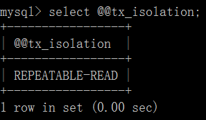

## 1.6 事务传播行为（propagation behavior）

指的就是当一个事务方法被另一个事务方法调用时，这个事务方法应该如何进行。 
例如：methodA事务方法调用methodB事务方法时，methodB是继续在调用者methodA的事务中运行呢，还是为自己开启一个新事务运行，这就是由methodB的事务传播行为决定的。
Spring定义了七种传播行为：参考 TransactionDefinition类

| **事务传播行为类型**      | **说明**                                                     |
| ------------------------- | ------------------------------------------------------------ |
| PROPAGATION_REQUIRED      | 如果当前没有事务，就新建一个事务，如果已经存在一个事务中，加入到这个事务中。默认 |
| PROPAGATION_SUPPORTS      | 支持当前事务，如果当前没有事务，就以非事务方式执行           |
| PROPAGATION_MANDATORY     | 使用当前的事务，如果当前没有事务，就抛出异常。               |
| PROPAGATION_REQUIRES_NEW  | 新建事务，如果当前存在事务，把当前事务挂起。（一个新的事务将启动，而且如果有一个现有的事务在运行的话，则这个方法将在运行期被挂起，直到新的事务提交或者回滚才恢复执行） |
| PROPAGATION_NOT_SUPPORTED | 以非事务方式执行操作，如果当前存在事务，就把当前事务挂起。   |
| PROPAGATION_NEVER         | 以非事务方式执行，如果当前存在事务，则抛出异常。             |
| PROPAGATION_NESTED        | 如果当前存在事务，则在嵌套事务内执行。如果当前没有事务，则执行与PROPAGATION_REQUIRED类似的操作。（外层事务抛出异常回滚，那么内层事务必须回滚，反之内层事务并不影响外层事务） |

## 1.7本地事务

本地事务也称为*数据库事务*或*传统事务*（相对于分布式事务而言）。它的执行模式就是常见的：

| **1. transaction begin**
**2. insert/delete/update**
**3. insert/delete/update**
**4. ...**

| **5. transaction commit/rollback** |
| ---------------------------------- |

- 本地事务有这么几个特征:
  - 一次事务只连接一个支持事务的数据库（一般来说都是关系型数据库）
  - 事务的执行结果保证ACID
  - 会用到数据库锁
- 起初，事务仅限于对单一数据库资源的访问控制，架构服务化以后，事务的概念延伸到了服务中。倘若将一个单一的服务操作作为一个事务，那么整个服务操作只能涉及一个单一的数据库资源，这类**基于****单个服务单一数据库****资源访问的事务，被称为****本地事务(Local Transaction)**。

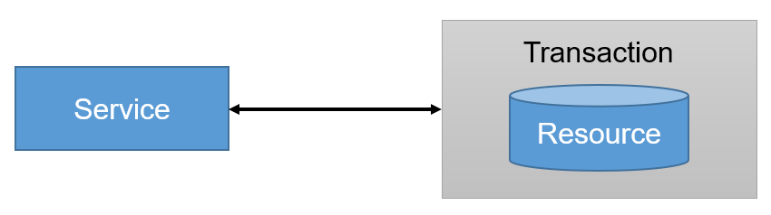

# 第二章 分布式事务

## 2.1 微服务分布式事务问题

- 首先，传统的**单体应用（Monolithic App）**，通过 3 个 Module，在同一个数据源上更新数据来完成一项业务。很自然的，整个业务过程的**数据一致性**由**本地事务**来保证。


- 随着业务需求和架构的变化，**单体应用被拆分为****微服务**：原来的 3 个 Module 被拆分为 3 个独立的服务，分别使用独立的数据源。业务过程将由 3 个服务的调用来完成。

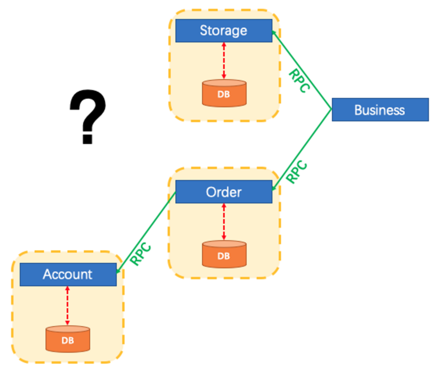

- 此时，每一个服务内部的数据一致性仍由本地事务来保证。而整个业务层面的全局数据一致性要如何保障呢？这就是微服务架构下面临的，典型的分布式事务需求：我们需要一个分布式事务的解决方案保障业务全局的数据一致性。

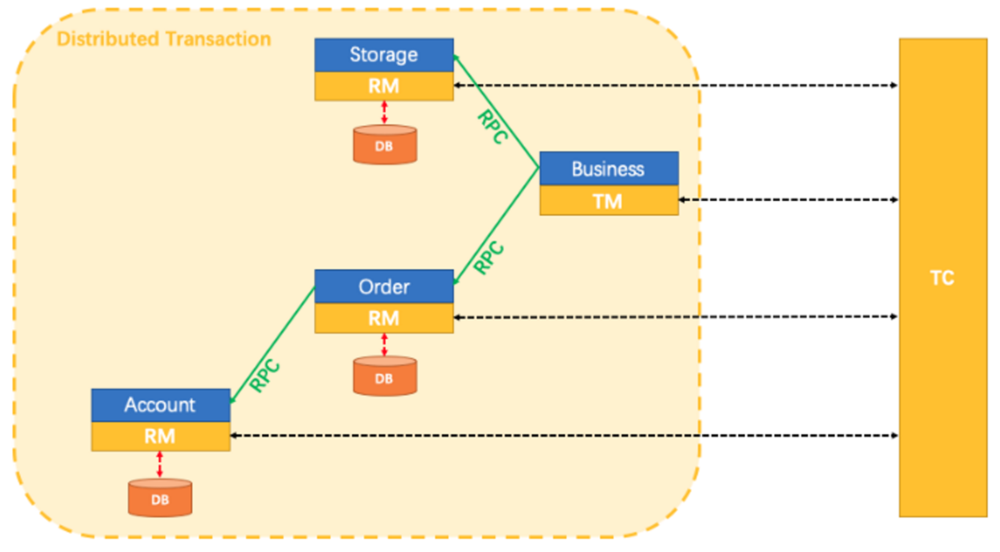

## 2.2 什么是分布式事务

分布式事务指事务的参与者、支持事务的服务器、资源服务器以及事务管理器分别位于不同的分布式系统的不同节点之上。
指一次大的操作由不同的小操作组成的，这些小的操作分布在不同的服务器上，分布式事务需要保证这些小操作要么全部成功，要么全部失败。
本质上来说，分布式事务就是为了保证不同数据库的数据一致性。

## 2.3 什么是分布式系统

- 部署在不同节点上的系统通过网络交互来完成协同工作的系统。
- 比如：
      - 充值加积分的业务，用户在充值系统向自己的账户充钱，在积分系统中自己积分相应的增加。
      - 充值系统和积分系统是两个不同的系统，一次充值加积分的业务就需要这两个系统协同工作来完成。

## 2.4 分布式事务应用在哪些场景

- 电商系统中的下单扣库存

电商系统中，**订单系统**和**库存系统**是两个系统，一次下单的操作由两个系统协同完成

- 金融系统中的银行卡充值

在金融系统中通过银行卡向平台充值需要通过**银行系统**和**金融系统**协同完成。

- 教育系统中下单选课业务

在线教育系统中，用户购买课程，下单支付成功后学生选课成功，此事务由**订单系统**和**选课系统**协同完成。

- SNS系统的消息发送

在社交系统中发送站内消息同时发送手机短信，一次消息发送由**站内消息系统**和**手机通信系统**协同完成。

## 2.5 跨多服务多数据库的分布式事务

一个服务操作调用另一个服务，这时事务需要跨越多个服务。在这种情况下，起始服务的事务在调用另外一个服务的时候，需要以某种机制流转到另外一个服务，从而使被调用的服务访问的资源也自动加入到该事务当中来。这就需要跨服务跨数据库的全局事务进行数据一致性的保证。
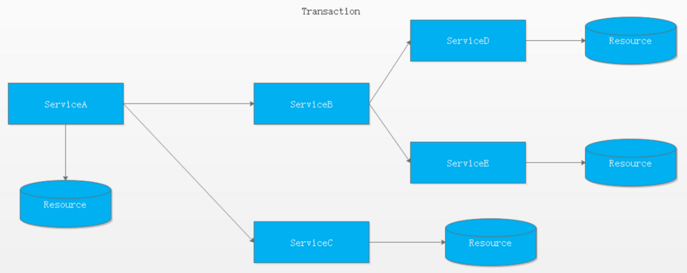
较之基于单一数据库资源访问的本地事务，分布式事务的应用架构更为复杂。在不同的分布式应用架构下，实现一个分布式事务要考虑的问题并不完全一样，比如对多资源的协调、事务的跨服务传播等，实现机制也是复杂多变。

# 第二章 #分布式事务解决方案

1.XA两段提交(低效率)-分布式事务解决方案
2.TCC三段提交(2段,高效率[不推荐(补偿代码)])
3.本地消息(MQ+Table)
4.事务消息(RocketMQ[alibaba])
5.Seata(alibaba)

## 2.1 基于XA协议的两阶段提交(2PC)

X/Open 组织（即现在的 Open Group ）定义了分布式事务处理模型
XA协议：XA是一个分布式事务协议。XA中大致分为两部分：**事务管理器**和**本地资源管理器**。其中本地资源管理器往往由数据库实现，比如Oracle、DB2这些商业数据库都实现了XA接口，而事务管理器作为全局的调度者，负责各个本地资源的提交和回滚。

### 2.1.1 概念

二阶段提交2PC（Two phase Commit）是指，在分布式系统里，为了保证所有节点在进行事务提交时保持一致性的一种算法。

### 2.1.2 背景

在分布式系统里，**每个节点都可以知晓自己操作的成功或者失败，却无法知道其他节点操作的成功或失败。**
当一个事务跨多个节点时，为了保持事务的原子性与一致性，需要引入一个**协调者**（Coordinator）来统一掌控所有**参与者**（Participant）的操作结果，并指示它们是否要把操作结果进行真正的提交（commit）或者回滚（rollback）。

### 2.1.3 思路

2PC顾名思义分为两个阶段，其实施思路可概括为：
（1）投票阶段（voting phase）：参与者将操作结果通知协调者；
（2）提交阶段（commit phase）：收到参与者的通知后，协调者再向参与者发出通知，根据反馈情况决定各参与者是否要提交还是回滚；

### 2.1.4 缺陷

算法执行过程中，**所有节点都处于阻塞状态，所有节点所持有的资源（例如数据库数据，本地文件等）都处于封锁状态。**
典型场景为：
（1）某一个参与者发出通知之前，所有参与者以及协调者都处于阻塞状态；
（2）在协调者发出通知之前，所有参与者都处于阻塞状态；
另外，如有协调者或者某个参与者出现了崩溃，为了避免整个算法处于一个完全阻塞状态，往往需要借助超时机制来将算法继续向前推进，故此时算法的效率比较低。
总的来说，**2PC是一种比较保守的算法**。

### 2.1.5 举例

甲乙丙丁四人要组织一个会议，需要确定会议时间，不妨设甲是协调者，乙丙丁是参与者。
**投票阶段：**
（1）甲发邮件给乙丙丁，周二十点开会是否有时间；
（2）甲回复有时间；
（3）乙回复有时间；
（4）丙迟迟不回复，此时对于这个活动，甲乙丙均处于阻塞状态，算法无法继续进行；
（5）丙回复有时间（或者没有时间）；
**提交阶段：**
（1）协调者甲将收集到的结果反馈给乙丙丁（什么时候反馈，以及反馈结果如何，在此例中取决与丙的时间与决定）；
（2）乙收到；
（3）丙收到；
（4）丁收到；

### 2.1.6 结论

2PC效率很低，分布式事务很难做

### 2.1.7 实际应用交互流程

#### 2 2PC两阶段提交的正向流程

**第一阶段：**
2PC中包含着两个角色：**事务协调者**和**事务参与者**。让我们来看一看他们之间的交互流程：
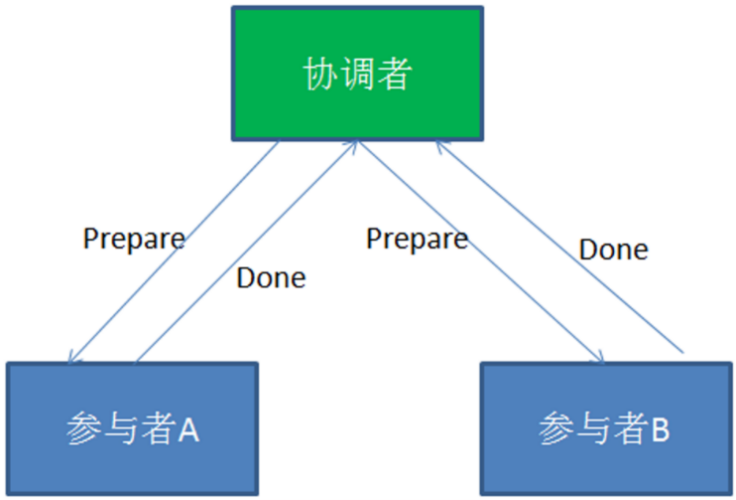
在分布式事务的第一阶段，作为事务协调者的节点会首先向所有的参与者节点发送Prepare请求。
在接到Prepare请求之后，每一个参与者节点会各自执行与事务有关的数据更新，写入Undo Log和Redo Log。如果参与者执行成功，暂时不提交事务，而是向事务协调节点返回“完成”消息。
当事务协调者接到了所有参与者的返回消息，整个分布式事务将会进入第二阶段。
**第二阶段：**
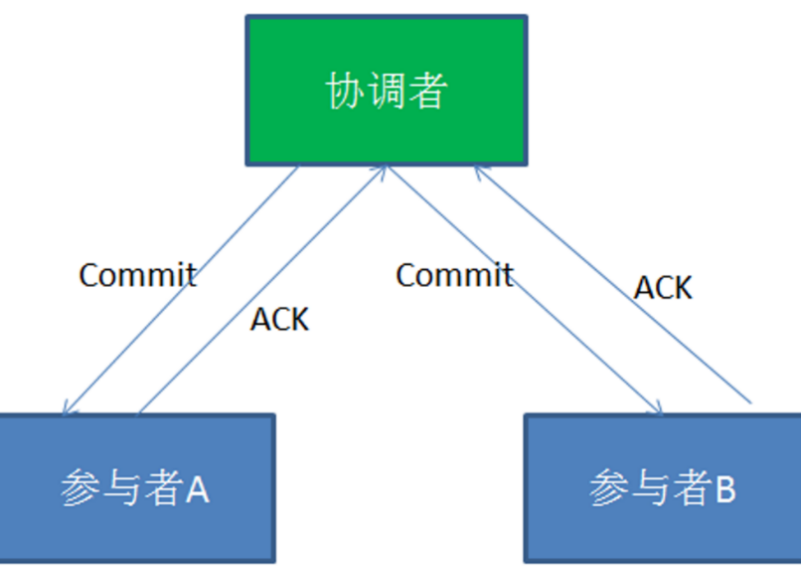
在2PC分布式事务的第二阶段，如果事务协调节点在之前所收到都是正向返回，那么它将会向所有事务参与者发出Commit请求。
接到Commit请求之后，事务参与者节点会各自进行本地的事务提交，并释放锁资源。当本地事务完成提交后，将会向事务协调者返回“完成”消息。
当事务协调者接收到所有事务参与者的“完成”反馈，整个分布式事务完成。

#### 3 失败情况的处理流程

**第一阶段：**
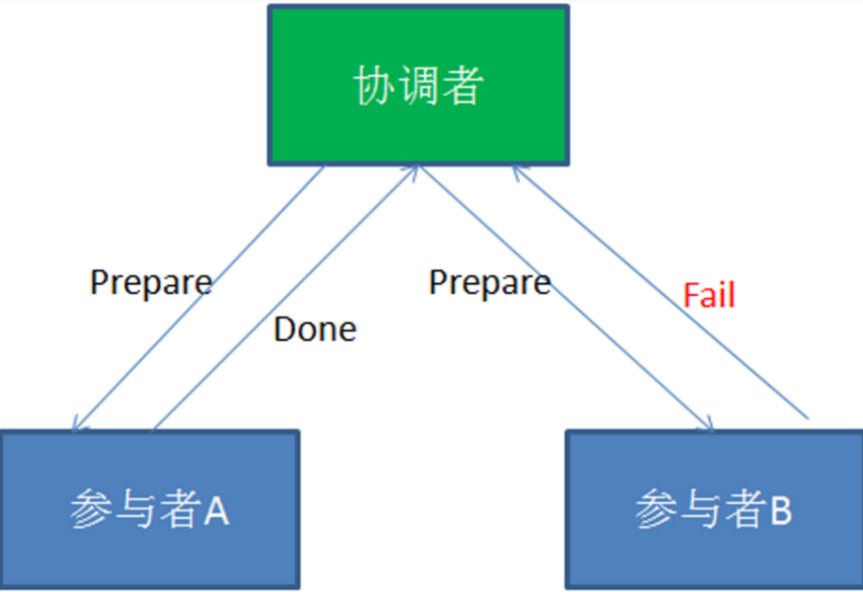
**第二阶段：**
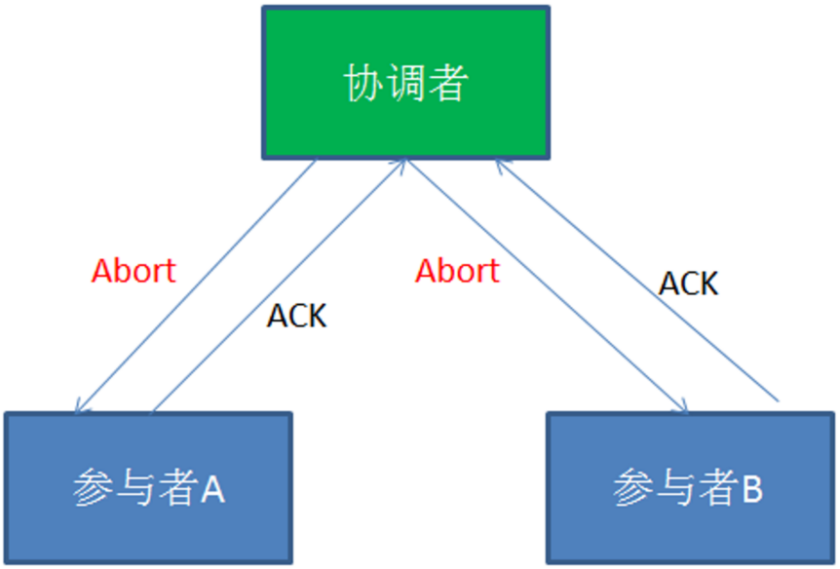
在2PC的第一阶段，如果某个事务参与者反馈失败消息，说明该节点的本地事务执行不成功，必须回滚。
于是在第二阶段，事务协调节点向所有的事务参与者发送Abort(中止)请求。接收到Abort请求之后，各个事务参与者节点需要在本地进行事务的回滚操作，回滚操作依照Undo Log来进行。
以上就是2PC两阶段提交协议的详细过程。

#### 4 2PC两阶段提交究竟有哪些不足呢？

1. **性能问题**

2PC遵循强一致性。在事务执行过程中，各个节点占用着数据库资源，只有当所有节点准备完毕，事务协调者才会通知提交，参与者提交后释放资源。这样的过程有着非常明显的性能问题。

1. **协调者单点故障问题**

2PC模型的核心，一旦事务协调者节点挂掉，参与者收不到提交或是回滚通知，参与者会一直处于中间状态无法完成事务。

1. **丢失消息导致的不一致问题。**

第二个阶段，如果发生局部网络问题，一部分事务参与者收到了提交消息，另一部分事务参与者没收到提交消息，那么就导致了节点之间数据的不一致。

## 2.2 代码补偿事务(TCC）

TCC的作用主要是解决跨服务调用场景下的分布式事务问题

### 2.2.1 场景案例

以航班预定的案例，来介绍TCC要解决的事务场景。在这里笔者虚构一个场景，把自己当做航班预定的主人公，来介绍这个案例。从合肥 –> 昆明 –> 大理。
准备从合肥出发，到云南大理去游玩，然后使用美团App(机票代理商)来订机票。发现没有从合肥直达大理的航班，需要到昆明进行中转。如下图：
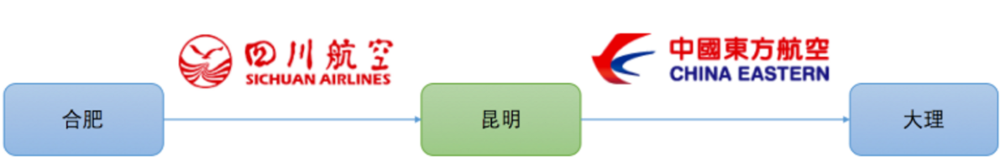
从图中我们可以看出来，从合肥到昆明乘坐的是四川航空，从昆明到大理乘坐的是东方航空。
 由于使用的是美团App预定，当我选择了这种航班预定方案后，美团App要去四川航空和东方航空各帮我购买一张票。如下图：

考虑最简单的情况：美团先去川航帮我买票，如果买不到，那么东航也没必要买了。如果川航购买成功，再去东航购买另一张票。
 现在问题来了：假设美团先从川航成功买到了票，然后去东航买票的时候，因为天气问题，东航航班被取消了。那么此时，美团必须取消川航的票，因为只有一张票是没用的，不取消就是浪费我的钱。那么如果取消会怎样呢？如果读者有取消机票经历的话，非正常退票，肯定要扣手续费的。在这里，川航本来已经购买成功，现在因为东航的原因要退川航的票，川航应该是要扣代理商的钱的。
 那么美团就要保证，如果任一航班购买失败，都不能扣钱，怎么做呢？
 两个航空公司都为美团提供以下3个接口：**机票预留接口、确认接口、取消接口**。美团App分2个阶段进行调用，如下所示：
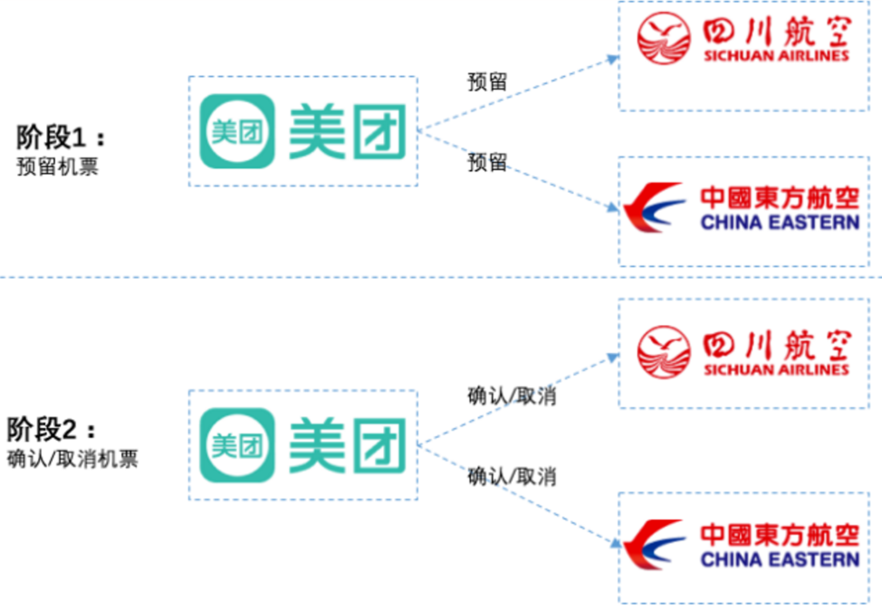
**在第1阶段：**
美团分别请求两个航空公司预留机票，两个航空公司分别告诉美团预留成功还是失败。航空公司需要保证，机票预留成功的话，之后一定能购买到。
**在第2阶段：**
如果两个航空公司都预留成功，则分别向两个公司发送确认购买请求。
如果两个航空公司任意一个预留失败，则对于预留成功的航空公司也要取消预留。这种情况下，对于之前预留成功机票的航班取消，也不会扣用户的钱，因为购买并没实际发生，之前只是请求预留机票而已。
通过这种方案，可以保证两个航空公司购买机票的一致性，要不都成功，要不都失败，即使失败也不会扣用户的钱。如果在两个航班都已经已经确认购买后，再退票，那肯定还是要扣钱的。
当然，实际情况肯定这里提到的肯定要复杂，通常航空公司在第一阶段，对于预留的机票，会要求在指定的时间必须确认购买(支付成功)，如果没有及时确认购买，会自动取消。假设川航要求10分钟内支付成功，东航要求30分钟内支付成功。以较短的时间算，如果用户在10分钟内支付成功的话，那么美团会向两个航空公司都发送确认购买的请求，如果超过10分钟(以较短的时间为准)，那么就不能进行支付。
这个方案提供给我们一种跨服务保证事务一致性的一种解决思路，可以把这种方案当做TCC的雏形。
具体流程：
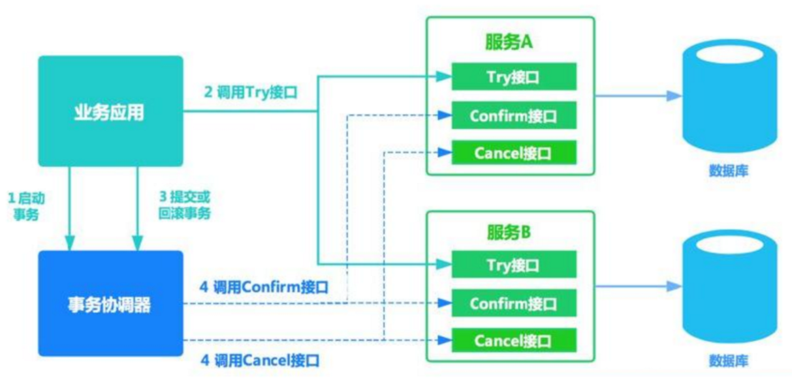
TCC是Try ( 尝试 ) — Confirm(确认) — Cancel ( 取消 ) 的简称:

| **操作方法** | **含义**                                                     |
| ------------ | ------------------------------------------------------------ |
| Try          | 完成所有业务检查（一致性），预留业务资源(准隔离性) 回顾上面航班预定案例的阶段1，机票就是业务资源，所有的资源提供者(航空公司)预留都成功，try阶段才算成功 |
| Confirm      | 确认执行业务操作，不做任何业务检查， 只使用Try阶段预留的业务资源。回顾上面航班预定案例的阶段2，美团APP确认两个航空公司机票都预留成功，因此向两个航空公司分别发送确认购买的请求。 |
| Cancel       | 取消Try阶段预留的业务资源。回顾上面航班预定案例的阶段2，如果某个业务方的业务资源没有预留成功，则取消所有业务资源预留请求。 |

### 2.2.2 TCC两阶段提交与XA两阶段提交的区别

 XA是资源层面的分布式事务，强一致性，在两阶段提交的整个过程中，一直会持有资源的锁。
TCC是业务层面的分布式事务，最终一致性，不会一直持有资源的锁。
其核心在于将业务分为两个操作步骤完成。不依赖 RM 对分布式事务的支持，而是通过对业务逻辑的分解来实现分布式事务。


## 2.3 本地消息表（异步确保）- 事务最终一致性

这种实现方式的思路，其实是源于 ebay，后来通过支付宝等公司的布道，在业内广泛使用。**其基本的设计思想是将远程分布式事务拆分成一系列的本地事务**。如果不考虑性能及设计优雅，借助关系型数据库中的表即可实现。

- 订单系统新增一条消息表，将新增订单和新增消息放到一个事务里完成，然后通过轮询的方式去查询消息表，将消息推送到 MQ，库存系统去消费 MQ。

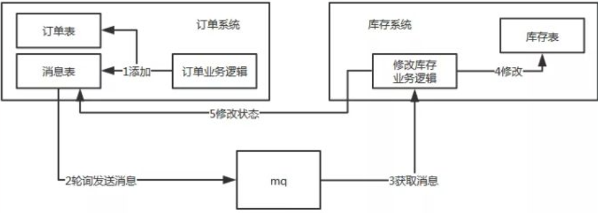

- 执行流程：
  - 订单系统，添加一条订单和一条消息，在一个事务里提交。
  - 订单系统，使用定时任务轮询查询状态为未同步的消息表，发送到 MQ，如果发送失败，就重试发送。
  - 库存系统，接收 MQ 消息，修改库存表，需要保证幂等操作。
  - 如果修改成功，调用 RPC 接口修改订单系统消息表的状态为已完成或者直接删除这条消息。
  - 如果修改失败，可以不做处理，等待重试。
- 订单系统中的消息有可能由于业务问题会一直重复发送，所以为了避免这种情况可以记录一下发送次数，当达到次数限制之后报警，人工接入处理；库存系统需要保证幂等，避免同一条消息被多次消费造成数据一致。
- 本地消息表这种方案实现了最终一致性，需要在业务系统里增加消息表，业务逻辑中多一次插入的 DB 操作，所以性能会有损耗，而且最终一致性的间隔主要由定时任务的间隔时间决定。
- 优点： 一种非常经典的实现，避免了分布式事务，实现了最终一致性。
- 缺点： 消息表会耦合到业务系统中，如果没有封装好的解决方案，会有很多杂活需要处理。

## 2.4 MQ 事务消息

有一些第三方的MQ是支持事务消息的，比如RocketMQ，他们支持事务消息的方式也是类似于采用的二阶段提交，但是市面上一些主流的MQ都是不支持事务消息的，比如 RabbitMQ 和 Kafka 都不支持。
以阿里的 RocketMQ 中间件为例，其思路大致为：

1. RocketMQ提供了类似X/Open XA的分布事务功能，通过MQ的事务消息能达到分布式事务的最终一致。
2. 发送方在业务执行开始会先向消息服务器中投递 “ **半消息** ” ，半消息即暂时不会真正投递的消息，当发送方（即生产者）将消息成功发送给了MQ服务端且并未将该消息的二次确认结果返回，此时消息状态是“ 暂时不可投递 ” 状态（可以认为是状态未知）。该状态下的消息即半消息。
3. 如果出现网络闪断、生产者应用重启等原因导致事务消息二次确认丢失，MQ服务端会通过扫描发现某条消息长期处于 “ 半消息 ” 状态，MQ服务端会主动向生产者查询该消息的最终状态是处于Commit(消息提交)还是Rollback(消息回滚)。这个过程称为**消息回查**。

在业务方法内要想消息队列提交两次请求，一次发送消息和一次确认消息。如果确认消息发送失败了RocketMQ会定期扫描消息集群中的事务消息，这时候发现了Prepared消息，它会向消息发送者确认，所以生产方需要实现一个check接口，RocketMQ会根据发送端设置的**策略来决定是回滚还是继续发送确认消息**。这样就保证了消息发送与本地事务同时成功或同时失败。
**总体而言RocketMQ事务消息分为两条主线**

- **定时任务发送流程：**发送half message(半消息)，执行本地事务，发送事务执行结果
- **定时任务回查流程：**MQ服务器回查本地事务，发送事务执行结果

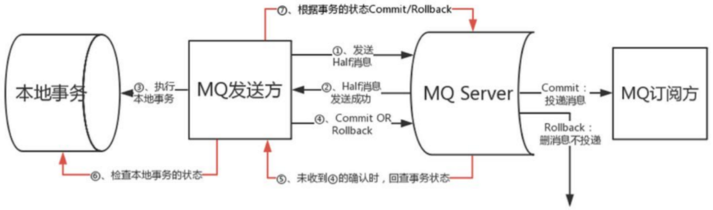
**具体流程如下 **
1、Producer 向 MQ 服务器 发送消息 , MQ Server 将消息状态标记为 Prepared（预备状态），注意此时这条消息消费者（MQ订阅方）是无法消费到的。
2、MQ 服务器收到消息并持久化成功之后，会向Producer 确认首次消息发送成功，此时消息处于 half message(半消息) 状态，并未发送给对应的 Consumer 。
3、Producer 开始执行本地事务逻辑 , 通过本地数据库事务控制。
4、根据事务执行结果，Producer 向 MQ 服务器提交二次确认 ( commit 或者 rollback) 。MQ Server 收到 Commit 状态则将半消息标记为可投递，Consumer 最终将收到该消息；MQ Server 收到 Rollback 状态则删除半消息，Consumer 将不会接受该消息。
5、在断网或者应用重启的情况下，二次确认未成功的发给 MQ Server，MQ Server 会主动向 Producer 启动消息回查
6、Producer 根据事务执行结果，对消息回查返回对应的结果。
7、Mq Server根据返回结果，决定继续投递消息或者丢弃消息(重复第4步操作)。
注意 1-4 为事务消息的发送过程， 5-6 为事务消息的回查过程。
**优点：** 实现了最终一致性，不需要依赖本地数据库事务。
**缺点：** 目前主流MQ中只有RocketMQ支持事务消息。

## 2.5 Seata介绍

[http://seata.io/zh-cn/](http://seata.io/zh-cn/)
**Seata**是阿里开源的一个分布式事务框架，能够让大家在操作分布式事务时，像操作本地事务一样简单。一个注解搞定分布式事务。
**解决分布式事务问题，有两个设计初衷**

- **对业务无侵入**：即减少技术架构上的微服务化所带来的分布式事务问题对业务的侵入
- **高性能**：减少分布式事务解决方案所带来的性能消耗

**Seata中有两种分布式事务实现方案，AT及TCC**

- AT模式主要关注多 DB 访问的数据一致性，当然也包括多服务下的多 DB 数据访问一致性问题 2PC-改进
- TCC 模式主要关注业务拆分，在按照业务横向扩展资源时，解决微服务间调用的一致性问题

**那 Seata 是怎么做到的呢？下面说说它的各个模块之间的关系。**
Seata 的设计思路是将一个分布式事务可以理解成一个全局事务，下面挂了若干个分支事务，而一个分支事务是一个满足 ACID 的本地事务，因此我们可以操作分布式事务像操作本地事务一样。
2019 年 1 月，**阿里**巴巴中间件团队发起了开源项目 [_Fescar_](https://www.oschina.net/p/fescar)（Fast & EaSy Commit And Rollback），和社区一起共建开源分布式事务解决方案。Fescar 的愿景是让分布式事务的使用像本地事务的使用一样，简单和高效，并逐步解决开发者们遇到的分布式事务方面的所有难题。
Seata全称：Simple Extensible Autonomous Transaction Architecture,简单可扩展自治事务框架。

### 2.5.1 AT模式（Automatic (Branch) Transaction Mode）

- **Transaction Coordinator （TC）：**事务协调器，**维护全局事务的运行状态**，负责协调并决定全局事务的提交或回滚。
- **Transaction Manager（TM）：** 控制全局事务的边界，负责开启一个全局事务，并最终发起**全局提交**或**全局回滚**的决议。
- **Resource Manager （RM）：**资源管理器，负责本地事务的注册，本地事务状态的汇报(投票)，并且**负责本地事务的提交和回滚**。
- **XID：**一个全局事务的唯一标识

其中，TM是一个分布式事务的发起者和终结者，TC负责维护分布式事务的运行状态，而RM则负责本地事务的运行。
如下图所示：
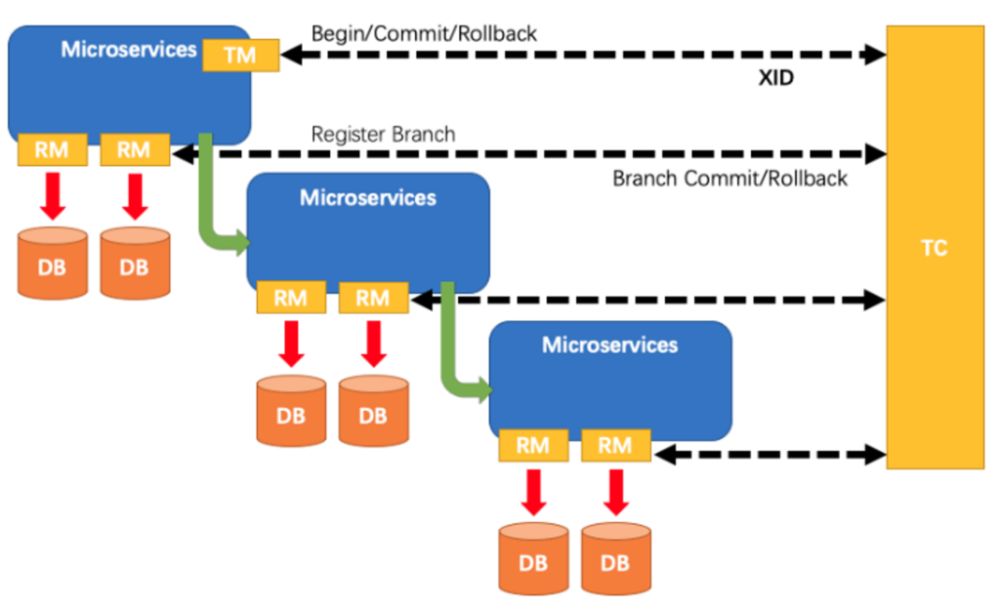
下面是一个分布式事务在Seata中的执行流程：

1. TM 向 TC 申请开启一个全局事务，全局事务创建成功并生成一个全局唯一的 XID
2. XID 在微服务调用链路的上下文中传播。
3. RM 向 TC 注册分支事务，接着执行这个分支事务并提交（重点：RM在第一阶段就已经执行了本地事务的提交/回滚），最后将执行结果汇报给TC
4. TM 根据 TC 中所有的分支事务的执行情况，发起全局提交或回滚决议。
5. TC 调度 XID 下管辖的全部分支事务完成提交或回滚请求。

Seata 中有三大模块，分别是 TM、RM 和 TC。 其中 TM 和 RM 是作为 Seata 的客户端与业务系统集成在一起，TC 作为 Seata 的服务端独立部署。
阿里云GTS，商业付费版。

##### ①整体机制

两阶段提交协议的演变：

- 一阶段：业务数据和回滚日志记录在同一个本地事务中提交，释放本地锁和连接资源。
- 二阶段：
  - 提交异步化，非常快速地完成。
  - 回滚通过一阶段的回滚日志进行反向补偿。

##### ②写隔离

- 一阶段本地事务提交前，需要确保先拿到 **全局锁** 。
- 拿不到 **全局锁** ，不能提交本地事务。
- 拿 **全局锁** 的尝试被限制在一定范围内，超出范围将放弃，并回滚本地事务，释放本地锁。

以一个示例来说明：
两个全局事务 tx1 和 tx2，分别对 a 表的 m 字段进行更新操作，m 的初始值 1000。
tx1 先开始，开启本地事务，拿到本地锁，更新操作 m = 1000 - 100 = 900。本地事务提交前，先拿到该记录的 **全局锁** ，本地提交释放本地锁。 tx2 后开始，开启本地事务，拿到本地锁，更新操作 m = 900 - 100 = 800。本地事务提交前，尝试拿该记录的 **全局锁** ，tx1 全局提交前，该记录的全局锁被 tx1 持有，tx2 需要重试等待 **全局锁** 。

tx1 二阶段全局提交，释放 **全局锁** 。tx2 拿到 **全局锁** 提交本地事务。

如果 tx1 的二阶段全局回滚，则 tx1 需要重新获取该数据的本地锁，进行反向补偿的更新操作，实现分支的回滚。
此时，如果 tx2 仍在等待该数据的 **全局锁**，同时持有本地锁，则 tx1 的分支回滚会失败。分支的回滚会一直重试，直到 tx2 的 **全局锁** 等锁超时，放弃 **全局锁** 并回滚本地事务释放本地锁，tx1 的分支回滚最终成功。
因为整个过程 **全局锁** 在 tx1 结束前一直是被 tx1 持有的，所以不会发生 **脏写** 的问题。

##### ③读隔离

在数据库本地事务隔离级别 **读已提交（Read Committed）** 或以上的基础上，Seata（AT 模式）的默认全局隔离级别是 **读未提交（Read Uncommitted）** 。
如果应用在特定场景下，必需要求全局的 **读已提交** ，目前 Seata 的方式是通过 SELECT FOR UPDATE 语句的代理。

SELECT FOR UPDATE 语句的执行会申请 **全局锁** ，如果 **全局锁** 被其他事务持有，则释放本地锁（回滚 SELECT FOR UPDATE 语句的本地执行)并重试。这个过程中，查询是被 block 住的，直到 **全局锁** 拿到，即读取的相关数据是 **已提交** 的，才返回。
出于总体性能上的考虑，Seata 目前的方案并没有对所有 SELECT 语句都进行代理，仅针对 FOR UPDATE 的 SELECT 语句。

##### ④工作机制

以一个示例来说明整个 AT 分支的工作过程。
业务表：product

| **Field** | **Type**     | **Key** |
| --------- | ------------ | ------- |
| id        | bigint(20)   | PRI     |
| name      | varchar(100) |         |
| since     | varchar(100) |         |

AT 分支事务的业务逻辑：
update product set name = 'GTS' where name = 'TXC';

###### 一阶段

过程：

1. 解析 SQL：得到 SQL 的类型（UPDATE），表（product），条件（where name = 'TXC'）等相关的信息。
2. 查询前镜像：根据解析得到的条件信息，生成查询语句，定位数据。

select id, name, since from product where name = 'TXC';
得到前镜像：

| **id** | **name** | **since** |
| ------ | -------- | --------- |
| 1      | TXC      | 2014      |

1. 执行业务 SQL：更新这条记录的 name 为 'GTS'。
2. 查询后镜像：根据前镜像的结果，通过 **主键** 定位数据。

select id, name, since from product where id = 1;
得到后镜像：

| **id** | **name** | **since** |
| ------ | -------- | --------- |
| 1      | GTS      | 2014      |

1. 插入回滚日志：把前后镜像数据以及业务 SQL 相关的信息组成一条回滚日志记录，插入到 UNDO_LOG 表中。

{"branchId": 641789253,"undoItems": [{"afterImage": {"rows": [{"fields": [{"name": "id","type": 4,"value": 1}, {"name": "name","type": 12,"value": "GTS"}, {"name": "since","type": 12,"value": "2014"}]
}],"tableName": "product"},"beforeImage": {"rows": [{"fields": [{"name": "id","type": 4,"value": 1}, {"name": "name","type": 12,"value": "TXC"}, {"name": "since","type": 12,"value": "2014"}]
}],"tableName": "product"},"sqlType": "UPDATE"}],"xid": "xid:xxx"}

1. 提交前，向 TC 注册分支：申请 product 表中，主键值等于 1 的记录的 **全局锁** 。
2. 本地事务提交：业务数据的更新和前面步骤中生成的 UNDO LOG 一并提交。
3. 将本地事务提交的结果上报给 TC。

###### 二阶段-回滚

1. 收到 TC 的分支回滚请求，开启一个本地事务，执行如下操作。
2. 通过 XID 和 Branch ID 查找到相应的 UNDO LOG 记录。
3. 数据校验：拿 UNDO LOG 中的后镜与当前数据进行比较，如果有不同，说明数据被当前全局事务之外的动作做了修改。这种情况，需要根据配置策略来做处理，详细的说明在另外的文档中介绍。
4. 根据 UNDO LOG 中的前镜像和业务 SQL 的相关信息生成并执行回滚的语句：

update product set name = 'TXC' where id = 1;

1. 提交本地事务。并把本地事务的执行结果（即分支事务回滚的结果）上报给 TC。

###### 二阶段-提交

1. 收到 TC 的分支提交请求，把请求放入一个异步任务的队列中，马上返回提交成功的结果给 TC。
2. 异步任务阶段的分支提交请求，将异步和批量地删除相应 UNDO LOG 记录。

# 第三章 Seata案例初始化

## 3.1 需求分析


完成一个案例，用户下单的时候记录下单日志，完成订单添加，完成商品库存削减功能，完成用户账户扣款，可以在扣款时制造异常，测试全局分布式事务一致性。

## 3.2 案例实现

Fescar：全称fast easy commit and rollback
导入课件中fescar-parent-none.rar案例项目。修改自己的数据库连接信息。接下来直接集成Seata框架。

# 第四章 Seata集成

版本声明：
nacos-server-1.4.2 + seata-server-1.4.2 + MySQL5.7 + Hoxton.SR9 + Alibaba2.2.6.RELEASE + SpringBoot2.3.2.RELEASE
[https://hub.fastgit.org/alibaba/spring-cloud-alibaba/wiki/%E7%89%88%E6%9C%AC%E8%AF%B4%E6%98%8E](https://hub.fastgit.org/alibaba/spring-cloud-alibaba/wiki/%E7%89%88%E6%9C%AC%E8%AF%B4%E6%98%8E)
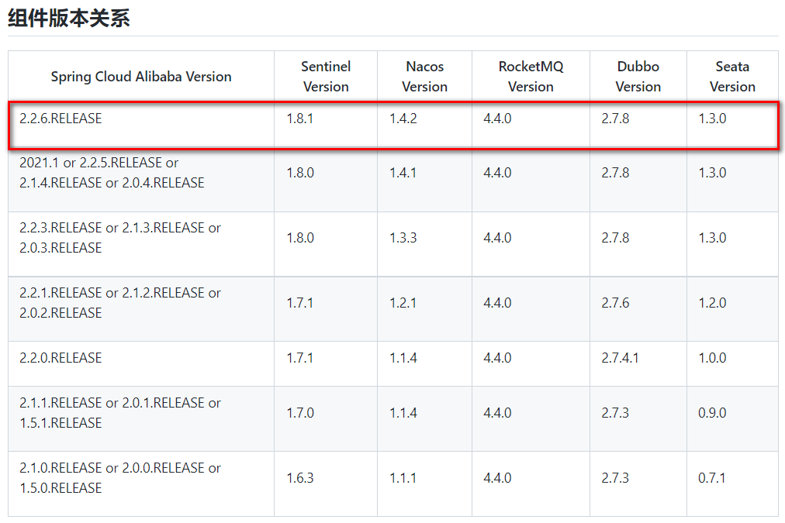

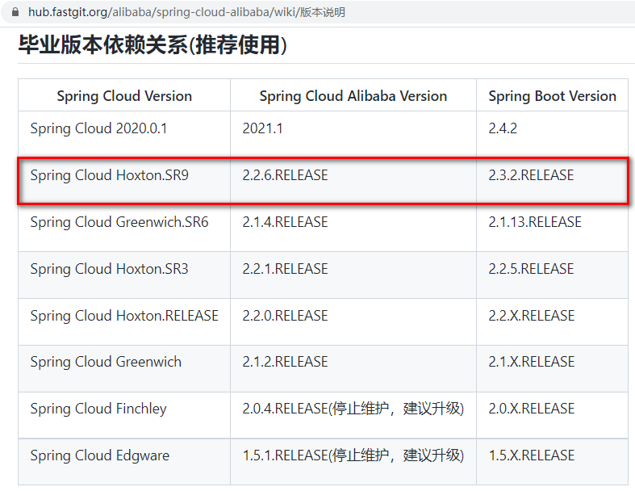

## 4.1 搭建注册中心和配置中心Nacos

1. 下载地址：[https://nacos.io/zh-cn/](https://nacos.io/zh-cn/)
2. 启动服务器：D:\Server\nacos-server-1.4.2\bin\startup.cmd -m standalone

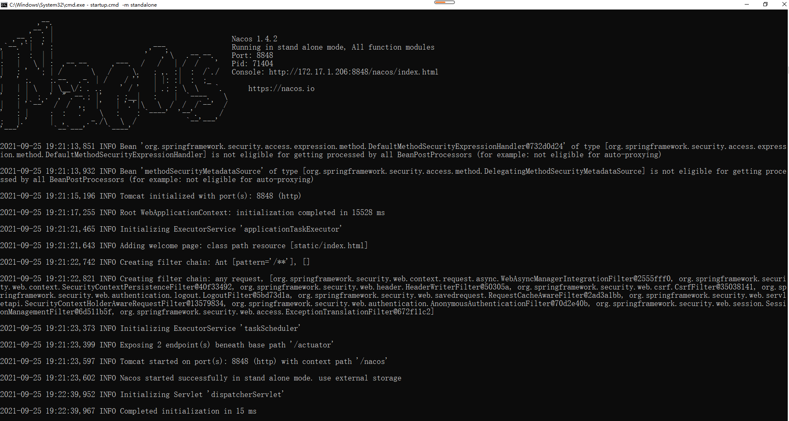

## 4.2 在配置中心增加配置

1. 新建dataId为seataServer.properties的配置，内容如下:

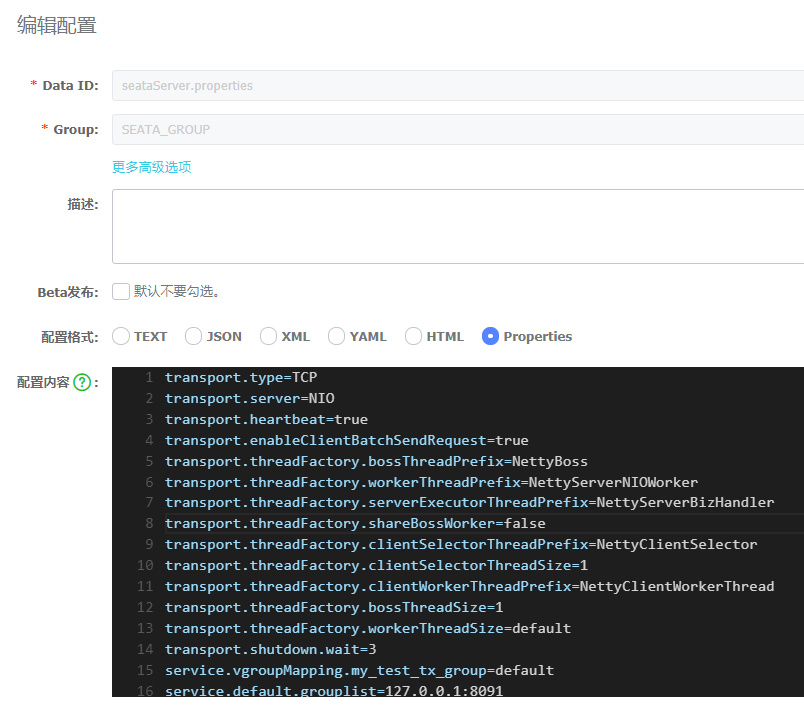
重点关注

- 虚拟组配置，所有的微服务需要加入名称为：my_test_tx_group的事务组中
- 设置TC进行全局事务控制的数据存储方式：store.mode有file,db,redis三种类型。这里选择db,设置mysql连接信息
  | transport.type=TCP
  transport.server=NIO
  transport.heartbeat=true
  transport.enableClientBatchSendRequest=true
  transport.threadFactory.bossThreadPrefix=NettyBoss
  transport.threadFactory.workerThreadPrefix=NettyServerNIOWorker
  transport.threadFactory.serverExecutorThreadPrefix=NettyServerBizHandler
  transport.threadFactory.shareBossWorker=false
  transport.threadFactory.clientSelectorThreadPrefix=NettyClientSelector
  transport.threadFactory.clientSelectorThreadSize=1
  transport.threadFactory.clientWorkerThreadPrefix=NettyClientWorkerThread
  transport.threadFactory.bossThreadSize=1
  transport.threadFactory.workerThreadSize=default
  transport.shutdown.wait=3
  service.vgroupMapping.**my_test_tx_group**=default
  service.default.grouplist=127.0.0.1:8091
  service.enableDegrade=false
  service.disableGlobalTransaction=false
  client.rm.asyncCommitBufferLimit=10000
  client.rm.lock.retryInterval=10
  client.rm.lock.retryTimes=30
  client.rm.lock.retryPolicyBranchRollbackOnConflict=true
  client.rm.reportRetryCount=5
  client.rm.tableMetaCheckEnable=false
  client.rm.tableMetaCheckerInterval=60000
  client.rm.sqlParserType=druid
  client.rm.reportSuccessEnable=false
  client.rm.sagaBranchRegisterEnable=false
  client.rm.tccActionInterceptorOrder=-2147482648
  client.tm.commitRetryCount=5
  client.tm.rollbackRetryCount=5
  client.tm.defaultGlobalTransactionTimeout=60000
  client.tm.degradeCheck=false
  client.tm.degradeCheckAllowTimes=10
  client.tm.degradeCheckPeriod=2000
  client.tm.interceptorOrder=-2147482648

store.mode=db
store.db.datasource=druid
store.db.dbType=mysql
store.db.driverClassName=com.mysql.cj.jdbc.Driver
store.db.url=jdbc:mysql://localhost:3306/seata142?characterEncoding=UTF-8&serverTimezone=Asia/Shanghai
store.db.user=root
store.db.password=root
store.db.minConn=5
store.db.maxConn=30
store.db.globalTable=global_table
store.db.branchTable=branch_table
store.db.queryLimit=100
store.db.lockTable=lock_table

store.lock.mode=file
store.session.mode=file
store.publicKey=123
server.recovery.committingRetryPeriod=1000
server.recovery.asynCommittingRetryPeriod=1000
server.recovery.rollbackingRetryPeriod=1000
server.recovery.timeoutRetryPeriod=1000
server.maxCommitRetryTimeout=-1
server.maxRollbackRetryTimeout=-1
server.rollbackRetryTimeoutUnlockEnable=false
server.distributedLockExpireTime=10000
client.undo.dataValidation=true
client.undo.logSerialization=jackson
client.undo.onlyCareUpdateColumns=true
server.undo.logSaveDays=7
server.undo.logDeletePeriod=86400000
client.undo.logTable=undo_log
client.undo.compress.enable=true
client.undo.compress.type=zip
client.undo.compress.threshold=64k
log.exceptionRate=100
transport.serialization=seata
transport.compressor=none
metrics.enabled=false
metrics.registryType=compact
metrics.exporterList=prometheus
metrics.exporterPrometheusPort=9898 |
| --- |

在seata142数据库中导入表：global_table、branch_table、lock_table，脚本参考课件：\dbsql\mysql_global_table.sql
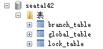

1. 新建dataId为common.yml配置，内容如下: 所有微服务共享这个配置。


| seata: 
  tx-service-group: my_test_tx_group |
| --- |

在fescar-api项目bootstrap.yml文件中引入common.yml配置，共享给其他服务使用。

| spring:
  cloud:
    nacos:
      discovery:
        server-addr: localhost:8848
        group: SEATA_GROUP
      config:
        server-addr: localhost:8848
        file-extension: yml
        group: SEATA_GROUP
        shared-configs[0]:
          data-id: common.yml
          refresh: true
          group: SEATA_GROUP |
| --- |

1. 查看配置中心


## 4.3 搭建TC服务器

1. 下载地址：[https://seata.io/zh-cn/index.html](https://seata.io/zh-cn/index.html)
2. 解压seata-server-1.4.2.zip安装，修改D:\Server\seata-server-1.4.2\conf\registry.conf设置TC 服务对应的注册中心和配置中心。 这里选择Nacos，

注意：dataId = "seataServer.properties"，从nacos配置中心拉取配置。

```
registry {
  # file 、nacos 、eureka、redis、zk、consul、etcd3、sofa
  type = "nacos"
  nacos {
    application = "seata-server"
    serverAddr = "127.0.0.1:8848"
    group = "SEATA_GROUP"
    namespace = ""
    cluster = "default"
    username = "nacos"
    password = "nacos"
  }
}
config {

  # file、nacos 、apollo、zk、consul、etcd3

  type = "nacos"
  nacos {
    serverAddr = "127.0.0.1:8848"
    namespace = ""
    group = "SEATA_GROUP"
    username = "nacos"
    password = "nacos"
dataId = "seataServer.properties"
  }
}
```

1. 进入到D:\Server\seata-server-1.4.2\bin目录运行seata-server.bat

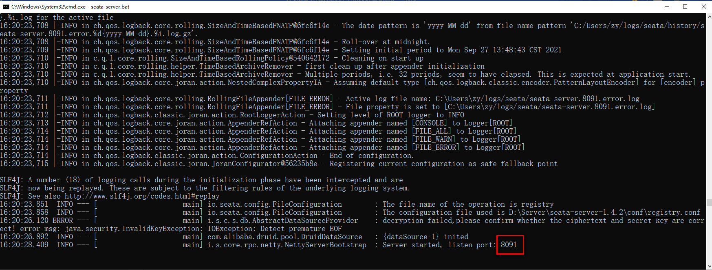

## 4.4 创建项目表结构

- 执行脚本：

  

- 查看数据库：

  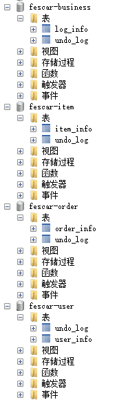

- 注意：脚本中undo_log表，每个业务数据库都需要有这张表，用于数据的rollback。这个表必须有独立的id主键，否则，保存日志报错。
  
  ```
  -- 注意此处0.7.0+ 增加字段 context
  CREATE TABLE `undo_log` (
  `id` bigint(20) NOT NULL AUTO_INCREMENT,
  `branch_id` bigint(20) NOT NULL,
  `xid` varchar(100) NOT NULL,
  `context` varchar(128) NOT NULL,
  `rollback_info` longblob NOT NULL,
  `log_status` int(11) NOT NULL,
  `log_created` datetime NOT NULL,
  `log_modified` datetime NOT NULL,
  `ext` varchar(100) DEFAULT NULL,
  PRIMARY KEY (`id`),
  UNIQUE KEY `ux_undo_log` (`xid`,`branch_id`)
  ) ENGINE=InnoDB DEFAULT CHARSET=utf8;
  ```
  
  

## 4.5 引入seata依赖

在fescar-api项目中引入依赖，排除低版本依赖，重新引入1.4.2；传递给其他微服务项目使用。

```\
<!--Seata依赖-->
<dependency>
    <groupId>com.alibaba.cloud</groupId>
    <artifactId>spring-cloud-starter-alibaba-seata</artifactId>
    <exclusions>
        <exclusion>
            <groupId>io.seata</groupId>
            <artifactId>seata-spring-boot-starter</artifactId>
        </exclusion>
    </exclusions>
</dependency>
<dependency>
    <groupId>io.seata</groupId>
    <artifactId>seata-spring-boot-starter</artifactId>
    <version>1.4.2</version>
</dependency>

```


## 4.6 在 fescar-api 工程下面新建配置类

```
package com.atguigu.config;
import com.alibaba.druid.pool.DruidDataSource;
import io.seata.rm.datasource.DataSourceProxy;
import org.apache.ibatis.session.SqlSessionFactory;
import org.mybatis.spring.SqlSessionFactoryBean;
import org.springframework.boot.context.properties.ConfigurationProperties;
import org.springframework.context.annotation.Bean;
import org.springframework.context.annotation.Configuration;
import javax.sql.DataSource;

@Configuration
public class DataSourceProxyConfig {
    /**
      * 普通数据源
      * @return
      */
    @Bean
    @ConfigurationProperties(prefix = "spring.datasource")
    public DataSource dataSource() {
        return new DruidDataSource();
    }
    
    /**
      * 代理数据源绑定DataSourceProxy ---> undo_log的操作
      * @param dataSource
      * @return
      */
    @Bean
    public DataSourceProxy dataSourceProxy(DataSource dataSource) {
    	return new DataSourceProxy(dataSource);
    }
    
    /**
      * mybatis--->手动指定sqlSessionFactory所使用的代理数据源
      * @param dataSourceProxy
      * @return
      * @throws Exception
      */
    @Bean
    public SqlSessionFactory sqlSessionFactoryBean(DataSourceProxy dataSourceProxy) throws Exception {
    	SqlSessionFactoryBean sqlSessionFactoryBean = new SqlSessionFactoryBean();
    	// 换成代理数据源        
    	sqlSessionFactoryBean.setDataSource(dataSourceProxy);
    	return sqlSessionFactoryBean.getObject();
    }
    
}

```


## 4.7 入口方法上添加@GlobalTransactional开启全局事务


其他微服务的业务方法增加@Transactional注解；在fescar-user的UserInfoServiceImpl中模拟异常，验证全局事务回滚。


## 4.8 启动四个微服务，观察控制台日志，查看注册中心


## 4.9 测试：[http://localhost:18081/business/addorder](http://localhost:18081/business/addorder) 

# 第五章 Seata之原理简介

## 5.1 再看TC/TM/RM三大组件

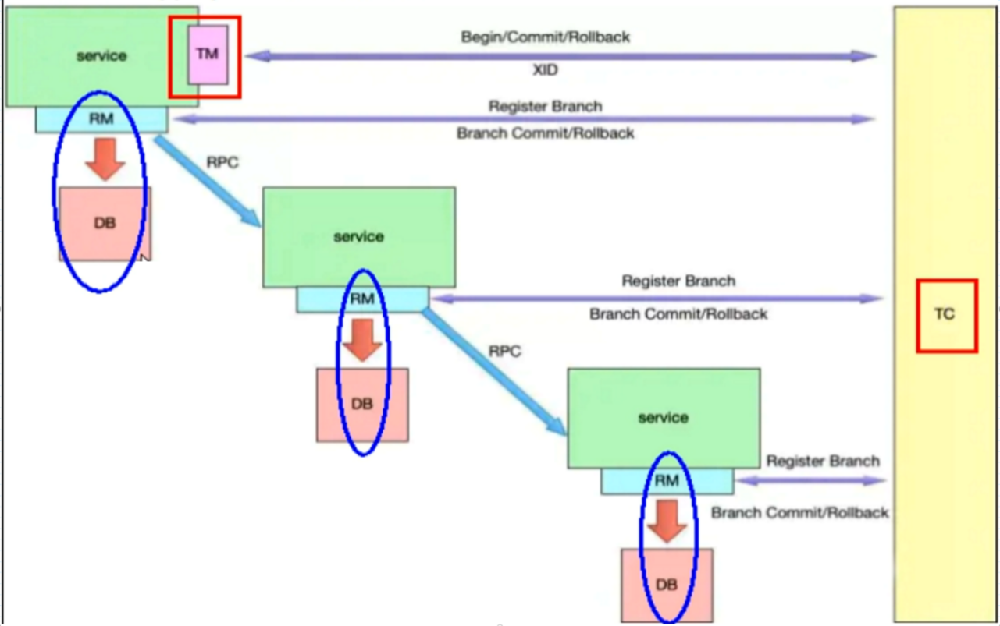

## 5.2 分布式事务的执行流程

- TM开启分布式事务(TM向TC注册全局事务记录)
- 换业务场景，编排数据库，服务等事务内资源（RM向TC汇报资源准备状态）
- TM结束分布式事务，事务一阶段结束（TM通知TC提交/回滚分布式事务）
- TC汇总事务信息，决定分布式事务是提交还是回滚
- TC通知所有RM提交/回滚资源，事务二阶段结束。

## 5.3 AT模式如何做到对业务的无侵入

是什么


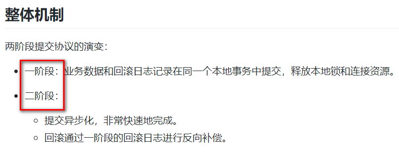

### 5.3.1 一阶段加载

- 在一阶段，Seata会拦截"业务SQL" 
  - 1.解析SQL语义，找到“业务SQL”要更新的业务数据，在业务数据被更新前，将其保存成“before image”
  - 2.执行"业务SQL"更新业务数据，在业务数据更新之后，
  - 3.其保存成“after image”，最后生成行锁。
- 以上操作全部在一个数据库事务内完成，这样保证了一阶段操作的原子性。

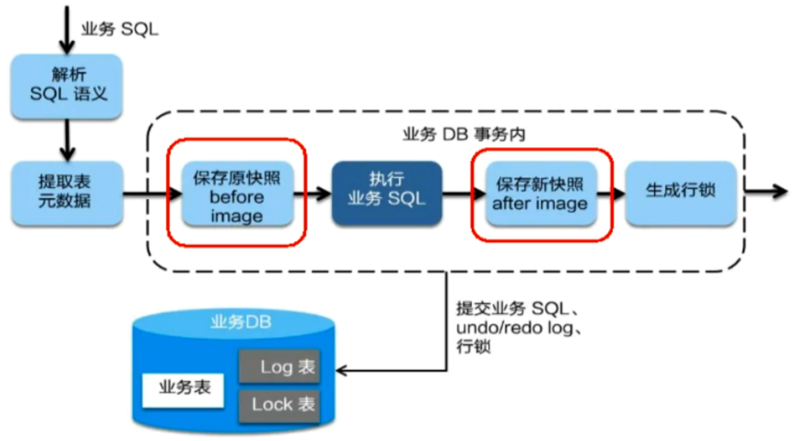

### 5.3.2 二阶段提交

- 二阶段如果顺利提交的话，因为“业务SQL”在一阶段已经提交至数据库，所以Seata框架只需将一阶段保存的快照数据和行锁删掉，完成数据清理即可。

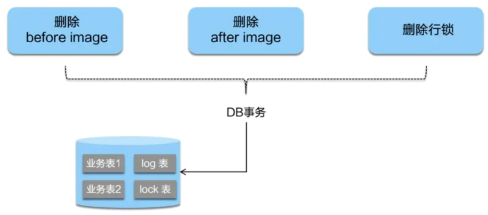

### 5.3.3 二阶段回滚

二阶段如果是回滚的话，Seata就需要回滚一阶段执行的“业务SQL”,还原业务数据。
回滚方式便是用“before image”还原业务数据；但在还原前要首先校验脏写，对比“数据库当前业务数据”和“after image”,如果两份数据完全一致就说明没有脏写，可以还原业务数据，如果不一致就说明有脏写，出现脏写就需要转人工处理。


