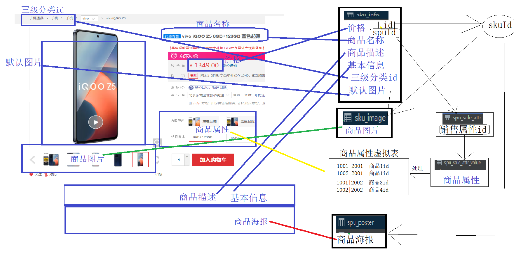

- [x] Swagger 1 2 整合笔记 #Swagger #knife4j
- [x] spu查询sql
- [x] 商品详情页 分析+实现
- [x] 属性选择调用 1|a 2|a 1|b 2|b
- [x] GROUP_CONCAT(字段 separator '分隔符'): 在分组之后, 可以把同一个组中的多行数据, 按照指定的规则拼接在一起, 进行显示 #mysql
- [x] 远程调用整合笔记

商品详情页分析

七个查询接口
1. 根据分类3id查询三级分类id
2. 根据spuId查询商品属性id列表和对应的skuId
3. 根据spuId 和 skuId 查询 商品属性值列表并且标记选中的属性值
4. 根据spuId查询商品海报图片
5. 根据skuId查询sku详细信息和图片信息
6. 根据skuId查询价格
7. 根据sku查询sku的平台属性