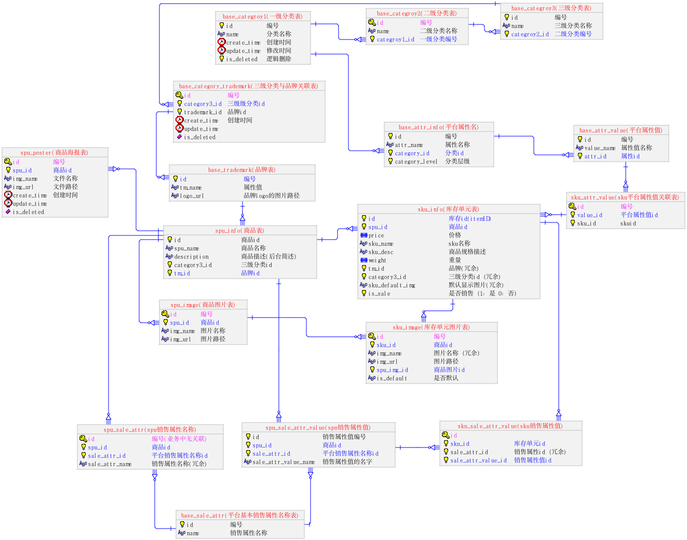
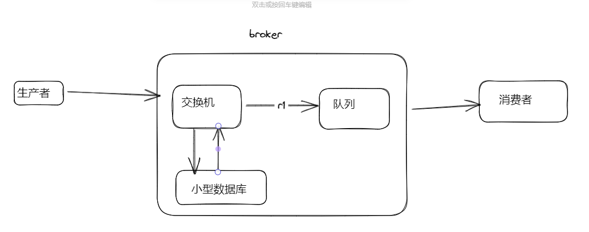
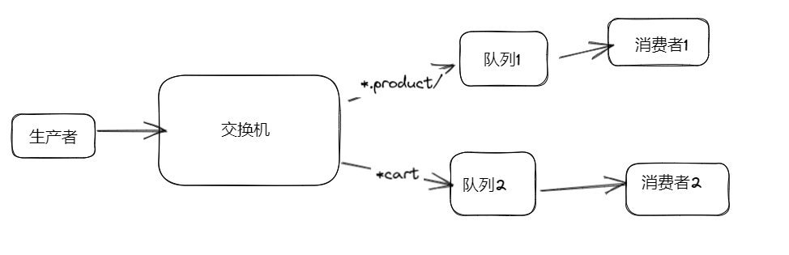
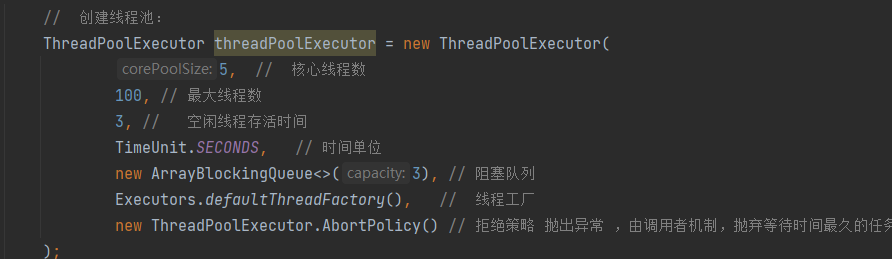
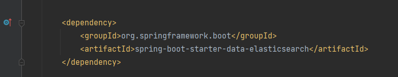

[电商总结](项目/电商项目总结/电商总结.md)

### 三、电商项目架构	
#### 1、技术栈

* Springboot

  * 脚手架 简化我们的开发流程、自动配置、版本控制
  * 常用注解有哪些
    * @SpringBootApplication
    * @ComponentScan: 组件扫描,扫描当前包及其子包有@Component注解的类,实例化并装配到容器中
    * @SpringBootConfiguration: 是@Configuration注解的变体, 只是声明了是springBoot, 便于后期扩展
      @EnableAutoConfiguration:扫描当前包及其子包下有@Configuration注解的配置类,实例化并装配到容器中


* Springcloud：依托于springboot使用

  * 组件有哪些？

    * openFegin 远程服务调用 相当于Ribbon+RestTemplate
    * nacos 注册中心和配置中心
    * sentinel,  限流、降级 熔断
    * gateway 网关 过滤器 鉴权
 - Sleuth 服务跟踪 SpringCloudSleuth和OpenZipkin(也称为Zipkin)集成.Zipkin是一个分布式跟踪平台

- Eureka: 注册中心
- Ribbon (负载均衡，远程调用)
- Hystrix(熔断器)(断路器) 熔断机制： 10秒内20次请求，50%失败，执行熔断， 5s后尝试恢复， 三次后还是不行就需要人工处理
- DashBoard： 仪表盘

- OpenFegin是怎么用的： 
	1. 引入OpenFegin依赖：spring-cloud-starter-openfegin
	2. 创建了一个接口，在接口上添加@FeginClient（"被调用服务名称"）定义了要调用的方法
	3. 在调用方启动类上加上@EnableFeginClients(basePackages="com.xxx.xxx")注解，开启远程调用
	4. 在调用方Controller中注入feginClient对象,像调用本地方法一样调用远程接口
    
- 负载均衡策略： 
		- 轮询
		- 权重
		- 最小响应时间
		- ip hash
		- 随机


* Mybatis-plus  

  * 持久层框架
  * 动态sql标签?    where if foreach set trim sql when choose otherwise
	  
```

<choose> //只会进一个
	<when test="id!=null"></when>  // if
	<when test="id!=null"></when>  // else if
	<otherwise></otherwise>        // else
</choose>
```

  * 支持单表的增删改查

  

* redis：非关系型数据库
https://baijiahao.baidu.com/s?id=1709170155160213718&wfr=spider&for=pc
  * 支持多种数据类型？
    * string : 一个k对一个v 
      
    * list : 双向链表
       
	1.  lpush+lpop=Stack(栈)
	2.  lpush+rpop=Queue（队列）
	3.  lpush+ltrim=Capped Collection（有限集合）
	4.  lpush+brpop=Message Queue（消息队列）
    * set : 一个key对应多个v, v的数据结构： `HashMap<String>`的key，value为null
    
      
    * zset： 比set多了一个分数  
      
    * hash : 一个key对应多个v, v的数据结构：`HashMap<String>`
      
    
不常用的 ： 
- HyperLogLogs（基数统计）
- Bitmaps (位图) 
  Bitmap 即位图数据结构，都是操作二进制位来进行记录，只有0 和 1 两个状态。
 **用来解决什么问题**？
	比如：统计用户信息，活跃，不活跃！ 登录，未登录！ 打卡，不打卡！ **两个状态的，都可以使用 Bitmaps**！
	如果存储一年的打卡状态需要多少内存呢？ 365 天 = 365 bit 1字节 = 8bit 46 个字节左右！
- geospatial （地理位置）
 Redis 的 Geo 在 Redis 3.2 版本就推出了! 这个功能可以推算地理位置的信息: 两地之间的距离, 方圆几里的人

```
127.0.0.1:6379> geoadd china:city 118.76 32.04 manjing 112.55 37.86 taiyuan 123.43 41.80 shenyang  
(integer) 3
```


  * 持久化?
    * rdb：
	    * 以指定时间间隔持久化数据
	    * 优点： 稳定
	    * 缺点： 有可能不全
    * aof： 
	    * 记录增删的所有命令
	    * 有两种模式： 1. 每写一调命令持久化一次 ; 2.每隔一秒种持久化一次
	    * 优点： 相对较全
	    * 缺点： 不稳定
什么时候用：
	如果只用于缓存， 两个都不用
	如果数据比较敏感，两个都开启，比较安全
	如果数据不敏感： 只开启rdb


* rabbitmq

  * 作用是啥？
    * 流量削峰
    * 异步处理
    * 解耦服务

消息模型： 
	简单模式：一个生产者，一个队列，一个消费者
	工作模式： 一个生产者，一个队列，多个消费者（竞争）
	发布订阅模式：一个生产者，一个交换机，多个队列，多个消费者 
	路由模式：一个生产者，一个交换机，routingkey匹配 多个队列，，多个消费者   
	主题模式： 一个生产者，一个交换机，有通配符（`*代表匹配一个单词，#代表匹配多个单词`）的 routingkey匹配 多个队列，，多个消费者  
  rpc：不算
  rpc远程调用： 
	  原理： 

 
 
 

RabbitMQ用在哪几个模块： 
- order模块：延迟关单 
- product模块： 上下架
- active模块： 秒杀


消息百分百投递： 
	三个方面保证消息的可靠：
		1. 生产端：应答机制，定义一个类，实现RabbitTemplate.ConfirmCallback,RabbitTemplate.ReturnCallback接口，实现方法：confirm(CorrelationData correlationData，boolean ack)和returnedMessage（）方法， 生产者发送消息到交换机时,将消息缓存到redis中， 失败时，broker会调用confirm（），如果成功发送到交换机，交换机在发送到队列时失败，broker调用returnedMessage（）方法。
		2. MQ服务端（brocker）：   消息持久化，消费端监听处 队列和交换机的参数后面的注解的参数：durable = "true",autoDelete = "false"开启持久化，关闭自动删除。（发送消息时通过设置deliveryMode=2持久化消息）
		3. 消费者端： 手动签收，在nacos配置文件中修改下面两个参数：
			   rabbitmq.listener.simple.acknowledge-mode: manual //默认情况下消息消费者是自动确认消息的，如果要手动确认消息则需要修改确认模式为

		   //手动确认  
         channel.basicAck(message.getMessageProperties().getDeliveryTag(),false);


RabbitMQ如何实现分布式事务：


* mysql

  * 关系型数据库，默认用什么存储引擎？ InnoDB
  * Caused by: com.mysql.cj.exceptions.CJCommunicationsException: Communications link failure  什么错误？
    * 典型的mysql连接不上
    * 可以问同事，我们本地跑项目的时候，用的mysql连接是什么配置

#MyISAM和InnoDB的区别


  * 面试题： mysql(a,b,c)联合索引
    * 1、where a = 1 and b=1 and c=1
    * 2、where a =1 and c = 1
    * 3、where b=1 and c =1
    * 4、 where b=1 and a=1 and c=1

带头大哥不能死，中间小弟不能断：
where条件中的第一个字段必须有，才会走索引，并且中间的字段如果没有的话，后面的字段就算有，也不会走索引


* ELK

  * elasticsearch 搜索引擎
  * logstash 日志收集
  * kibana 图形化界面
  * es-head 测试环境


* docker

  * docker pull 拉取镜像
  * docker images 查看镜像
  * docker ps  查看容器
  * docker logs 
  * docker run -d 后台运行   -p 端口映射 80:80  --restart=always -v  /etc/mysql/conf:/usr/local/conf 数据卷挂载  -name mysql 设置新的容器的名称 mysql:8.0
  * docker start 
  * docker stop

* k8s集群 线上环境


#### 2、项目结构

gmall-parent（名字随便起）

​	common 公用基础模块  - 一般是不需要大家自己手写的

​    seveice-client openfeign服务调用模块

​	gateway 模块 网管模块

​    sevice

​		service-product  后台商品管理模块

​		service-item		商品详情模块

​		service-list		首页

​		service-user	单点登录模块

​		service-cart 	购物车模块

​		service-order	订单模块

​		service-payment	支付模块

​		service-activity	秒杀模块

​		service-mq 	测试mq模块

web

​	web-all  前端模块

​         

#### 3、微服务组件使用
#微服务组件使用
nacos
	作用: 
		注册中心
		配置中心
	使用: 
		启动nacos服务
		引入依赖
		配置文件 bootstrap.properties
		添加启动类注解 @EnableDiscoveryClient
gateway
	作用:
		网关 跨域 鉴权 全局过滤器
	使用: 
		引入依赖
		配置文件 开启路由功能 在nacos
	gateway是什么时候执行的:
		通过域名到时候找到80端口,找到gateway服务, 然后通过路由规则负载均衡给其它模块
OpenFeign
	作用: 
		远程调用, 简化HttpClient 可以像调用本地方法一样进行远程调用
	使用:
		引入依赖
		调用方
			@EnableFeignClients(basePackages={"com.xxx"})
		使用方
			@FeignClient(value = "service-xxx", fallback = XxxDegradeFeignClient.class)
Sentinel
	作用: 
		熔断 降级 限流
	使用
		配合OpenFeign
		fallback = XxxDegradeFeignClient.class


### 四. 后台商品管理模块(练习代码基本功)
#### 三级分类
	一级分类表
	二级分类表 中包含一级分类id
	三级分类表 中包含二级分类id
	面试题: 你们的三级分类用了几张表? 3张, 可以用一张吗?可以, pId字段
#### 品牌
	三级分类表
	品牌表
	中间表 为什么要有中间表: 品牌和三级分类是多对多的关系, 设计表结构的时候首先应该先判断关系, 一对一, 一对多, 多对对
	拿到需求: 
		第一步设计表结构, 
		第二步写model实体类pojo和vo, 
		第三步写Controller和Service先返回假数据, 最后进行实现
#### 平台属性和平台属性值
	表结构设计
		base_attr_info
		base_attr_value
		实际开发中: 先判断如果是空就直接返回, 尽量不要if嵌套, 最多嵌套三层
	具体接口实现
#### spu和sku
	Spu srandard product unit  标准化产品单元
	Sku stock keeping unit 库存量单位
#### spu销售属性和销售属性值
* 销售属性表 spu_sale_attr
* 销售属性值表  spu_sale_attr_value

#### spu基本信息表

spu_info


#### sku基本信息表

sku_info


#### sku关联平台属性表

sku_attr_value


#### sku的销售属性值表

sku_sale_attr_value


#### sku图片

sku_image


#### spu图片 spu海报 

spu_image

spu_poster


#### Spu sku业务实现

* 需求文档

​	

* 表设计结构

  

* 具体接口实现

  * 按照优化代码的思路去实现


#### 商品管理相关表结构
 


#### 商品上架和下架 

* Sku_info表有一个字段？  is_sale 
* 数据怎么同步到es的goods？
  * 发送消息


#### 引进Rabbitmq
##### 作用
		流量削峰
		异步处理
		解耦服务
		
##### mq有哪些 

* rocket mq   java  万级吞吐量
* kafka    java    十万级吞吐量 ： 搭建spark集群   hadoop集群  去百度自己查查
* rabbitmq  erlang 万级吞吐量
* active mq   java 万级吞吐量

* qps: 每秒处理请求的数量
* tps: 每秒处理事务的请求数量
* 吞吐量（qps/tps）  单位时间内请求的数量

##### rabbitmq组成结构

* 简单画个图？
* 
	组成部分
		生产者
		消费者
		交换机
		队列
		routing kye
		binging
		broker服务
		
##### rabbitmq消息模型
- 简单模型 : 一对一, 一个生产者 队列 一个消费者
- 工作模型: 一对多 一个生产者 队列 多个消费者
- 发布订阅模型: 
	- 路由模型 fanout
	- 定向投递 direct
	- 通配投递 topic
		- excalidraw.com 画图工具

* 发布订阅模型图示：

  * 路由模型 fanout

    * 

  * 定向投递  direct

    * 

  * 通配投递 topic

    

##### 面试题: 

###### 防止消息的重复消费

* 幂等性？ 就是用户对于同一操作发起的一次请求或者多次请求的结果是一致的。

* set和setnx区别

  * 

* 怎么保证幂等性？

  * setnx可以 set不可以
  * redisson框架
  * 用mysql设置一个唯一值 （夯筑: 代码有问题导致大量请求落到mysql, 导致MySQL夯筑了）

  


###### 怎么保证消息不丢失（怎么保证消息的准确性）

* 生产者把消息投递到交换机，交换机把消息投递到队列，都可能引发消息丢失

  * 解决：生产者到交换机应答机制，交换机到队列的应答机制

* 服务端：消息是存储在内存中，如果服务挂了，消息就没了。

  * 解决：持久化    交换机和队列配置参数：durable = "true"

* 消费者：消息默认自动签收，只要消费者一监听，消息就出队了。

  * 解决：
    * 配置手动签收方式
    * basicAck

  

* 具体案例实现：

  * 生产者到交换机开启应答机制： publisher-confirm-type: correlated

    * publisher-confirm-type三种类型：

      * None 默认参数（不开启应答机制）
      * Simple  串行化 (同步)
      * correlated 异步

    * 重写了一个confrim方法 （生产者到交换机消息发送成功或者失败都调用重写方法）

      * 回调参数 ack 如果参数值是1 代表消息到达了交换机，如果是0代码没有到达交换机

        

  * 交换机到队列开启应答机制：

    * publisher-returns: true 

    * mandary:true

      * ```
        if (mandatory) {
          messageProperties.getHeaders().put(PublisherCallbackChannel.RETURN_LISTENER_CORRELATION_KEY, this.uuid);
        }
        ```

    * 重写了一个returnMessage方法（交换机到队列，失败回调）

    * 源码publisherCallbackChannelImpl方法handleReturn

    

    

  * 服务端broker

    * 交换机和队列配置  durable = true

    

    

  * 消费者

    * 配置手动签收方式
    * basicAck
    * channel.basicAck(message.getMessageProperties().getDeliveryTag(),false);

    

    
### 五、商品详情模块

http://sph-item.atguigu.cn/7.html

#### 数据展示字段信息

* sku_info  名称 价格 重要  描述 图片  销售属性  销售属性值   平台属性 平台属性值
* spu_info   海报 销售属性  销售属性值 


#### 商品详情页特点

* 访问量大


#### 商品详情页优化方案

##### 根据什么指标了解到需要优化？

​	监控平台 grafana  阿里云平台  kibana

##### 商品详情页优化手段：

###### 异步编排技术 + 线程池

* completableFuture
	juc下面的异步编排技术 CompletableFuture
	CompletableFuture的几个方法
	CompletableFuture的合并操作没有返回值, 所以需要用map或者list手动封装返回值, 返回给前端

  * allof

  * join

  * supplyAsync
    thenAcceptAsync

    

* 线程池7大参数
		1. 核心线程数
		2. 最大线程数
		3. 空闲时间
		4. 时间单位
		5. 阻塞队列
		6. 线程工厂
		7. 拒绝策略
  * 


###### redis缓存技术
redis三大问题
	缓存穿透: 访问value为null的
		缓存null值, 最终解决: 布隆过滤器
	缓存雪崩: 多个key同时失效
		设置随机过期时间
	缓存击穿: 热点key失效问题
		第一种: 锁
			synchronized lock ==> 本地jvm锁 底层调用native方法调用C或C++的方法
		第二种: redis实现分布式锁 --调研的第二种方案 ( 高并发 , 多线程场景)
			加锁: setnx 
				问题一: 死锁处理: 加一个过期时间 setnx  k  v  ttl 
				问题二: 删除不是自己的那把锁 - 加唯一标识 uuid : setnx  k  uuid  ttl 
			释放锁
				首先判断这把锁是不是自己持有的, uuid 和redis里面的值是否一样, 一样才可以删除, 有没有问题? 
					问题: 判断成功了,但是因为各种原因,这时候卡顿了, 正在这时, 过期了, 然后再进释放锁操做, 就把别人的锁给释放了, (没有保证原子性)
					解决方案: lua脚本
		第三种: redisson
			lock.trylock()
			lock.unlokck()
		第四种: 终极方案:AOP+redis/redisson
			为什么要用这种方式: 
				解决代码复用
				解耦,便于后期维护
			怎么实现?
				第一步: 自定义一个注解 @GmallCache 通过@interface实现
				第二步: 定义一个切面类 通过@Aspect
				第三步: 通过@annotation绑定 
					命名空间绑定 
				环绕通知/环绕增强@Around("@annotation(com.xxx.xxx.xxx)")
				ProceedingJoinPoint配合aound使用
				joinPoint.proceed(args); 调用此方法 执行原有的核心业务方法
				上来可以先不要写最终的代码, 可以先试一下
### 六、首页
首页特点
	访问量大
	相对固定, 展示商品不经常变动
页面静态化
	事先把需要的数据查询出来写死，生成一个静态页面，这样就不需要和后端再次交互了
Thymeleaf技术
使用静态化的好处
	访问速度快
	解决高并发 nginx实现静态化, 进行静态资源部署
	有哪些方式可以实现页面静态化
		Thymeleaf
		nginx
		<mark>定时脚本, 按照公司的需求去定时生成一个静态页面输出到nginx指定的位置, 把老的页面替换一下即可</mark>
@Scheduled(cron = "0/10 * * * * ?") 实现定时脚本注解 
Java定时任务: 秒分时日月星期
linux定时任务: 分时日月星期


### 七. 搜索
#### 什么是ES 
- 文档数据, 惊醒关键字查询
- ELK 
	- elasticsearch 搜索引擎
	- logstash 日志收集
	- kibana 可视化客户端
- es-head 使用 测试环境使用
#### MySQL与Elasticsearch对比
| MySQL | Elasticsearch |
| - | - | 
| 数据库(databases)   |   索引库(index) |
|表结构(table)     |      映射(mapping) |
| 记录(row)        |       文档(document) |
| 字段(colume)      |      字段(field) |
| 查询语句(sql)      |      查询语句(dsl) |
#### 业务实现

* 引入依赖

  

* 创建mapping （我们自己定义一个结构）

  

* 创建index

  

* 创建数据（数据是怎么来滴 ）

  上下架

  

* 展示数据

  
#### 热点数据的更新
- 商品详情页点击一次, 热度就加1 频率很高, 如果每一次我们就去更新一下ex压力很大, 可以十次存一下
- goods中商品的热度字段更新方式?
	- redis数据类型存储热度字段: zset
#### 常见面试题
- elasticsearch版本是什么?
	- 7.8
- es倒排索引
	- 什么是正排索引: 
		- 以文本作为key, 以分词作为values , 通过文本去查分词
	- 什么是倒排索引: #倒排索引 
		- 以分词作为key, 以文本作为values, 通过分词去查询文本
- <mark>怎么保证数据库的es的一致性</mark>
	- 实时性: mq发送消息
		- 业务中实现
			- 我们项目中上下架 功能用到了, 使用了mq技术
			- 耦合业务
		- <mark>非业务中实现(这个答对就稳了, 下来后自己总结一下)</mark>
					- 监听binlog日志 (运维同时 一般使用go / python语言 把binlog日志同步到 kafka/rabbitmq )
					- Java工程师单独的开发一个微服务模块 binlog-consumer, 消费消息同步到es
	- 非实时性: 数据报表, 统计面板, 季度 年度报告 年终报告
		- 怎么实现?
			- logstash + mysql ==> 同步到es

    * 输入
 ```
        input {
        
            #ai课基础数据
            jdbc {
                type => "jdbc"
                jdbc_connection_string => "${jdbc_connection_string}"
                jdbc_user => "${jdbc_user}"
                jdbc_password => "${jdbc_password}"
                jdbc_driver_library => "${jdbc_driver_library}"
                jdbc_default_timezone => "Asia/Shanghai"
                jdbc_driver_class => "${jdbc_driver_class}"
                connection_retry_attempts => "3"
                jdbc_validate_connection => "true"
                jdbc_validation_timeout => "3600"
                jdbc_paging_enabled => "true"
                jdbc_page_size => "100000"
        
                statement => "
                    select
                        ai.id,
                        ai.uid user_id,
                        uu.username user_name,
                        uu.mobile,
                        uu.master master_id,
                        ua.username master_name,
                        ai.course_no,
                        substring_index(ai.course_no, 'L', 1) a_k_u,
                        substring_index(substring_index(ai.course_no, 'A', -1), 'K', 1) subject_id,
                        substring_index(substring_index(ai.course_no, 'K', -1), 'U', 1) special_id,
                        substring_index(substring_index(ai.course_no, 'U', -1), 'L', 1) unit,
                        substring_index(ai.course_no, 'Lesson', -1) lesson,
                        kaic.title course_name,
                        kais.title subject_name,
                        ai.status course_status,
                        ai.ctime open_time,
                        ai.attend_time,
                        ai.complete_time
                    from
                      u_lesson_ai ai
                    left join
                       k_ai_courseware kaic
                    on
                       ai.course_id = kaic.id
                    left join
                       k_ai_system kais
                    on
                       ai.subject_id = kais.id
                    left join
                       u_userinfo uu
                    on
                       uu.id = ai.uid
                    left join
                       u_admin ua
                    on
                       uu.master = ua.id
                "
        
                lowercase_column_names => false
                sql_log_level => warn
                schedule => "* * * * *"
            }
            }
 ```
  -  输出  
```
        output {
            elasticsearch {
                hosts => ["${elasticsearch_host}"]
                index => "course_ai"
                document_id => "%{id}"
                user=> "${elasticsearch_user}"
                password=> "${elasticsearch_password}"
                action => update
                doc_as_upsert => true
            }
        }
```

### 八. 单点登录
#### 登录业务
登录过程
登录流程图
老师写的: 
 
我自己写的: 
			前端传过来用户名密码
			查询数据库是否存在该用户, 
			存在
			生成一个token
			得到nickName
			redis存token
			返回token和nickName给前端
跨域
	
认证业务
	GlobalFilter全局过滤器实现: 所有的url请求首先找到我们的gateway进而找到GlobalFilter, 做一些校验功能, 之后进行路由转发
	认证流程
		获取url请求
		判断inner内部接口
		获取用户id和临时用户id, 判断用户是否登录, 鉴权 ip地址判断(防止伪造)
		判断auth接口
		判断白名单页面
		把用户id和临时id添加到请求头header里面(为什么呢? Cookie不能跨域)


如何解决用户通过浏览器回退重复提交订单?
进入结算页面时,生成一个结算流水号, 然后保存到结算页面的隐藏元素中, 每次用户提交都检查该流水号于页面提交的是否相符, 订单保存后吧后台的流水号删除掉. 那么第二次用户用同一个页面提交的化流水号就会匹配失败, 无法重复保存订单. 

验证库存与价格是否有变动
因为与其它模块没有耦合, 所以可以通过异步编排提高效率


