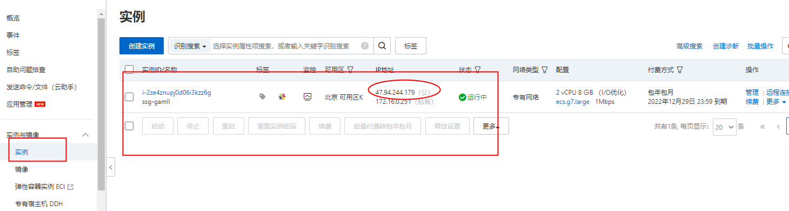
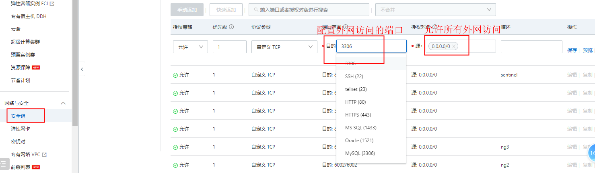
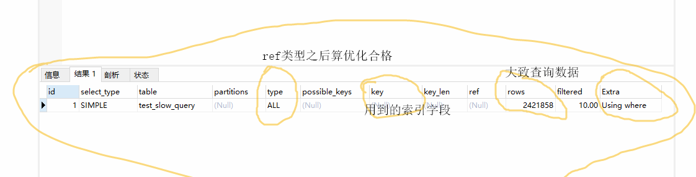
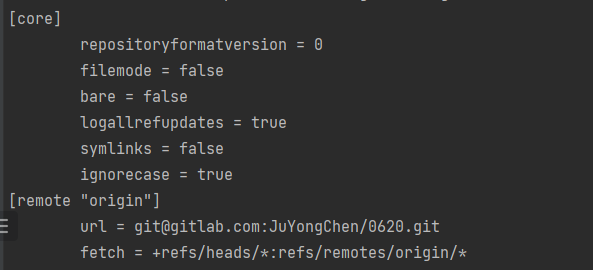
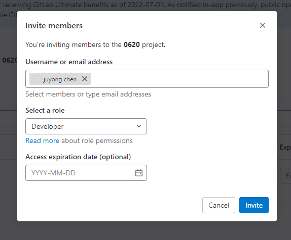
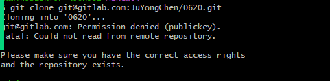

### 一、工作中的用到的工具


#### 阿里云ECS  

* 没有账号，自己可以申请一个账号

* 弹性计算服务

  

##### 	国内使用的各种云排名

* 阿里云
* 腾讯云
* 华为云
* 青云
* 


##### ECS购买




##### 安全组




#### 阿里云RDS


##### RDS

* 阿里云关系型数据库： 提供容灾、备份、恢复、监控全套方案


##### RDS购买


##### <mark>慢查询sql</mark>

* 开启慢查询设置

  * slow_query_log 开启慢查询日志功能  默认是on 开启

  * long_query_time 配置慢查询sql响应时间  大于这个时间的算慢sql

    

* 怎么获取慢日志文件

  * 运维人员(DBA)导出excel文件，文件里面都是慢查询sql，发到专门的一个钉钉群（解决公司慢查询sql群）
  * 主力开发去找我们相应的业务线的sql，我们再测试环境去处理（explain）

* 优化sql

  * 通过explain
  * 
  * 解决办法加索引：alter table test_slow_query add index idx_name(name)
    * 

* 提交sql审批

  * 钉钉审批 
  * yearning平台审批
  * 最终由DBA到阿里云后台去执行sql

  

#### GitLab 

##### 注册一个账号

* 公司私服
  * 运维人员搭建一个gitlab服务

* 关联邮箱
  * 去登录我们的gitlab网站


##### 创建项目

* 技术主管 或者 启动新项目的开发主力
* 

##### 本地项目关联我们远端仓库项目

* 初始化
  * git init

* 关联远端仓库
  * git remote add origin + git@gitlab.com:JuYongChen/0620.git （ gitlab项目仓库地址）
  * 

* 添加本地项目到远端仓库
  *   git add ./  把本地文件存储在暂存区域
  *   git commit -m 'init'  把暂存区域代码发布到git本地仓库  （.git隐藏目录中）
  *   git push origin master  把本地代码推送到gitlab远端仓库


##### Invite members

* 邀请成员加入项目
* 


##### ssh Key

* 为什么要用ssh key拉去代码?
  * 有些公司禁止使用https去拉去 克隆代码， 出去安全考虑
* 克隆代码提示没有权限怎么处理？
  * 
* 执行ssh-keygen.exe
  * /c/Users/admin/.ssh两个文件：
* 配置公钥和私钥
  * 私钥id_rsa 公钥 id_rsa.pub
* 我们把公钥放在ssh key位置即可
  * 
* 配置成功，拉取代码
  * 


##### tag使用

​	

* 每个公司情况不同，根据tag做上线和回滚代码
* 创建一个tag,主要来源是主干分支
  * master 线上分支
  * test/prod   预发分支
  * dev   测试分支

* 通过jenkins上线我们的代码


##### 改变默认分支 删除main分支

* 

​	


##### 线上分支禁止推送代码

* master分支不允许通过 git push 操作推送代码 （规定）
* 


##### Merge Request

* 主干分支禁止使用push操作之后，可以通过merge request进行代码合并

​	


#### <mark>Git</mark>

##### git文件的三种状态

* 已修改
  * 没有和git关联

* 已暂存
  * git add ./操作把文件变成已暂存状态

* 已提交
  * git commit -m '商品详情功能'
  * 提交到本地的一个git仓库


##### git别名

* 我们日后去公司工作，建议使用git命令操作代码

* 配置别名 cat /etc/gitconfig

  * [alias]
        df = diff
        st = status
        co = checkout
        ci = commit
        br = branch
        lga = log --graph --decorate --oneline --simplify-by-decoration --all
        lg = log --color --graph --pretty=format:'%Cred%h%Creset -%C(yellow)%d%Creset %s %Cgreen(%cr) %C(bold blue)<%an>%Creset' --abbrev-commit

  

##### git常用命令以及使用场景

```
开发一个新功能流程: （单点登录模块）
git clone 项目
git co -b + 新分支名称（sso-func）    新建分支并且切换到新建分支上
git ci -am '单点登录功能'  等于 （git add ./  +  git commit -m '单点登录功能'）
git status 查看文件状态（习惯操作 ）
git co dev 切换到dev分支
git merge sso-func
git lg 查看当前提交的记录（习惯操作 ）
git push origin dev
同步部署平台（jenkins,  ci cd）


使用场景：咱们是主力开发了，你手上的项目不止一个。可以先暂存我们目前开发的项目代码，去解决线上其他紧急的问题。
	git stash save ''  暂存我们不想提交到版本记录的代码
	git stash list     查看暂存文件中的内容 （存储结构- 队列）
	git stash pop      弹出你暂存的文件        


  git clean -fd 清楚已修改的文件或者目录(用不好的先暂时不用)
  git diff 查看文件不同
  git log -p  查看代码提交的版本记录
  git branch   查看本地分支
  git branch -a 查看本地和远程所有分支


git revert
git reset
git rebase


```


#### 中午作业

* gitlab 账号申请一个
* git常用命令以及使用场景
* 慢查询sql 从来到没得过程（要会说）


##### 常见面试题 

* git revert 和 git reset 

  * 都可以作为代码回退操作

  * git reset + 版本id  ---  回退版本id之后所有提交的版本记录（删除版本id所有记录）

  * git revert + 版本id --- 回退当前版本id的提交记录，生成一个新的版本记录id（当前版本id逆向操作）

    

    

  * revert 使用

    * 
    * 

  * git reset禁止回退远端代码

    * 会把本地的最新提交版本记录删除，这样的话 本地版本记录落后于远端代码
    * 这样通过reset回退代码之后，git push origin dev会报错误，提示本地代码落后于远端，先要pull代码。


* git rebase

  * 变基操作- 改变基底

  * 禁止在主干分支使用rebase命令：污染我们的主干分支

    * 测试分支
    * 预发分支
    * 线上分支
    * 原来master
      * 

    * rebase1提交进来的master
      * 

    * rebase2分支版本记录
      * 

    * rebase2提交进来的master
      * 

    * 最后的master分支
      * 
      * 在master分支执行 git rebase rebase2发生了什么？
        * 找master分支找rebase2分支的基底（19708f3）
        * 在基底的上面放入rebase2分支提交的版本记录
        * 把rebase2分支提交的版本记录的上面的所有提交版本记录删除，并且生成新的提交版本记录

    

  

* Git 冲突解决

  * 
  * 
  * 冲突解决：
    * 首先遇到错误，我们通过git status查看冲突代码都有哪些
    * 和冲突代码的当事人，我们该了相同的代码，商量之后，把<<Head  == >>>删除掉，并且修改原有的代码。
    * 冲突解决之后，git commit -m '冲突解决', 最后提交代码：git push origin dev


#### Potainer 

##### 介绍

* 可视化docker操作工具，可以不用写docker命令实现容器的管理


##### 创建镜像


##### 创建容器


#### docker基本操作

* docker pull 拉去镜像

* docker images 查看镜像

* docker ps  查看容器

* docker logs 

* docker run -d 后台运行   -p 端口映射 80:80  --restart=always -v  /etc/mysql/conf:/usr/local/conf 数据卷挂在  -name mysql 设置新的容器的名称 mysql:8.0

* docker start 

* docker stop

  


#### grafana

* 线上监控平台： 接口的响应时间和接口的响应次数

* 

  


#### bug平台

* 较新：Jira  gitee

* 老牌：禅道  mantis

  


#### Github,baidu, google 

* 工作中一直都用的，善于使用这些免费的工具

* Github 号称全球最大的交友网站

* 科学上网：https://github.com/bannedbook/fanqiang

* 要善于总结

  

  

### 二、工作流程

#### 产品提需求

* Prd  producet requirement document 产品需求文档


#### 评审会

* 钉钉通知大家开会  - 人员都有哪些？
  * 后端主力java
  * 前端妹子
  * 测试妹子
  * ui小姐姐
  * 产品经理

* 产品目的？
  * 产品排期：什么时候上测试、预发、线上

* 开完评审会不要着急给排期，一般什么时候给排期？
  * 2周以内的开发时间，当天下班前给到排期。
  * 大型项目 -一个月以上开发时间，建议2天左右在给排期。


#### 开发

* 后端：
  * 设计数据结构 -  字段定义规范
  * 设计接口文档 --  一定好设计好，尽量不要返工
  * model 映射表结构 和vo 输出给前端定义字段
  * controller ,  interface, impl实现类写假接口，测试用例
  * 写具体的业务逻辑

* 前端：
  *  静态页面
  *  根据接口文档写js(操作dom)

* 测试:
  * 冒烟测试用例 - 满足需求的基本功能跑通

* UI: 美化页面
* 合作：
  * 前后端联调代码
  * 我们要跑通冒烟测试用例才能提测代码


#### 代码审查

* 谁来做代码审查？

  * 技术主管code review代码
  * 组员内互相review 

  

#### 提测 

* 提测分支？

  * dev

  * test

  * master  线上无bug

* 谁来测试代码质量？

  * 测试和产品经理

  


#### 上线&监控

* kibana 查看线上日志
* 阿里云平台
* grafana

​	


#### 线上有bug，二次上线

* 新建hotfix-sso分支

* 最终提交审批上线


### 