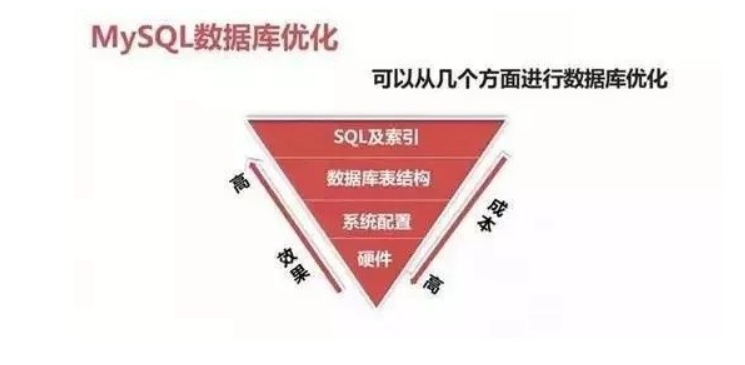
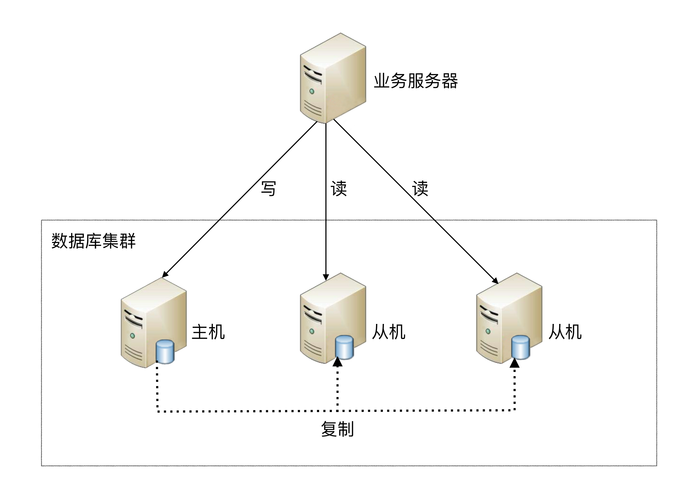
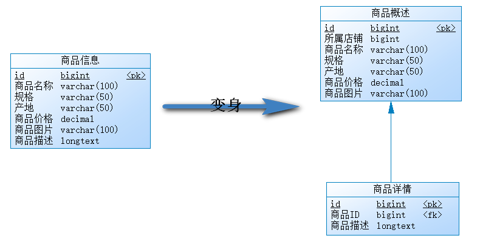
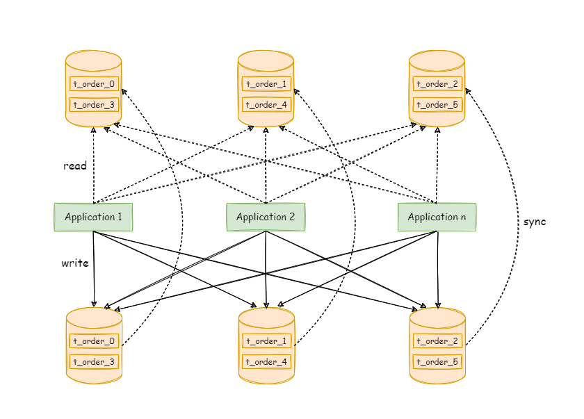
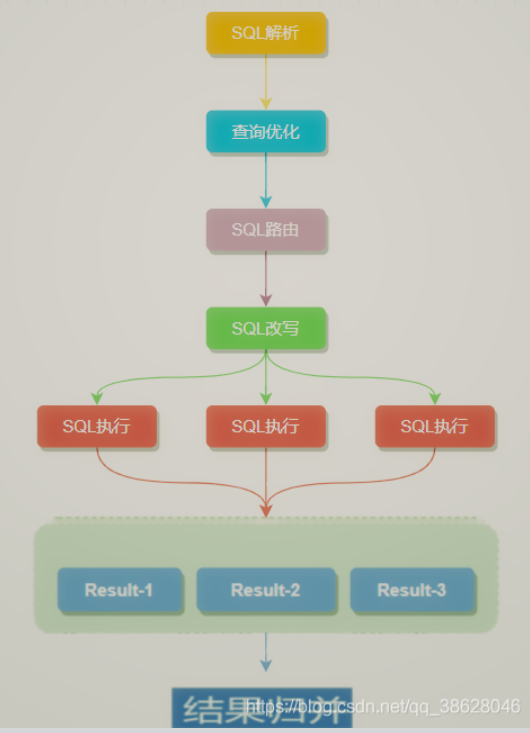
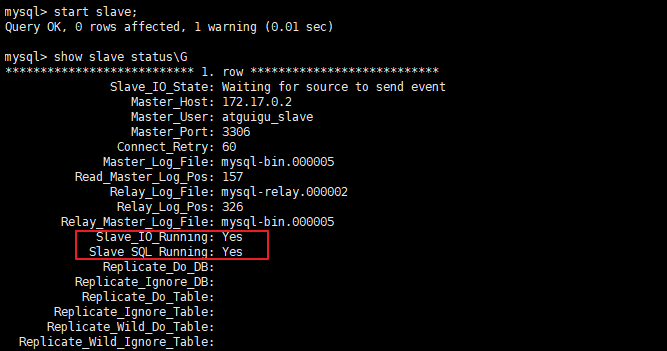

------
#ShardingSphere
# 优化的维度



**硬件： ** CPU、内存、存储、网络设备等

**系统配置：** 服务器系统、数据库服务参数等

**数据库表结构：** 高可用、分库分表、读写分离、存储引擎、表设计等

**Sql及索引：** sql语句、索引使用等

- 从优化成本进行考虑：硬件>系统配置>数据库表结构>SQL及索引
- 从优化效果进行考虑：硬件<系统配置<数据库表结构<SQL及索引

优化工具：

```
mysqldumpslow  重点
explian	重点
```

**应急调优的思路：**

针对突然的业务办理卡顿，无法进行正常的业务处理！需要立马解决的场景！

1.  show processlist（查看链接session状态）

2.  explain(分析查询计划)，show index from table（分析索引）

3.  通过执行计划判断，索引问题（有没有、合不合理）或者语句本身问题

4.  show status like '%lock%'; # 查询锁状态

5.  SESSION_ID; # 杀掉有问题的session

   

**常规调优的思路：**

针对业务周期性的卡顿，例如在每天10-11点业务特别慢，但是还能够使用，过了这段时间就好了。

1.  查看slowlog，分析slowlog，分析出查询慢的语句。
2.  按照一定优先级，进行一个一个的排查所有慢语句。
3.  分析top sql，进行explain调试，查看语句执行时间。
4.  调整索引或语句本身。

# 第01章 高性能架构模式

​	假如我们现在是一个初创公司，现在注册用户就 30万，每天活跃用户就 1 万，每天单表数据量就 1000，然后高峰期每秒钟并发请求最多就 10。这种系统基本上没有并发。

​	假如业务发展迅猛，过了几个月，注册用户数达到了 2000 万！每天活跃用户数 100 万！每天单表数据量 10 万条！高峰期每秒最大请求达到 1000！好吧，没事，现在大家感觉压力已经有点大了，为啥呢？因为每天多 10 万条数据，一个月就多 300 万条数据，现在单表已经几百万数据了，马上就破千万了。但是勉强还能撑着。高峰期请求现在是 1000，线上部署了几台机器，负载均衡分担压力，数据库撑 1000QPS 也还凑合。但是现在开始感觉有点担心了，接下来咋整呢......

​	再接下来几个月，，公司用户数已经达到 1 亿，公司继续融资几十亿人民币！公司估值达到了惊人的几十亿美金，成为了国内今年最牛X的明星创业公司！我们太幸运了。但是我们同时也是不幸的，因为此时每天活跃用户数上千万，每天单表新增数据多达 50 万，目前一个表总数据量都已经达到了两三千万了！数据库磁盘容量不断消耗掉！高峰期并发达到惊人的 5000~8000！你的系统支撑不到现在，已经挂掉了！

​	好吧，所以你看到这里差不多就理解分库分表是怎么回事儿了，实际上这是跟着你的公司业务发展走的，你公司业务发展越好，用户就越多，数据量越大，请求量越大，那单个数据库一定扛不住。	

​	**分库分表**是为了解决由于数据量过大而导致数据库性能降低的问题，将原来独立的数据库拆分成若干数据库组成，将数据大表拆分成若干数据表组成，使得单一数据库、单一数据表的数据量变小，从而达到提升数据库性能的目的。	

互联网业务兴起之后，海量用户加上海量数据的特点，单个数据库服务器已经难以满足业务需要，必须考虑数据库集群的方式来提升性能。高性能数据库集群的`第一种方式是“读写分离”`，`第二种方式是“数据库分片”`。


## 1、读写分离架构

**读写分离原理：**读写分离的基本原理是将数据库读写操作分散到不同的节点上，下面是其基本架构图：



**读写分离的基本实现：**

-  `主库负责处理事务性的增删改操作，从库负责处理查询操作`，能够有效的避免由数据更新导致的行锁，使得整个系统的查询性能得到极大的改善。
-  读写分离是`根据 SQL 语义的分析`，`将读操作和写操作分别路由至主库与从库`。
-  通过`一主多从`的配置方式，可以将查询请求均匀的分散到多个数据副本，能够进一步的提升系统的处理能力。 
-  使用`多主多从`的方式，不但能够提升系统的吞吐量，还能够提升系统的可用性，可以达到在任何一个数据库宕机，甚至磁盘物理损坏的情况下仍然不影响系统的正常运行。


**下图展示了根据业务需要，将用户表的写操作和读操路由到不同的数据库的方案：**


**CAP 理论：**

CAP 定理（CAP theorem）又被称作布鲁尔定理（Brewer's theorem），是加州大学伯克利分校的计算机科学家埃里克·布鲁尔（Eric Brewer）在 2000 年的 ACM PODC 上提出的一个猜想。`对于设计分布式系统的架构师来说，CAP 是必须掌握的理论。`


在一个`分布式系统中`，当涉及读写操作时，只能保证一致性（Consistence）、可用性（Availability）、分区容错性（Partition Tolerance）三者中的两个，另外一个必须被牺牲。

- C 一致性（Consistency）：对某个指定的客户端来说，读操作保证能够返回最新的写操作结果
- A 可用性（Availability）：非故障的节点在合理的时间内返回合理的响应`（不是错误和超时的响应）`
- P 分区容忍性（Partition Tolerance）：当出现网络分区后`（可能是丢包，也可能是连接中断，还可能是拥塞）`，系统能够继续“履行职责”


**CAP特点：**

- 在实际设计过程中，每个系统不可能只处理一种数据，而是包含多种类型的数据，`有的数据必须选择 CP，有的数据必须选择 AP，分布式系统理论上不可能选择 CA 架构。`

  

  - CP：如下图所示，`为了保证一致性`，当发生分区现象后，N1 节点上的数据已经更新到 y，但由于 N1 和 N2 之间的复制通道中断，数据 y 无法同步到 N2，N2 节点上的数据还是 x。`这时客户端 C 访问 N2 时，N2 需要返回 Error，提示客户端 C“系统现在发生了错误”，`这种处理方式`违背了可用性`（Availability）的要求，因此 CAP 三者只能满足 CP。

  

  

  - AP：如下图所示，`为了保证可用性`，当发生分区现象后，N1 节点上的数据已经更新到 y，但由于 N1 和 N2 之间的复制通道中断，数据 y 无法同步到 N2，N2 节点上的数据还是 x。`这时客户端 C 访问 N2 时，N2 将当前自己拥有的数据 x 返回给客户端 C 了`，而实际上当前最新的数据已经是 y 了，这就`不满足一致性`（Consistency）的要求了，因此 CAP 三者只能满足 AP。注意：这里 N2 节点返回 x，虽然不是一个“正确”的结果，但是一个“合理”的结果，因为 x 是旧的数据，并不是一个错乱的值，只是不是最新的数据而已。


- CAP 理论中的 `C 在实践中是不可能完美实现的`，在数据复制的过程中，节点N1 和节点 N2 的数据并不一致（强一致性）。即使无法做到`强一致性`，但应用可以采用适合的方式达到`最终一致性`。具有如下特点：

  - 基本可用（Basically Available）：分布式系统在出现故障时，允许损失部分可用性，即保证核心可用。
  - 软状态（Soft State）：允许系统存在中间状态，而该中间状态不会影响系统整体可用性。这里的中间状态就是 CAP 理论中的数据不一致。
  - `最终一致性（Eventual Consistency）：系统中的所有数据副本经过一定时间后，最终能够达到一致的状态。`


## 2、数据库分片架构

**读写分离的问题：**

读写分离分散了数据库读写操作的压力，但没有分散存储压力，为了满足业务数据存储的需求，就需要`将存储分散到多台数据库服务器上`。

**数据分片：**

将存放在单一数据库中的数据分散地存放至多个数据库或表中，以达到提升性能瓶颈以及可用性的效果。 数据分片的有效手段是对关系型数据库进行`分库和分表`。数据分片的拆分方式又分为`垂直分片和水平分片`。


### 2.1、垂直分片

**垂直分库：**

`按照业务拆分的方式称为垂直分片，又称为纵向拆分`，它的核心理念是专库专用。 在拆分之前，一个数据库由多个数据表构成，每个表对应着不同的业务。而拆分之后，则是按照业务将表进行归类，分布到不同的数据库中，从而将压力分散至不同的数据库。 


下图展示了根据业务需要，将用户表和订单表垂直分片到不同的数据库的方案：


​	

垂直拆分可以缓解数据量和访问量带来的问题，但无法根治。`如果垂直拆分之后，表中的数据量依然超过单节点所能承载的阈值，则需要水平分片来进一步处理。`


**垂直分表：**

`垂直分表适合将表中某些不常用的列，或者是占了大量空间的列拆分出去。`

用户在电商平台流览商品时，首先看到的是商品的基本信息，如果对该商品感兴趣时才会继续查看该商品的详细描述。因此，商品基本信息的访问频次要高于商品详细描述信息，商品基本信息的访问效率要高于商品详细描述信息(大字段)。	由于这两种数据的特性不一样，因此考虑将商品信息表拆分如下：




假设我们是一个婚恋网站，用户在筛选其他用户的时候，主要是用 age 和 sex 两个字段进行查询，而 nickname 和 description 两个字段主要用于展示，一般不会在业务查询中用到。description 本身又比较长，因此我们可以将这两个字段独立到另外一张表中，这样在查询 age 和 sex 时，就能带来一定的性能提升。

垂直分表引入的复杂性主要体现在表操作的数量要增加。例如，原来只要一次查询就可以获取 name、age、sex、nickname、description，现在需要两次查询，一次查询获取 name、age、sex，另外一次查询获取 nickname、description。


`水平分表适合表行数特别大的表，水平分表属于水平分片`。


### 2.2、水平分片

`水平分片又称为横向拆分。` 相对于垂直分片，它不再将数据根据业务逻辑分类，而是通过某个字段（或某几个字段-分片键），根据某种规则将数据分散至多个库或表中，每个分片仅包含数据的一部分。 例如：根据主键分片，偶数主键的记录放入 0 库（或表），奇数主键的记录放入 1 库（或表），如下图所示。


`单表进行切分后，是否将多个表分散在不同的数据库服务器中，可以根据实际的切分效果来确定。`

- **水平分表：**单表切分为多表后，新的表即使在同一个数据库服务器中，也可能带来可观的性能提升，如果性能能够满足业务要求，可以不拆分到多台数据库服务器，毕竟业务分库也会引入很多复杂性；

- **水平分库：**如果单表拆分为多表后，单台服务器依然无法满足性能要求，那就需要将多个表分散在不同的数据库服务器中。


> **阿里巴巴Java开发手册：**
>
> 【推荐】单表行数超过 500 万行或者单表容量超过 2GB，才推荐进行分库分表。
>
> 说明：如果预计三年后的数据量根本达不到这个级别，`请不要在创建表时就分库分表`。


## 3、读写分离和数据分片架构

 下图展现了将数据分片与读写分离一同使用时，应用程序与数据库集群之间的复杂拓扑关系。

###### 


## 4、实现方式

读写分离和数据分片具体的实现方式一般有两种：  `程序代码封装`和`中间件封装`。


### 4.1、程序代码封装

程序代码封装指在代码中抽象一个`数据访问层（或中间层封装）`，实现读写操作分离和数据库服务器连接的管理。

**其基本架构是：**以读写分离为例


### 4.2、中间件封装

中间件封装指的是`独立一套系统出来`，实现读写操作分离和数据库服务器连接的管理。对于业务服务器来说，访问中间件和访问数据库没有区别，在业务服务器看来，中间件就是一个数据库服务器。

**基本架构是：**以读写分离为例


### 4.3、常用解决方案

Apache Shard8 ingSphere（程序级别和中间件级别）

MyCat（数据库中间件） 


# 第02章 ShardingSphere
#ShardingSphere
## 1、简介

官网：https://shardingsphere.apache.org/index_zh.html

文档：https://shardingsphere.apache.org/document/5.1.1/cn/overview/

Apache ShardingSphere 由 JDBC、Proxy 和 Sidecar（规划中）这 3 款既能够独立部署，又支持混合部署配合使用的产品组成。 


## 2、ShardingSphere-JDBC

**程序代码封装**

定位为轻量级 Java 框架，`在 Java 的 JDBC 层提供的额外服务`。 它使用客户端直连数据库，`以 jar 包形式提供服务`，无需额外部署和依赖，可理解为增强版的 JDBC 驱动，完全兼容 JDBC 和各种 ORM 框架。


当Sharding-JDBC接受到一条SQL语句时，会陆续执行 SQL解析 => 查询优化 => SQL路由 => SQL改写 => SQL执行 =>结果归并 ，最终返回执行结果。



## 3、ShardingSphere-Proxy

**中间件封装**

定位为透明化的`数据库代理端`，提供封装了数据库二进制协议的服务端版本，用于完成对异构语言的支持。 目前提供 MySQL 和 PostgreSQL版本，它可以使用任何兼容 MySQL/PostgreSQL 协议的访问客户端（如：MySQL Command Client, MySQL Workbench, Navicat 等）操作数据，对 DBA 更加友好。


# 第03章 MySQL主从同步

## 1、MySQL主从同步原理
[[MySQL主从同步原理]]


**基本原理：**

slave会从master读取binlog来进行数据同步

**具体步骤：**

- `step1：`master将数据改变记录到`二进制日志（binary log）`中。
- `step2：` 当slave上执行 `start slave` 命令之后，slave会创建一个 `IO 线程`用来连接master，请求master中的binlog。
- `step3：`当slave连接master时，master会创建一个 `log dump 线程`，用于发送 binlog 的内容。在读取 binlog 的内容的操作中，会对主节点上的 binlog 加锁，当读取完成并发送给从服务器后解锁。
- `step4：`IO 线程接收主节点 binlog dump 进程发来的更新之后，保存到 `中继日志（relay log）` 中。
- `step5：`slave的`SQL线程`，读取relay log日志，并解析成具体操作，从而实现主从操作一致，最终数据一致。


## 2、一主多从配置
[[MySQL一主多从配置]]
docker镜像相关命令：

```shell
docker search 镜像名称;
docker pull 镜像:版本;
docker images; #查询本地镜像列表
docker rmi 镜像名称/Id; #删除镜像
```

docker容器相关命令：

```shell
docker ps -a;  #查询本地正在运行/全部 容器列表
docker run -d --name=容器名称  -p 宿主机端口:容器内部服务端口  -e 环境变量 镜像:版本;
docker stop/start/restart 容器ID/容器名称 容器ID/容器名称 容器ID/容器名称;
docker rm 容器ID/容器名称 容器ID/容器名称;
```

服务器规划：使用`docker`方式创建，`主从服务器IP一致，端口号不一致`


- 主服务器：容器名`atguigu-mysql-master`，端口`3306`  **注意：将以前RPM安装Mysql服务停止**
- 从服务器：容器名`atguigu-mysql-slave1`，端口`3307`
- 从服务器：容器名`atguigu-mysql-slave2`，端口`3308`

**注意：**如果此时防火墙是开启的，`则先关闭防火墙，并重启docker`，否则后续安装的MySQL无法启动

 ```shell
 #关闭docker
 systemctl stop docker
 #关闭防火墙
 systemctl stop firewalld
 #启动docker
 systemctl start docker
 ```


### 2.1、准备主服务器

- **step1：在docker中创建并启动MySQL主服务器：**`端口3306`

```shell
docker run -d \
-p 3306:3306 \
-v /atguigu/mysql/master/conf:/etc/mysql/conf.d \
-v /atguigu/mysql/master/data:/var/lib/mysql \
-e MYSQL_ROOT_PASSWORD=123456 \
--name atguigu-mysql-master \
mysql:8.0.29
```


- **step2：创建MySQL主服务器配置文件：** 

默认情况下MySQL的binlog日志是自动开启的，可以通过如下配置定义一些可选配置

```shell
vim /atguigu/mysql/master/conf/my.cnf
```

配置如下内容

```properties
[mysqld]
# 服务器唯一id，默认值1
server-id=1
# 设置日志格式，默认值ROW
binlog_format=STATEMENT
# 二进制日志名，默认binlog
# log-bin=binlog
# 设置需要复制的数据库，默认复制全部数据库
#binlog-do-db=mytestdb
# 设置不需要复制的数据库
#binlog-ignore-db=mysql
#binlog-ignore-db=infomation_schema
```

重启MySQL容器

```shell
docker restart atguigu-mysql-master
```


`binlog格式说明：`

- binlog_format=STATEMENT：日志记录的是主机数据库的`写指令`，性能高，但是now()之类的函数以及获取系统参数的操作会出现主从数据不同步的问题。
- binlog_format=ROW（默认）：日志记录的是主机数据库的`写后的数据`，批量操作时性能较差，解决now()或者  user()或者  @@hostname 等操作在主从机器上不一致的问题。
- binlog_format=MIXED：是以上两种level的混合使用，有函数用ROW，没函数用STATEMENT，但是无法识别系统变量


`binlog-ignore-db和binlog-do-db的优先级问题：`


- **step3：使用命令行登录MySQL主服务器：**

```shell
#进入容器：env LANG=C.UTF-8 避免容器中显示中文乱码
docker exec -it atguigu-mysql-master env LANG=C.UTF-8 /bin/bash
#进入容器内的mysql命令行
mysql -uroot -p
#修改默认密码校验方式
ALTER USER 'root'@'%' IDENTIFIED WITH mysql_native_password BY '123456';
```


- **step4：主机中创建slave用户：**

```sql
-- 创建slave用户
CREATE USER 'atguigu_slave'@'%';
-- 设置密码
ALTER USER 'atguigu_slave'@'%' IDENTIFIED WITH mysql_native_password BY '123456';
-- 授予复制权限
GRANT REPLICATION SLAVE ON *.* TO 'atguigu_slave'@'%';
-- 刷新权限
FLUSH PRIVILEGES;
```


- **step5：主机中查询master状态：**

执行完此步骤后`不要再操作主服务器MYSQL`，防止主服务器状态值变化

```sql
SHOW MASTER STATUS;
```

记下`File`和`Position`的值。执行完此步骤后不要再操作主服务器MYSQL，防止主服务器状态值变化。


### 2.2、准备从服务器

**两台从节点**安装以下方式配置多台从机slave1、slave2...，这里以配置slave1为例

- **step1：在docker中创建并启动MySQL从服务器：**`端口3307`

```shell
docker run -d \
-p 3307:3306 \
-v /atguigu/mysql/slave1/conf:/etc/mysql/conf.d \
-v /atguigu/mysql/slave1/data:/var/lib/mysql \
-e MYSQL_ROOT_PASSWORD=123456 \
--name atguigu-mysql-slave1 \
mysql:8.0.29
```


- **step2：创建MySQL从服务器配置文件：** 

```shell
vim /atguigu/mysql/slave1/conf/my.cnf
```

配置如下内容：

```properties
[mysqld]
#服务器唯一id，每台服务器的id必须不同，如果配置其他从机，注意修改id
server-id=2
#中继日志名，默认xxxxxxxxxxxx-relay-bin
#relay-log=relay-bin
```

重启MySQL容器

```shell
docker restart atguigu-mysql-slave1
```


- **step3：使用命令行登录MySQL从服务器：**

```shell
#进入容器：
docker exec -it atguigu-mysql-slave1 env LANG=C.UTF-8 /bin/bash
#进入容器内的mysql命令行
mysql -uroot -p
#修改默认密码校验方式
ALTER USER 'root'@'%' IDENTIFIED WITH mysql_native_password BY '123456';
```


- **step4：在从机上配置主从关系：**

在**从机**上执行以下SQL操作

```sql
CHANGE MASTER TO MASTER_HOST='192.168.100.102', 
MASTER_USER='atguigu_slave',MASTER_PASSWORD='123456', MASTER_PORT=3306,
MASTER_LOG_FILE='binlog.000002',MASTER_LOG_POS=1357; 
```


### 2.3、启动主从同步

启动从机的复制功能，执行SQL：

```sql
START SLAVE;
-- 查看状态（不需要分号）
SHOW SLAVE STATUS\G
```


**两个关键进程：**下面两个参数都是Yes，则说明主从配置成功！




### 2.4、实现主从同步

在主机中执行以下SQL，在从机中查看数据库、表和数据是否已经被同步

```sql
CREATE DATABASE db_user;
USE db_user;
CREATE TABLE t_user (
 id BIGINT AUTO_INCREMENT,
 uname VARCHAR(30),
 PRIMARY KEY (id)
);
INSERT INTO t_user(uname) VALUES('zhang3');
INSERT INTO t_user(uname) VALUES(@@hostname);
```


### 2.5、停止和重置

需要的时候，可以使用如下SQL语句

```sql
-- 在从机上执行。功能说明：停止I/O 线程和SQL线程的操作。
stop slave; 

-- 在从机上执行。功能说明：用于删除SLAVE数据库的relaylog日志文件，并重新启用新的relaylog文件。
reset slave;

-- 在主机上执行。功能说明：删除所有的binglog日志文件，并将日志索引文件清空，重新开始所有新的日志文件。
-- 用于第一次进行搭建主从库时，进行主库binlog初始化工作；
reset master;
```


### **2.6、常见问题**

#### 问题1

启动主从同步后，常见错误是`Slave_IO_Running： No 或者 Connecting` 的情况，此时查看下方的 `Last_IO_ERROR`错误日志，根据日志中显示的错误信息在网上搜索解决方案即可


**典型的错误例如：**`Last_IO_Error: Got fatal error 1236 from master when reading data from binary log: 'Client requested master to start replication from position > file size'`

**解决方案：**

```sql
-- 在从机停止slave
SLAVE STOP;

-- 在主机查看mater状态
SHOW MASTER STATUS;
-- 在主机刷新日志
FLUSH LOGS;
-- 再次在主机查看mater状态（会发现File和Position发生了变化）
SHOW MASTER STATUS;
-- 修改从机连接主机的SQL，并重新连接即可
```


#### 问题2

启动docker容器后提示 `WARNING: IPv4 forwarding is disabled. Networking will not work.`


此错误，虽然不影响主从同步的搭建，但是如果想从远程客户端通过以下方式连接docker中的MySQL则没法连接

```shell
C:\Users\administrator>mysql -h 192.168.100.102 -P 3306 -u root -p
```

**解决方案：**

```shell
#修改配置文件：
vim /usr/lib/sysctl.d/00-system.conf
#追加
net.ipv4.ip_forward=1
#接着重启网络
systemctl restart network
```


# 第04章 ShardingSphere-JDBC读写分离

## 1、创建SpringBoot程序

### 1.1、创建项目

项目类型：Spring Initializr

SpringBoot脚手架：http://start.aliyun.com

项目名：sharding-jdbc-demo

SpringBoot版本：2.3.7.RELEASE

开发步骤：前提本地Maven环境没有问题（idea全局配置）

- 创建Maven项目
- 导入相关依赖：springboot-parent，spring-boot-starter-xxx,mybatisPlus-xxx-starter,shardingjdbc
- 创建配置类/启动类
- 创建配置文件：application.properties，application.yml
- 搭建MP，Shardingjdbc环境
  - 配置文件中数据源-配置多个数据源
  - 配置读写分离策略
- 创建对应实体类
- 创建持久层Mapper接口 
- 创建业务层Service
- 创建web层Controller
- 完成注入
- 按照接口文档开发

### 1.2、添加依赖

```xml
<parent>
    <groupId>org.springframework.boot</groupId>
    <artifactId>spring-boot-starter-parent</artifactId>
    <version>2.3.7.RELEASE</version>
</parent>
<dependencies>
    <dependency>
        <groupId>org.springframework.boot</groupId>
        <artifactId>spring-boot-starter-web</artifactId>
    </dependency>

    <dependency>
        <groupId>org.apache.shardingsphere</groupId>
        <artifactId>shardingsphere-jdbc-core-spring-boot-starter</artifactId>
        <version>5.1.1</version>
    </dependency>

    <dependency>
        <groupId>mysql</groupId>
        <artifactId>mysql-connector-java</artifactId>
        <scope>runtime</scope>
    </dependency>

    <dependency>
        <groupId>com.baomidou</groupId>
        <artifactId>mybatis-plus-boot-starter</artifactId>
        <version>3.3.1</version>
    </dependency>

    <dependency>
        <groupId>org.projectlombok</groupId>
        <artifactId>lombok</artifactId>
        <optional>true</optional>
    </dependency>

    <dependency>
        <groupId>org.springframework.boot</groupId>
        <artifactId>spring-boot-starter-test</artifactId>
        <scope>test</scope>
        <exclusions>
            <exclusion>
                <groupId>org.junit.vintage</groupId>
                <artifactId>junit-vintage-engine</artifactId>
            </exclusion>
        </exclusions>
    </dependency>
</dependencies>
```

启动类

```java
package com.atguigu;

import org.springframework.boot.SpringApplication;
import org.springframework.boot.autoconfigure.SpringBootApplication;

/**
 * @author: itheima
 * @create: 2022-10-26 11:26
 */
@SpringBootApplication
public class ShardingJDBCDemoApp {

    public static void main(String[] args) {
        SpringApplication.run(ShardingJDBCDemoApp.class, args);
    }
}

```


### 1.3、创建实体类

```java
package com.atguigu.shardingjdbcdemo.entity;

@TableName("t_user")
@Data
public class User {
    @TableId(type = IdType.AUTO)
    private Long id;
    private String uname;
}
```


### 1.4、创建Mapper

```java
package com.atguigu.shardingjdbcdemo.mapper;

@Mapper
public interface UserMapper extends BaseMapper<User> {
}
```


### 1.5、配置读写分离

application.properties：

```properties
# 配置真实数据源
spring.shardingsphere.datasource.names=master,slave1,slave2

# 配置第 1 个数据源
spring.shardingsphere.datasource.master.type=com.zaxxer.hikari.HikariDataSource
spring.shardingsphere.datasource.master.driver-class-name=com.mysql.cj.jdbc.Driver
spring.shardingsphere.datasource.master.jdbc-url=jdbc:mysql://192.168.100.102:3306/db_user
spring.shardingsphere.datasource.master.username=root
spring.shardingsphere.datasource.master.password=123456

# 配置第 2 个数据源 从节点1
spring.shardingsphere.datasource.slave1.type=com.zaxxer.hikari.HikariDataSource
spring.shardingsphere.datasource.slave1.driver-class-name=com.mysql.cj.jdbc.Driver
spring.shardingsphere.datasource.slave1.jdbc-url=jdbc:mysql://192.168.100.102:3307/db_user
spring.shardingsphere.datasource.slave1.username=root
spring.shardingsphere.datasource.slave1.password=123456


# 配置第3 个数据源 从节点1
spring.shardingsphere.datasource.slave2.type=com.zaxxer.hikari.HikariDataSource
spring.shardingsphere.datasource.slave2.driver-class-name=com.mysql.cj.jdbc.Driver
spring.shardingsphere.datasource.slave2.jdbc-url=jdbc:mysql://192.168.100.102:3308/db_user
spring.shardingsphere.datasource.slave2.username=root
spring.shardingsphere.datasource.slave2.password=123456


# 读写分离类型，如: Static，Dynamic
spring.shardingsphere.rules.readwrite-splitting.data-sources.myds.type=Static
# 写数据源名称
spring.shardingsphere.rules.readwrite-splitting.data-sources.myds.props.write-data-source-name=master
# 读数据源名称，多个从数据源用逗号分隔
spring.shardingsphere.rules.readwrite-splitting.data-sources.myds.props.read-data-source-names=slave1,slave2

# 负载均衡算法名称
spring.shardingsphere.rules.readwrite-splitting.data-sources.myds.load-balancer-name=alg_random

#负载均衡算法配置 提供给上面使用，使用名称即可
#负载均衡算法类型
spring.shardingsphere.rules.readwrite-splitting.load-balancers.alg_round.type=ROUND_ROBIN
spring.shardingsphere.rules.readwrite-splitting.load-balancers.alg_random.type=RANDOM
spring.shardingsphere.rules.readwrite-splitting.load-balancers.alg_weight.type=WEIGHT
spring.shardingsphere.rules.readwrite-splitting.load-balancers.alg_weight.props.slave1=1
spring.shardingsphere.rules.readwrite-splitting.load-balancers.alg_weight.props.slave2=2


# 打印SQl
spring.shardingsphere.props.sql-show=true
```


## 2、测试

### 2.1、读写分离测试

```java
package com.atguigu.shardingjdbcdemo;

@SpringBootTest
class ReadwriteTest {

    @Autowired
    private UserMapper userMapper;

    /**
     * 写入数据的测试
     */
    @Test
    public void testInsert(){

        User user = new User();
        user.setUname("张三丰");
        userMapper.insert(user);
    }

}
```


### 2.2、事务测试

为了保证主从库间的事务一致性，避免跨服务的分布式事务，ShardingSphere-JDBC的`主从模型中，事务中的数据读写均用主库`。

 * 不添加@Transactional：insert对主库操作，select对从库操作
 * 添加@Transactional：则insert和select均对主库操作
 * **注意：**在JUnit环境下的@Transactional注解，默认情况下就会对事务进行回滚（即使在没加注解@Rollback，也会对事务回滚）

```java
/**
     * 事务测试
     */
@Transactional//开启事务
@Test
public void testTrans(){

    User user = new User();
    user.setUname("铁锤");
    userMapper.insert(user);

    List<User> users = userMapper.selectList(null);
}
```


### 2.3、负载均衡测试

```java
/**
     * 读数据测试
     */
@Test
public void testSelectAll(){
    List<User> users = userMapper.selectList(null);
    List<User> users = userMapper.selectList(null);//执行第二次测试负载均衡
    users.forEach(System.out::println);
}

```


也可以在web请求中测试负载均衡

```java
package com.atguigu.shardingjdbcdemo.controller;

@RestController
@RequestMapping("/userController")
public class UserController {

    @Autowired
    private UserMapper userMapper;

    /**
     * 测试负载均衡策略
     */
    @GetMapping("selectAll")
    public void selectAll(){
        List<User> users = userMapper.selectList(null);
        users.forEach(System.out::println);
    }
}
```

# 第05章 ShardingSphere-JDBC垂直分片

## 1、准备服务器

服务器规划：使用`docker`方式创建如下容器


- 服务器：容器名`server-user`，端口`3301`

- 服务器：容器名`server-order`，端口`3302`

  

### 1.1、创建server-user容器

- **step1：创建容器：**

```shell
docker run -d \
-p 3301:3306 \
-v /atguigu/server/user/conf:/etc/mysql/conf.d \
-v /atguigu/server/user/data:/var/lib/mysql \
-e MYSQL_ROOT_PASSWORD=123456 \
--name server-user \
mysql:8.0.29
```


- **step2：登录MySQL服务器：**

```shell
#进入容器：
docker exec -it server-user env LANG=C.UTF-8 /bin/bash
#进入容器内的mysql命令行
mysql -uroot -p
#修改默认密码插件
ALTER USER 'root'@'%' IDENTIFIED WITH mysql_native_password BY '123456';
```


- **step3：创建数据库：**

```sql
CREATE DATABASE db_user;
USE db_user;
CREATE TABLE t_user (
 id BIGINT AUTO_INCREMENT,
 uname VARCHAR(30),
 PRIMARY KEY (id)
);
```


### 1.2、创建server-order容器

- **step1：创建容器：**

```shell
docker run -d \
-p 3302:3306 \
-v /atguigu/server/order/conf:/etc/mysql/conf.d \
-v /atguigu/server/order/data:/var/lib/mysql \
-e MYSQL_ROOT_PASSWORD=123456 \
--name server-order \
mysql:8.0.29
```


- **step2：登录MySQL服务器：**

```shell
#进入容器：
docker exec -it server-order env LANG=C.UTF-8 /bin/bash
#进入容器内的mysql命令行
mysql -uroot -p
#修改默认密码插件
ALTER USER 'root'@'%' IDENTIFIED WITH mysql_native_password BY '123456';
```


- **step3：创建数据库：**

```sql
CREATE DATABASE db_order;
USE db_order;
CREATE TABLE t_order (
  id BIGINT AUTO_INCREMENT,
  order_no VARCHAR(30),
  user_id BIGINT,
  amount DECIMAL(10,2),
  PRIMARY KEY(id) 
);
```


## 2、程序实现

### 2.1、创建实体类

```java
package com.atguigu.shardingjdbcdemo.entity;

@TableName("t_order")
@Data
public class Order {
    @TableId(type = IdType.AUTO)
    private Long id;
    private String orderNo;
    private Long userId;
    private BigDecimal amount;
}
```


### 2.2、创建Mapper

```java
package com.atguigu.shardingjdbcdemo.mapper;

@Mapper
public interface OrderMapper extends BaseMapper<Order> {
}
```


### 2.3、配置垂直分片

```properties
#B加树 应用名称
spring.application.name=sharding-jdbc-demo
#环境设置
spring.profiles.active=dev

#配置真实数据源
spring.shardingsphere.datasource.names=server-user,server-order

#配置第 1 个数据源
spring.shardingsphere.datasource.server-user.type=com.zaxxer.hikari.HikariDataSource
spring.shardingsphere.datasource.server-user.driver-class-name=com.mysql.jdbc.Driver
spring.shardingsphere.datasource.server-user.jdbc-url=jdbc:mysql://192.168.100.102:3301/db_user
spring.shardingsphere.datasource.server-user.username=root
spring.shardingsphere.datasource.server-user.password=123456

# 配置第 2 个数据源
spring.shardingsphere.datasource.server-order.type=com.zaxxer.hikari.HikariDataSource
spring.shardingsphere.datasource.server-order.driver-class-name=com.mysql.jdbc.Driver
spring.shardingsphere.datasource.server-order.jdbc-url=jdbc:mysql://192.168.100.102:3302/db_order
spring.shardingsphere.datasource.server-order.username=root
spring.shardingsphere.datasource.server-order.password=123456

# 标准分片表配置（数据节点）
# spring.shardingsphere.rules.sharding.tables.<table-name>.actual-data-nodes=值
# 值由数据源名 + 表名组成，以小数点分隔。
# <table-name>：逻辑表名
spring.shardingsphere.rules.sharding.tables.t_user.actual-data-nodes=server-user.t_user
spring.shardingsphere.rules.sharding.tables.t_order.actual-data-nodes=server-order.t_order


# 打印SQL
spring.shardingsphere.props.sql-show=true

```


## 3、测试垂直分片

```java
package com.atguigu.shardingjdbcdemo;

@SpringBootTest
public class ShardingTest {


    @Autowired
    private UserMapper userMapper;

    @Autowired
    private OrderMapper orderMapper;

    /**
     * 垂直分片：插入数据测试
     */
    @Test
    public void testInsertOrderAndUser(){

        User user = new User();
        user.setUname("强哥");
        userMapper.insert(user);

        Order order = new Order();
        order.setOrderNo("ATGUIGU001");
        order.setUserId(user.getId());
        order.setAmount(new BigDecimal(100));
        orderMapper.insert(order);

    }

    /**
     * 垂直分片：查询数据测试
     */
    @Test
    public void testSelectFromOrderAndUser(){
        User user = userMapper.selectById(1L);
        Order order = orderMapper.selectById(1L);
    }
}
```


### 常见错误


ShardingSphere-JDBC远程连接的方式默认的密码加密规则是：mysql_native_password

因此需要在服务器端修改服务器的密码加密规则，如下：

```sql
ALTER USER 'root'@'%' IDENTIFIED WITH mysql_native_password BY '123456';
```


# 第06章 ShardingSphere-JDBC水平分片

## 1、准备服务器

服务器规划：使用`docker`方式创建如下容器


- 服务器：容器名`server-order0`，端口`3310`

- 服务器：容器名`server-order1`，端口`3311`

  

### 1.1、创建server-order0容器

- **step1：创建容器：**

```shell
docker run -d \
-p 3310:3306 \
-v /atguigu/server/order0/conf:/etc/mysql/conf.d \
-v /atguigu/server/order0/data:/var/lib/mysql \
-e MYSQL_ROOT_PASSWORD=123456 \
--name server-order0 \
mysql:8.0.29
```


- **step2：登录MySQL服务器：**

```shell
#进入容器：
docker exec -it server-order0 env LANG=C.UTF-8 /bin/bash
#进入容器内的mysql命令行
mysql -uroot -p
#修改默认密码插件
ALTER USER 'root'@'%' IDENTIFIED WITH mysql_native_password BY '123456';
```


- **step3：创建数据库：**

`注意：`水平分片的id需要在业务层实现，`不能依赖数据库的主键自增`

```sql
CREATE DATABASE db_order;
USE db_order;
CREATE TABLE t_order0 (
  id BIGINT,
  order_no VARCHAR(30),
  user_id BIGINT,
  amount DECIMAL(10,2),
  PRIMARY KEY(id) 
);
CREATE TABLE t_order1 (
  id BIGINT,
  order_no VARCHAR(30),
  user_id BIGINT,
  amount DECIMAL(10,2),
  PRIMARY KEY(id) 
);
```


### 1.2、创建server-order1容器

- **step1：创建容器：**

```shell
docker run -d \
-p 3311:3306 \
-v /atguigu/server/order1/conf:/etc/mysql/conf.d \
-v /atguigu/server/order1/data:/var/lib/mysql \
-e MYSQL_ROOT_PASSWORD=123456 \
--name server-order1 \
mysql:8.0.29
```


- **step2：登录MySQL服务器：**

```shell
#进入容器：
docker exec -it server-order1 env LANG=C.UTF-8 /bin/bash
#进入容器内的mysql命令行
mysql -uroot -p
#修改默认密码插件
ALTER USER 'root'@'%' IDENTIFIED WITH mysql_native_password BY '123456';
```


- **step3：创建数据库：**和server-order0相同

`注意：`水平分片的id需要在业务层实现，不能依赖数据库的主键自增

```sql
CREATE DATABASE db_order;
USE db_order;
CREATE TABLE t_order0 (
  id BIGINT,
  order_no VARCHAR(30),
  user_id BIGINT,
  amount DECIMAL(10,2),
  PRIMARY KEY(id) 
);
CREATE TABLE t_order1 (
  id BIGINT,
  order_no VARCHAR(30),
  user_id BIGINT,
  amount DECIMAL(10,2),
  PRIMARY KEY(id) 
);
```


## 2、基本水平分片

### 2.1、基本配置

```properties
#========================基本配置
#应用名称
spring.application.name=sharging-jdbc-demo
#开发环境设置
spring.profiles.active=dev
#内存模式
spring.shardingsphere.mode.type=Memory
#打印SQl
spring.shardingsphere.props.sql-show=true
```


### 2.2、数据源配置

```properties
#========================数据源配置
# 配置真实数据源
spring.shardingsphere.datasource.names=server-user,server-order0,server-order1

# 配置第 1 个数据源
spring.shardingsphere.datasource.server-user.type=com.zaxxer.hikari.HikariDataSource
spring.shardingsphere.datasource.server-user.driver-class-name=com.mysql.jdbc.Driver
spring.shardingsphere.datasource.server-user.jdbc-url=jdbc:mysql://192.168.100.102:3301/db_user
spring.shardingsphere.datasource.server-user.username=root
spring.shardingsphere.datasource.server-user.password=123456

# 配置第 2 个数据源
spring.shardingsphere.datasource.server-order.type=com.zaxxer.hikari.HikariDataSource
spring.shardingsphere.datasource.server-order.driver-class-name=com.mysql.jdbc.Driver
spring.shardingsphere.datasource.server-order.jdbc-url=jdbc:mysql://192.168.100.102:3310/db_order
spring.shardingsphere.datasource.server-order.username=root
spring.shardingsphere.datasource.server-order.password=123456

# 配置第 3 个数据源
spring.shardingsphere.datasource.server-order.type=com.zaxxer.hikari.HikariDataSource
spring.shardingsphere.datasource.server-order.driver-class-name=com.mysql.jdbc.Driver
spring.shardingsphere.datasource.server-order.jdbc-url=jdbc:mysql://192.168.100.102:3311/db_order
spring.shardingsphere.datasource.server-order.username=root
spring.shardingsphere.datasource.server-order.password=123456
```


### 2.3、标椎分片表配置

**注意：配置行表达式后才可以动态的完成逻辑表跟真实表映射。**

```properties
#========================标准分片表配置（数据节点配置）
# spring.shardingsphere.rules.sharding.tables.<table-name>.actual-data-nodes=值
# 值由数据源名 + 表名组成，以小数点分隔。多个表以逗号分隔，支持 inline 表达式。
# <table-name>：逻辑表名
spring.shardingsphere.rules.sharding.tables.t_user.actual-data-nodes=server-user.t_user
spring.shardingsphere.rules.sharding.tables.t_order.actual-data-nodes=server-order0.t_order0,server-order0.t_order1,server-order1.t_order0,server-order1.t_order1
```


修改Order实体类的主键策略：

```java
//@TableId(type = IdType.AUTO)//依赖数据库的主键自增策略
@TableId(type = IdType.ASSIGN_ID)//分布式id
```


测试：保留上面配置中的一个分片表节点分别进行测试，检查每个分片节点是否可用

```java
/**
     * 水平分片：插入数据测试
     */
@Test
public void testInsertOrder(){

    Order order = new Order();
    order.setOrderNo("ATGUIGU001");
    order.setUserId(1L);
    order.setAmount(new BigDecimal(100));
    orderMapper.insert(order);
}
```


### 2.4、行表达式

优化上一步的分片表配置

https://shardingsphere.apache.org/document/5.1.1/cn/features/sharding/concept/inline-expression/

```properties
#========================标准分片表配置（数据节点配置）
# spring.shardingsphere.rules.sharding.tables.<table-name>.actual-data-nodes=值
# 值由数据源名 + 表名组成，以小数点分隔。多个表以逗号分隔，支持 inline 表达式。
# <table-name>：逻辑表名
spring.shardingsphere.rules.sharding.tables.t_user.actual-data-nodes=server-user.t_user
spring.shardingsphere.rules.sharding.tables.t_order.actual-data-nodes=server-order$->{0..1}.t_order$->{0..1}
```


### 2.5、分片算法配置

**水平分库：**

分片规则：order表中`user_id`为偶数时，数据插入`server-order0服务器`，`user_id`为奇数时，数据插入`server-order1服务器`。这样分片的好处是，同一个用户的订单数据，一定会被插入到同一台服务器上，查询一个用户的订单时效率较高。

```properties
#------------------------分库策略
# 分片列名称
spring.shardingsphere.rules.sharding.tables.t_order.database-strategy.standard.sharding-column=user_id
# 分片算法名称
spring.shardingsphere.rules.sharding.tables.t_order.database-strategy.standard.sharding-algorithm-name=alg_inline_userid

#------------------------分片算法配置
# 行表达式分片算法
# 分片算法类型
spring.shardingsphere.rules.sharding.sharding-algorithms.alg_inline_userid.type=INLINE
# 分片算法属性配置
spring.shardingsphere.rules.sharding.sharding-algorithms.alg_inline_userid.props.algorithm-expression=server-order$->{user_id % 2}

# 取模分片算法
# 分片算法类型
spring.shardingsphere.rules.sharding.sharding-algorithms.alg_mod.type=MOD
# 分片算法属性配置
spring.shardingsphere.rules.sharding.sharding-algorithms.alg_mod.props.sharding-count=2
```


为了方便测试，先设置只在 `t_order0`表上进行测试

```properties
xxx.actual-data-nodes=server-order$->{0..1}.t_order0
```


测试：可以分别测试行表达式分片算法和取模分片算法

```java
/**
     * 水平分片：分库插入数据测试
     */
@Test
public void testInsertOrderDatabaseStrategy(){

    for (long i = 0; i < 4; i++) {
        Order order = new Order();
        order.setOrderNo("ATGUIGU001");
        order.setUserId(i + 1);
        order.setAmount(new BigDecimal(100));
        orderMapper.insert(order);
    }

}
```


**水平分表：**

分片规则：order表中`order_no的哈希值为偶数时`，数据插入对应服务器的`t_order0表`，`order_no的哈希值为奇数时`，数据插入对应服务器的`t_order1表`。因为order_no是字符串形式，因此不能直接取模。

```properties
#------------------------分表策略
# 分片列名称
spring.shardingsphere.rules.sharding.tables.t_order.table-strategy.standard.sharding-column=order_no
# 分片算法名称
spring.shardingsphere.rules.sharding.tables.t_order.table-strategy.standard.sharding-algorithm-name=alg_hash_mod


#------------------------分片算法配置
# 哈希取模分片算法
# 分片算法类型
spring.shardingsphere.rules.sharding.sharding-algorithms.alg_hash_mod.type=HASH_MOD
# 分片算法属性配置
spring.shardingsphere.rules.sharding.sharding-algorithms.alg_hash_mod.props.sharding-count=2

```


测试前不要忘记将如下节点改回原来的状态

```properties
xxx.actual-data-nodes=server-order$->{0..1}.t_order$->{0..1}
```


测试：

```java
/**
     * 水平分片：分表插入数据测试
     */
@Test
public void testInsertOrderTableStrategy(){

    for (long i = 1; i < 5; i++) {

        Order order = new Order();
        order.setOrderNo("ATGUIGU" + i);
        order.setUserId(1L);
        order.setAmount(new BigDecimal(100));
        orderMapper.insert(order);
    }

    for (long i = 5; i < 9; i++) {

        Order order = new Order();
        order.setOrderNo("ATGUIGU" + i);
        order.setUserId(2L);
        order.setAmount(new BigDecimal(100));
        orderMapper.insert(order);
    }
}

/**
     * 测试哈希取模
     */
@Test
public void testHash(){

    //注意hash取模的结果是整个字符串hash后再取模，和数值后缀是奇数还是偶数无关
    System.out.println("ATGUIGU001".hashCode() % 2);
    System.out.println("ATGUIGU0011".hashCode() % 2);
}
```


**查询测试：**

```java
/**
     * 水平分片：查询所有记录
     * 查询了两个数据源，每个数据源中使用UNION ALL连接两个表
     */
@Test
public void testShardingSelectAll(){

    List<Order> orders = orderMapper.selectList(null);
    orders.forEach(System.out::println);
}

/**
     * 水平分片：根据user_id查询记录
     * 查询了一个数据源，每个数据源中使用UNION ALL连接两个表
     */
@Test
public void testShardingSelectByUserId(){

    QueryWrapper<Order> orderQueryWrapper = new QueryWrapper<>();
    orderQueryWrapper.eq("user_id", 1L);
    List<Order> orders = orderMapper.selectList(orderQueryWrapper);
    orders.forEach(System.out::println);
}
```


### 2.6、分布式序列算法

 ** 雪花算法：**

 https://shardingsphere.apache.org/document/5.1.1/cn/features/sharding/concept/key-generator/


	
	水平分片需要关注全局序列，因为不能简单的使用基于数据库的主键自增。
	
	这里有两种方案：一种是基于MyBatisPlus的id策略；一种是ShardingSphere-JDBC的全局序列配置。
	
	`基于MyBatisPlus的id策略：`将Order类的id设置成如下形式

 ```java
 @TableId(type = IdType.ASSIGN_ID)
 private Long id;
 ```


`基于ShardingSphere-JDBC的全局序列配置`：和前面的MyBatisPlus的策略二选一

```properties
#------------------------分布式序列策略配置
# 分布式序列列名称
spring.shardingsphere.rules.sharding.tables.t_order.key-generate-strategy.column=id
# 分布式序列算法名称
spring.shardingsphere.rules.sharding.tables.t_order.key-generate-strategy.key-generator-name=alg_snowflake

# 分布式序列算法配置
# 分布式序列算法类型
spring.shardingsphere.rules.sharding.key-generators.alg_snowflake.type=SNOWFLAKE
# 分布式序列算法属性配置
#spring.shardingsphere.rules.sharding.key-generators.alg_snowflake.props.xxx=
```

此时，需要将实体类中的id策略修改成以下形式：

```java
//当配置了shardingsphere-jdbc的分布式序列时，自动使用shardingsphere-jdbc的分布式序列
//当没有配置shardingsphere-jdbc的分布式序列时，自动依赖数据库的主键自增策略
@TableId(type = IdType.AUTO)
```


## 3、多表关联

### 3.1、创建关联表

在`server-order0、server-order1`服务器中分别创建两张订单详情表`t_order_item0、t_order_item1`

我们希望`同一个用户的订单表和订单详情表中的数据都在同一个数据源中，避免跨库关联`，因此这两张表我们使用相同的分片策略。

那么在`t_order_item`中我们也需要创建`order_no`和`user_id`这两个分片键

```sql
CREATE TABLE t_order_item0(
    id BIGINT,
    order_no VARCHAR(30),
    user_id BIGINT,
    price DECIMAL(10,2),
    `count` INT,
    PRIMARY KEY(id)
);

CREATE TABLE t_order_item1(
    id BIGINT,
    order_no VARCHAR(30),
    user_id BIGINT,
    price DECIMAL(10,2),
    `count` INT,
    PRIMARY KEY(id)
);
```


### 3.2、创建实体类

```java
package com.atguigu.shardingjdbcdemo.entity;

@TableName("t_order_item")
@Data
public class OrderItem {
    //当配置了shardingsphere-jdbc的分布式序列时，自动使用shardingsphere-jdbc的分布式序列
    @TableId(type = IdType.AUTO)
    private Long id;
    private String orderNo;
    private Long userId;
    private BigDecimal price;
    private Integer count;
}
```


### 3.3、创建Mapper

```java
package com.atguigu.shargingjdbcdemo.mapper;

@Mapper
public interface OrderItemMapper extends BaseMapper<OrderItem> {

}
```


### 3.4、配置关联表

t_order_item的分片表、分片策略、分布式序列策略和t_order一致

```properties
#------------------------标准分片表配置（数据节点配置）
spring.shardingsphere.rules.sharding.tables.t_order_item.actual-data-nodes=server-order$->{0..1}.t_order_item$->{0..1}

#------------------------分库策略
# 分片列名称
spring.shardingsphere.rules.sharding.tables.t_order_item.database-strategy.standard.sharding-column=user_id
# 分片算法名称
spring.shardingsphere.rules.sharding.tables.t_order_item.database-strategy.standard.sharding-algorithm-name=alg_mod

#------------------------分表策略
# 分片列名称
spring.shardingsphere.rules.sharding.tables.t_order_item.table-strategy.standard.sharding-column=order_no
# 分片算法名称
spring.shardingsphere.rules.sharding.tables.t_order_item.table-strategy.standard.sharding-algorithm-name=alg_hash_mod

#------------------------分布式序列策略配置
# 分布式序列列名称
spring.shardingsphere.rules.sharding.tables.t_order_item.key-generate-strategy.column=id
# 分布式序列算法名称
spring.shardingsphere.rules.sharding.tables.t_order_item.key-generate-strategy.key-generator-name=alg_snowflake
```


### 3.5、测试插入数据

同一个用户的订单表和订单详情表中的数据都在同一个数据源中，避免跨库关联

```java
/**
     * 测试关联表插入
     */
@Test
public void testInsertOrderAndOrderItem(){

    for (long i = 1; i < 3; i++) {

        Order order = new Order();
        order.setOrderNo("ATGUIGU" + i);
        order.setUserId(1L);
        orderMapper.insert(order);

        for (long j = 1; j < 3; j++) {
            OrderItem orderItem = new OrderItem();
            orderItem.setOrderNo("ATGUIGU" + i);
            orderItem.setUserId(1L);
            orderItem.setPrice(new BigDecimal(10));
            orderItem.setCount(2);
            orderItemMapper.insert(orderItem);
        }
    }

    for (long i = 5; i < 7; i++) {

        Order order = new Order();
        order.setOrderNo("ATGUIGU" + i);
        order.setUserId(2L);
        orderMapper.insert(order);

        for (long j = 1; j < 3; j++) {
            OrderItem orderItem = new OrderItem();
            orderItem.setOrderNo("ATGUIGU" + i);
            orderItem.setUserId(2L);
            orderItem.setPrice(new BigDecimal(1));
            orderItem.setCount(3);
            orderItemMapper.insert(orderItem);
        }
    }

}
```


## 4、绑定表

**需求：**查询每个订单的订单号和总订单金额


### 4.1、创建VO对象

```java
package com.atguigu.shardingjdbcdemo.entity;

@Data
public class OrderVo {
    private String orderNo;
    private BigDecimal amount;
}
```


### 4.2、添加Mapper方法

```java
package com.atguigu.shardingjdbcdemo.mapper;

@Mapper
public interface OrderMapper extends BaseMapper<Order> {

    @Select({"SELECT o.order_no, SUM(i.price * i.count) AS amount",
            "FROM t_order o JOIN t_order_item i ON o.order_no = i.order_no",
            "GROUP BY o.order_no"})
    List<OrderVo> getOrderAmount();

}
```


### 4.3、测试关联查询

```java
/**
     * 测试关联表查询
     */
@Test
public void testGetOrderAmount(){

    List<OrderVo> orderAmountList = orderMapper.getOrderAmount();
    orderAmountList.forEach(System.out::println);
}
```


### 4.4、配置绑定表

在原来水平分片配置的基础上添加如下配置：

```properties
#------------------------绑定表
spring.shardingsphere.rules.sharding.binding-tables[0]=t_order,t_order_item
```

配置完绑定表后再次进行关联查询的测试：

- **如果不配置绑定表：测试的结果为8个SQL。**多表关联查询会出现笛卡尔积关联。

- **如果配置绑定表：测试的结果为4个SQL。** 多表关联查询不会出现笛卡尔积关联，关联查询效率将大大提升。


`绑定表：`指分片规则一致的一组分片表。 使用绑定表进行多表关联查询时，必须使用分片键进行关联，否则会出现笛卡尔积关联或跨库关联，从而影响查询效率。

## 5、广播表
### 4.1、什么是[[广播表]]
#广播表
指所有的分片数据源中都存在的表，表结构及其数据在每个数据库中均完全一致。 适用于数据量不大且需要与海量数据的表进行关联查询的场景，例如：字典表。

广播具有以下特性：

（1）插入、更新操作会实时在所有节点上执行，保持各个分片的数据一致性

（2）查询操作，只从一个节点获取

（3）可以跟任何一个表进行 JOIN 操作


### 4.2、创建广播表

在server-order0、server-order1和server-user服务器中分别创建t_dict表

```sql
CREATE TABLE t_dict(
    id BIGINT,
    dict_type VARCHAR(200),
    PRIMARY KEY(id)
);
```


### 4.3、程序实现

#### 4.3.1、创建实体类

```java
package com.atguigu.shardingjdbcdemo.entity;

@TableName("t_dict")
@Data
public class Dict {
    //可以使用MyBatisPlus的雪花算法
    @TableId(type = IdType.ASSIGN_ID)
    private Long id;
    private String dictType;
}
```


#### 4.3.2、创建Mapper

```java
package com.atguigu.shardingjdbcdemo.mapper;

@Mapper
public interface DictMapper extends BaseMapper<Dict> {
}
```


#### 4.3.3、配置广播表

```properties
#数据节点可不配置，默认情况下，向所有数据源广播
spring.shardingsphere.rules.sharding.tables.t_dict.actual-data-nodes=server-user.t_dict,server-order$->{0..1}.t_dict

# 广播表
spring.shardingsphere.rules.sharding.broadcast-tables[0]=t_dict
```


### 4.4、测试广播表

```java
@Autowired
private DictMapper dictMapper;

/**
     * 广播表：每个服务器中的t_dict同时添加了新数据
     */
@Test
public void testBroadcast(){

    Dict dict = new Dict();
    dict.setDictType("type1");
    dictMapper.insert(dict);
}

/**
     * 查询操作，只从一个节点获取数据
     * 随机负载均衡规则
     */
@Test
public void testSelectBroadcast(){

    List<Dict> dicts = dictMapper.selectList(null);
    dicts.forEach(System.out::println);
}
```

