------
#MySQL8高级


# 第01章 [[Linux]]下MySQL的安装与使用


## 1、版本说明

> - **MySQL Community Server** **社区版本**，开源免费，自由下载，但不提供官方技术支持，适用于大多数普通用户。
> - **MySQL Enterprise Edition** **企业版本**，需付费，不能在线下载，可以试用30天。提供了更多的功能和更完备的技术支持，更适合于对数据库的功能和可靠性要求较高的企业客户。

我们使用`rpm`离线安装的方式，在`CentOS7`操作系统上，安装`MySQL8社区版`。

## 2、下载MySQL

### 2.1、官网

[https://www.mysql.com](https://www.mysql.com)


### 2.2、下载页面

[https://dev.mysql.com/downloads/mysql/](https://dev.mysql.com/downloads/mysql/)


**下载MySQL 8.0.xx**

这里没有CentOS7系统的版本，所以选择与之对应的`Red Hat Enterprise Linux 7`

点击`Download`下载`RPM Bundle`全量包，包括了所有组件：


点击：`No thanks, just start my download.`


### 2.3、安装包

`mysql-8.0.29-1.el7.x86_64.rpm-bundle.tar`


## 3、检查安装环境

### 3.1、卸载系统自带的mariaDB

否则后面安装的过程会产生冲突

```shell
#CentOS7中默认安装了mariaDB
#检查是否安装，-i 表示忽略大小写，如果显示完整的rpm的名字，则表示已安装
rpm -qa|grep -i mariaDB
#卸载， --nodeps 表示排除依赖，否则如果别的软件依赖mysql，则无法删除
rpm -e --nodeps mariadb-libs
```


### 3.2、卸载已安装的MySQL

**需要的时候参考**

#### 3.2.1、卸载MySQL5.7

`1.停止MySQL服务`

```shell
systemctl stop mysqld
```


`2.查看当前MySQL安装状况`

```shell
rpm -qa|grep -i mysql
```

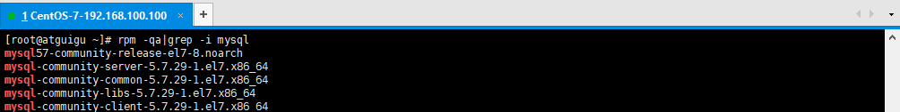


`3.卸载已安装程序`

```shell
#卸载上述命令查询出的所有已安装程序
rpm -e --nodeps mysql57-community-release
rpm -e --nodeps mysql-community-server
rpm -e --nodeps mysql-community-common
rpm -e --nodeps mysql-community-libs
rpm -e --nodeps mysql-community-client
```


`4.删除残留文件`

查找相关文件

```shell
find / -name mysql
```


删除上述命令查找出的相关文件

```shell
rm -rf /var/lib/mysql
rm -rf /usr/share/mysql
rm -rf /etc/selinux/targeted/active/modules/100/mysql
rm -rf /etc/selinux/targeted/tmp/modules/100/mysql
```


`5.删除配置文件和日志`

```shell
rm -f /etc/my.cnf*
rm -f /var/log/mysqld.log
```


#### 3.2.2、卸载MySQL8

`1.停止MySQL服务`

```shell
systemctl stop mysqld
```


`2.查看当前MySQL安装状况`

```shell
rpm -qa|grep -i mysql
```


`3.卸载已安装程序`

```shell
#卸载上述命令查询出的所有已安装程序
rpm -e --nodeps mysql-community-common
rpm -e --nodeps mysql-community-server
rpm -e --nodeps mysql-community-libs
rpm -e --nodeps mysql-community-icu-data-files
rpm -e --nodeps mysql-community-client
rpm -e --nodeps mysql-community-client-plugins
```


`4.删除残留文件`

查找相关文件

```shell
find / -name mysql
```


删除上述命令查找出的相关文件

```shell
rm -rf /etc/selinux/targeted/active/modules/100/mysql
rm -rf /etc/selinux/targeted/tmp/modules/100/mysql
rm -rf /usr/lib64/mysql
rm -rf /var/lib/mysql
```


`5.删除配置文件和日志`

```shell
rm -f /etc/my.cnf* #如果有的话
rm -f /var/log/mysqld.log
```


### 3.3、检查必要依赖

查询是否安装了如下依赖

```shell
rpm -qa|grep libaio #支持同步IO，对于数据库系统特别重要，安装数据库软件时需要
rpm -qa|grep net-tools #网络通信工具包，安装后可以使用netstat命令
```

如果存在，则如下所示：


如果不存在，则需要安装

```shell
yum install libaio
yum install net-tools
```


### 3.4、检查/tmp临时目权限

由于MySQL安装过程中，会通过MySQL用户在/tmp目录下新建tmp_db文件，所以请给/tmp较大的权限。

权限检查：

```shell
ll -a /
```


如果权限不是777则授权为777：

```shell
chmod -R 777 /tmp
```


## 4、安装

### 4.1、解压

将安装程序上传至到/opt目录下，并解压：

```shell
cd /opt
tar xvf mysql-8.0.29-1.el7.x86_64.rpm-bundle.tar
```


### 4.2、安装

在安装文件目录下执行以下命令（必须按照顺序执行）：

```shell
rpm -ivh mysql-community-common-8.0.29-1.el7.x86_64.rpm
rpm -ivh mysql-community-client-plugins-8.0.29-1.el7.x86_64.rpm
rpm -ivh mysql-community-libs-8.0.29-1.el7.x86_64.rpm
rpm -ivh mysql-community-icu-data-files-8.0.29-1.el7.x86_64.rpm
rpm -ivh mysql-community-client-8.0.29-1.el7.x86_64.rpm
rpm -ivh mysql-community-server-8.0.29-1.el7.x86_64.rpm

# -i, --install    安装软件包
# -v, --verbose    提供更多的详细信息输出
# -h, --hash       软件包安装的时候列出哈希标记 (和 -v 一起使用效果更好)，展示进度条
```


### 4.3、查看是否安装成功

```shell
rpm -qa|grep -i mysql
```

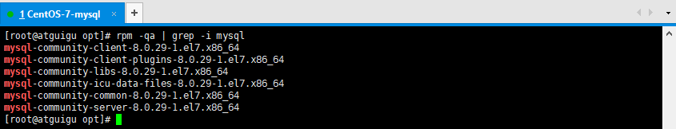


### 4.4、查看版本

```shell
mysqladmin --version
```


### 4.5、安装后的目录结构

| 路径                                                       | 解释                       |
| ---------------------------------------------------------- | -------------------------- |
| /usr/bin                                                   | 相关命令目录，mysqladmin等 |
| `/var/lib/mysql/`                                          | MySQL数据库文件的存放路径  |
| /usr/lib64/mysql/plugin                                    | MySQL                      |
| `/var/log/mysqld.log`                                      | MySQL日志路径              |
| /var/run/mysqld/mysqld.pid                                 | 进程pid文件                |
| /var/lib/mysql/mysql.sock                                  | 本地连接时用的套接字文件   |
| /etc/systemd/system/multi-user.target.wants/mysqld.service | 服务启停相关脚本           |
| `/etc/my.cnf`、/usr/share/mysql-8.0                        | MySQL配置文件              |


## 5、启动

### 5.1、服务的初始化

```shell
#初始化数据目录并生成初始密码
mysqld --initialize --user=mysql
#查看数据目录
ls /var/lib/mysql/
```


### 5.2、服务的启动和停止

```shell
#启动
systemctl start mysqld
#关闭
systemctl stop mysqld
#重启
systemctl restart mysqld
#查看服务状态
systemctl status mysqld
```

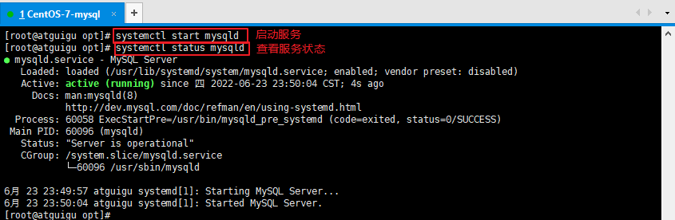


### 5.3、查看进程

```shell
#进程存在则说明MySQL启动成功
ps -ef|grep -i mysql
```


### 5.4、设置开机启动

```shell
#查看服务是否自动启动（是：enabled | 否：disabled）
systemctl list-unit-files|grep mysqld.service 

#设置开机启动：如不是enabled可以运行如下命令设置自启动
systemctl enable mysqld
#重新加载服务配置
systemctl daemon-reload 

#如果希望不进行自启动，运行如下命令设置
systemctl disable mysqld
#重新加载服务配置
systemctl daemon-reload 
```


## 6、配置密码

### 6.1、查找初始密码

```shell
#mysql安装完成之后，在/var/log/mysqld.log文件中给root生成了一个默认密码。通过下面的方式找到root默认密码，然后登录mysql。
grep 'temporary password' /var/log/mysqld.log
```


### 6.2、登录MySQL客户端

```shell
mysql -uroot -p
#然后输入上面找到的默认密码
```


### 6.3、修改密码

因为初始密码只是一个临时密码，默认只可以登录，无法做其他操作，因此我们需要重置密码

```sql
ALTER USER 'root'@'localhost' IDENTIFIED BY '123456';
-- 或者
SET password FOR 'root'@'localhost'= '123456';
```


### 6.4、忘记root密码（了解）

**需要的时候参考**

在/etc/my.cnf 文件[mysqld]中加上：

```properties
skip_grant_tables=1
```

重新启动mysql服务使配置生效：

```shell
systemctl restart mysqld
```

就可以无需密码登录MySQL客户端

```shell
mysql -uroot
```

接下来可以执行修改密码的语句重置密码

```sql
-- 先进行权限列表的刷新
FLUSH PRIVILEGES;
-- 再修改密码   host位置是实际主机地址：例如 % 或 localhost
ALTER USER 'root'@'localhost' IDENTIFIED BY '123456';
```

最后不要忘记重新将/etc/my.cnf中的`skip_grant_tables=1`删除掉，重启mysql服务

## 7、远程连接

### 7.1、当前问题

在用SQLyog或Navicat中配置远程连接MySQL数据库时遇到如下报错信息，这是由于MySQL默认不支持远程连接。


### 7.2、解决方案

查看系统数据库MySQL中的user表：

```sql
USE mysql;
SELECT Host,User FROM user;
```

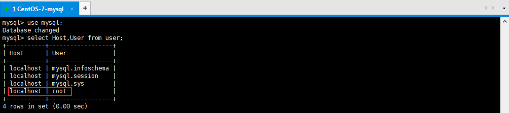

可以看到root用户的当前主机配置信息为localhost。**修改Host为通配符%**

Host列指定了允许用户登录所使用的IP：

- `Host=localhost`，表示只能通过本机客户端去访问。

- `Host=%` ，表示所有IP都有连接权限。

```sql
UPDATE user SET Host = '%' WHERE User ='root';
FLUSH PRIVILEGES; -- Host修改完成后记得执行FLUSH PRIVILEGES使配置立即生效：
```

> 注意：在生产环境下不能为了省事将host设置为%，这样做会存在安全问题，可以设置为生产环境IP。


**测试连接：**MySQL 8 版本，较旧版本的图形连接时还会出现如下问题


配置新连接报错：错误号码 2058，出现这个原因是MySQL 8 之前的版本中加密规则是mysql_native_password，而在MySQL 8之后，加密规则是caching_sha2_password。

解决方案有两种，一种是升级SQLyog和Navicat（因此，新版SQLyog和Navicat不会出现此问题），另一种是把MySQL用户登录密码加密规则还原成mysql_native_password。

**解决方法：**Linux下 mysql -uroot -p 登录你的 MySQL 数据库，然后 执行这条SQL：

```sql
ALTER USER 'root'@'%' IDENTIFIED WITH mysql_native_password BY '123456';
```

然后再重新配置SQLyog的连接，重新填写密码，则可连接成功了。 


### 7.3、排查其他连接问题

> 注意：如果上述解决方案无效，则需要按照以下步骤确认MySQL服务器网络、端口号和防火墙的状态

确认网络连接：在本机 ping 远程IP地址 保证网络畅通，如果网络不畅同则需要确认IP地址，网关等：

```shell
ping MySQL主机IP
```


确认防火墙状态：关闭防火墙或开放端口：

**方式一：关闭防火墙**

```shell
#查看防火墙状态
firewall-cmd --state 
#或 
systemctl status firewalld

#关闭防火墙
systemctl stop firewalld

#禁用开机启动
systemctl disable firewalld
```


**方式二：启用防火墙并开放3306端口**

```shell
#查看防火墙状态
firewall-cmd --state

#开启防火墙
systemctl start firewalld

#设置开机自启
systemctl enable firewalld

#查看开放的端口
firewall-cmd --list-ports

#设置开放的端口号
firewall-cmd --add-service=http --permanent
firewall-cmd --add-port=3306/tcp --permanent
#重启防火墙
firewall-cmd --reload 

#查看开放的端口
firewall-cmd --list-ports

```


## 8、字符集

### 8.1、默认字符集

MySQL 8版本之前，默认字符集为 latin1 ，不支持中文，使用前必须设置字符集为utf8（utf8mb3）或utf8

mb4。从MySQL 8开始，数据库的默认字符集为 utf8mb4 ，从而避免中文乱码的问题。

```sql
SHOW VARIABLES LIKE '%char%';
```


### 8.2、utf8与utf8mb4

utf8 字符集表示一个字符需要使用1～4个字节，但是我们常用的一些字符使用1～3个字节就可以表示了。而字符集表示一个字符所用的最大字节长度，在某些方面会影响系统的存储和性能，所以设计MySQL的设计者偷偷的定义了两个概念：

**utf8mb3 ：**阉割过的 utf8 字符集，只使用1～3个字节表示字符。（无法存储emoji表情）

**utf8mb4 ：**正宗的 utf8 字符集，使用1～4个字节表示字符。


## 9、 SQL大小写规范

### 9.1、Windows和Linux的区别 

**Windows环境：**

全部不区分大小写

**Linux环境：**

1、数据库名、表名、表的别名、变量名`严格区分大小写`；

2、列名与列的别名`不区分大小写`。

3、关键字、函数名称`不区分大小写`；


### 9.2、Linux下大小写规则设置（了解）

在MySQL 8中设置的具体步骤为：

```
1、停止MySQL服务 
2、删除数据目录，即删除 /var/lib/mysql 目录 
3、在MySQL配置文件（/etc/my.cnf ）的 [mysqld] 中添加 lower_case_table_names=1 
4、初始化数据目录 mysqld --initialize --user=mysql
5、启动MySQL服务 systemctl start mysqld
```

> 注意：不建议在开发过程中修改此参数，将会丢失所有数据


## 10、sql_mode

### 10.1、宽松模式 vs 严格模式

**宽松模式：**

执行错误的SQL或插入不规范的数据，也会被接受，并且不报错。

**严格模式：**

执行错误的SQL或插入不规范的数据，会报错。MySQL5.7版本开始就将sql_mode默认值设置为了严格模式。


### 10.2、查看和设置sql_mode

**查询sql_mode的值：**

```sql
SELECT @@session.sql_mode; 
SELECT @@global.sql_mode; 
-- 或者 
SHOW VARIABLES LIKE 'sql_mode'; --session级别
```


**临时设置sql_mode的值：**

```sql
SET GLOBAL sql_mode = 'mode1,model2,...'; --全局，要重新启动客户端生效，重启MySQL服务后失效
SET SESSION sql_mode = 'mode1,model2,...'; --当前会话生效效，关闭当前会话就不生效了。可以省略SESSION关键字
```

**在 /etc/my.cnf 中配置，永久生效：**

```properties
[mysqld]
sql-mode = "mode1,model2,..."
```


### 10.3、错误开发演示 

**建表并插入数据：**

```sql
CREATE DATABASE atguigudb;
USE atguigudb;
CREATE TABLE employee(id INT, `name` VARCHAR(16),age INT,dept INT);
INSERT INTO employee VALUES(1,'zhang3',33,101);
INSERT INTO employee VALUES(2,'li4',34,101);
INSERT INTO employee VALUES(3,'wang5',34,102);
INSERT INTO employee VALUES(4,'zhao6',34,102);
INSERT INTO employee VALUES(5,'tian7',36,102);
```

**需求：查询每个部门年龄最大的人**

```sql
SELECT `name`, dept, MAX(age) FROM employee GROUP BY dept; 
```

以上查询语句在 “`ONLY_FULL_GROUP_BY`” 模式下查询出错，因为select子句中的name列并没有出现在group by子句中，也没有出现在函数中：


在非 “ONLY_FULL_GROUP_BY” 模式下可以正常执行，但是得到的是错误的结果：

```sqlite
SET SESSION sql_mode = ''; 
```


**正确的查询方式：查询应该分两个步骤**

1、查询每个部门最大的年龄

2、查询人

正确的语句：

```sql
SELECT e.* 
FROM employee e
INNER JOIN (SELECT dept, MAX(age) age FROM employee GROUP BY dept) AS maxage 
ON e.dept = maxage.dept AND e.age = maxage.age;
```


**测试完成后再将sql_mode设置回来：**

```sqlite
SET SESSION sql_mode = 'ONLY_FULL_GROUP_BY,STRICT_TRANS_TABLES,NO_ZERO_IN_DATE,NO_ZERO_DATE,ERROR_FOR_DIVISION_BY_ZERO,NO_ENGINE_SUBSTITUTION';
```


### 10.4、sql_mode常用值（了解）

- `ONLY_FULL_GROUP_BY：`对于GROUP BY聚合操作，SELECT子句中只能包含函数和 GROUP BY 中出现的字段。
- STRICT_TRANS_TABLES：
  - 对于支持事务的表，如果发现某个值缺失或非法，MySQL将抛出错误，语句会停止运行并回滚。
  - 对于不支持事务的表，不做限制，提高性能。
- NO_ZERO_IN_DATE：不允许日期和月份为零。
- NO_ZERO_DATE：MySQL数据库不允许插入零日期，插入零日期会抛出错误而不是警告。
- ERROR_FOR_DIVISION_BY_ZERO：在INSERT或UPDATE过程中，如果数据被零除，则产生错误而非警告。如果未给出该模式，那么数据被零除时MySQL返回NULL。
- NO_ENGINE_SUBSTITUTION：如果需要的存储引擎被禁用或不存在，那么抛出错误。不设置此值时，用默认的存储引擎替代。


# 第02章 用户与权限管理

## 1、用户管理

### 1.1、登录MySQL服务器

启动MySQL服务后，可以通过MySQL命令来登录MySQL服务器，命令如下：

```shell
mysql –h hostname|hostIP –P port –u username –p DatabaseName –e "SQL语句"
```

下面详细介绍命令中的参数：

- `-h参数` 后面接主机名或者主机IP。 

- `-P参数` 后面接MySQL服务的端口，通过该参数连接到指定的端口。MySQL服务的默认端口是3306，不使用该参数时自动连接到3306端口。

- `-u参数` 后面接用户名。

- `-p参数` 会提示输入密码。

- `DatabaseName参数` 指明登录到哪一个数据库中。如果没有该参数，登录后使用USE命令来选择数据库。

- `-e参数` 后面可以直接加SQL语句。登录MySQL服务器以后即可执行这个SQL语句，然后退出MySQL服务器。

举例：

```shell
mysql -uroot -p -hlocalhost -P3306 mysql -e "select host,user from user"
```


### 1.2、创建用户

**语法：**

```sql
CREATE USER 用户名 [IDENTIFIED BY '密码'][,用户名 [IDENTIFIED BY '密码']];
```

- 用户名参数表示新建用户的账户，由 用户（User） 和 主机名（Host） 构成；

- “[ ]”表示可选，也就是说，可以指定用户登录时需要密码验证，也可以不指定密码验证，这样用户可以直接登录。不过，不指定密码的方式不安全，不推荐使用。如果指定密码值，这里需要使用IDENTIFIED BY指定明文密码值。

- CREATE USER语句可以同时创建多个用户。

**举例：**

```sql
CREATE USER zhang3 IDENTIFIED BY '123456'; -- 默认host是 %
```

```sql
CREATE USER 'li4'@'localhost' IDENTIFIED BY '123456';
```


### 1.3、修改用户

修改用户名：

```sql
UPDATE mysql.user SET USER='wang5' WHERE USER='li4'; 
FLUSH PRIVILEGES;
```


### 1.4、删除用户

**语法：**

```sql
DROP USER user[,user]…;
```

**举例：**

```sql
DROP USER zhang3; -- 默认删除host为%的用户
```

```sql
DROP USER 'wang5'@'localhost';
```

> **注意：**不推荐通过 DELETE FROM user WHERE User='zhang3' 进行删除，系统会有残留信息保留。而drop user命令会删除用户以及对应的权限，执行命令后你会发现mysql.user表和mysql.db表的相应记录都消失了。


## 2、权限管理

### 2.1、权限列表 

MySQL到底都有哪些权限呢？

```sql
SHOW PRIVILEGES;
```

（1） `CREATE和DROP权限` 可以创建新的数据库和表，或删除已有的数据库和表。 
（2） `SELECT、INSERT、UPDATE和DELETE权限` 允许在一个数据库现有的表上实施操作。 
（3） `INDEX权限` 允许创建或删除索引。 
（4） `ALTER权限` 可以使用ALTER TABLE来更改表的结构和重新命名表。 
（5） `GRANT权限` 允许授权给其他用户，可用于数据库、表和保存的程序。 


### 2.2、授予权限

**语法：**

```sql
GRANT 权限1,权限2,…权限n ON 数据库名称.表名称 TO 用户名@用户地址 [IDENTIFIED BY ‘密码口令’];
```

- 如果发现没有该用户，则会直接新建一个用户，并设置密码。
- 如果已经有了该用户，则会授予权限，如果后面有IDENTIFIED，则修改密码，否则只授予权限。

**举例：**

- 使用root用户给zhao6授予atguigudb库下所有表的增改查的权限

```sql
CREATE USER zhao6 IDENTIFIED BY '123456'; -- 创建用户
-- 此时用zhao6登录，并 执行show databases; 只能看到information_schema数据库

GRANT SELECT, INSERT, UPDATE ON atguigudb.* TO 'zhao6'@'%'; --授权
-- 此时用zhao6登录，并 执行show databases; 可以看到atguigudb数据库


-- 用zhao6登录可以执行SELECT, INSERT, UPDATE
USE atguigudb;
SELECT * FROM employee;
UPDATE employee SET NAME = 'helen' WHERE id = 1;
INSERT INTO employee VALUES(6, 'annie', 20, 101) ;

-- 不可以执行 DELETE
DELETE FROM employee WHERE id = 1;

--如果再次授予zhao6 DELETE权限，则需要退出客户端重新登录再进行测试
```


- 使用root用户给tian7授予所有库下所有表的所有权限

```sql
CREATE USER tian7 IDENTIFIED BY '123456'; -- 创建用户
GRANT ALL PRIVILEGES ON *.* TO 'tian7'@'%'; --授权
```

> 注意：tian7虽然拥有所有的权限，但是没有给其他人授权的能力

- 使用root用户给tian7授予所有库下所有表的所有权限，`并可以给他人授权,使用 WITH GRANT OPTION`

```sql
GRANT SYSTEM_USER ON *.* TO 'root'@'%'; -- root先给自己授予SYSTEM_USER权限
GRANT ALL PRIVILEGES ON *.* TO 'tian7'@'%' WITH GRANT OPTION; --授权
```


### 2.3、查看权限

查看当前用户权限：

```sql
SHOW GRANTS;
```

查看某用户的权限：

```sql
SHOW GRANTS FOR '用户名'@'主机地址';
```


### 2.4、回收权限

**语法：**

```sql
REVOKE  权限1, 权限2, …权限n ON 数据库名称.表名称 FROM '用户名'@'主机地址';
```

**举例：**

- 收回zhao6在atguigudb库下的所有表的SELECT权限

```sql
REVOKE SELECT ON atguigudb.* FROM 'zhao6'@'%';
```

- 收回zhao6全库全表的所有权限 

```sql
REVOKE ALL PRIVILEGES ON *.* FROM 'zhao6'@'%'; 
```

- 收回tian7全库全表的所有权限 

```sql
-- GRANT SYSTEM_USER ON *.* TO 'root'@'%'; -- root先给自己授予SYSTEM_USER权限
REVOKE ALL PRIVILEGES ON *.* FROM 'tian7'@'%'; -- 再收回tian7的所有权限
```


# 第03章 逻辑架构

[MySQL逻辑架构](../../z_技术点/MySQL逻辑架构.md)
## 1、逻辑架构剖析

### 1.1、服务器处理客户端请求

下面是MySQL5.7使用的**经典**架构图，MySQL 8中去掉了Caches&Buffers部分：


### 1.2、Connectors（客户端）

MySQL服务器之外的客户端程序，与具体的语言相关，例如Java中的JDBC，图形用户界面SQLyog等。`本质上都是在TCP连接上通过MySQL协议和MySQL服务器进行通信。`


### 1.3、MySQL Server（服务器）

#### **第1层：连接层**

- 客户端访问 MySQL 服务器前，做的`第一件事就是建立 TCP 连接`。
- 经过三次握手建立连接成功后， MySQL 服务器对 TCP 传输过来的账号密码做`身份认证、权限获取`。
  - 用户名或密码不对`，会收到一个`Access denied for user`错误，客户端程序结束执行`
  - `用户名密码认证通过`，会从权限表`查出账号拥有的权限`与连接关联，之后的权限判断逻辑，都将依赖于此时读到的权限
- TCP 连接收到请求后，必须要分配给一个线程专门与这个客户端的交互。所以还会有个线程池，去走后面的流程。每一个连接从线程池中获取线程，省去了创建和销毁线程的开销。


#### **第2层：服务层**

**Management Serveices & Utilities： 系统管理和控制工具**

**SQL Interface：SQL接口：**

- `接收用户的SQL命令，并且返回用户需要查询的结果。`比如SELECT ... FROM就是调用SQL Interface 
- MySQL支持DML（数据操作语言）、DDL（数据定义语言）、存储过程、视图、触发器、自定义函数等多种SQL语言接口

**Parser：解析器：**

在SQL命令传递到解析器的时候会被解析器验证和解析。解析器中SQL 语句进行`词法分析、语法分析、语义分析`，并为其创建`语法树`。

- 词法分析：将整个语句拆分成一个个字段

- 语法分析：将词法分析拆分出的字段，按照MySQl语法规则，生成解析树

- 语义分析：`检查解析树是否合法`，比如查看表是否存在，列是否存在

典型的解析树如下：

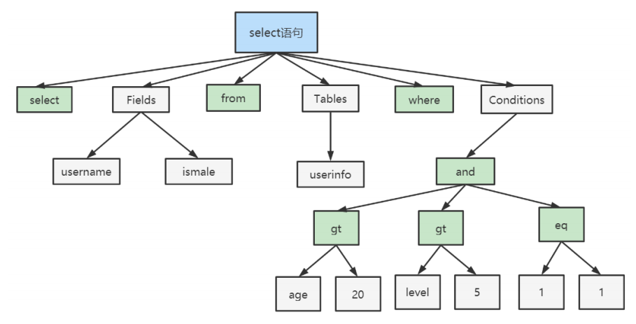


**Optimizer：查询优化器：**

- SQL语句在语法解析后、查询前会使用查询优化器对查询进行优化，`确定SQL语句的执行路径，生成一个执行计划`。


**Caches & Buffers： 查询缓存组件：**

- MySQL内部维持着一些Cache和Buffer，比如Query Cache用来缓存一条SELECT语句的执行结果，如果能够在其中找到对应的查询结果，那么就不必再进行查询解析、查询优化和执行的整个过程了，直接将结果反馈给客户端。
- 这个缓存机制是由一系列小缓存组成的。比如表缓存，记录缓存，key缓存，权限缓存等 。
- 这个查询缓存可以在不同客户端之间共享 。 
- **问：大多数情况查询缓存就是个鸡肋，为什么呢？**
  - 只有相同的SQL语句才会命中查询缓存。两个查询请求在任何字符上的不同（例如：空格、注释、大小写），都会导致缓存不会命中。
  - 在两条查询之间 有 INSERT 、 UPDATE 、 DELETE 、 TRUNCATE TABLE 、 ALTER TABLE 、 DROP TABLE 或 DROP DATABASE 语句也会导致缓存失效
  - 因此 MySQL的查询缓存命中率不高。`所以在MySQL 8之后就抛弃了这个功能。`


#### **第3层：引擎层**

存储引擎层（ Storage Engines），`负责MySQL中数据的存储和提取，对物理服务器级别维护的底层数据执行操作，服务器通过API与存储引擎进行通信`。不同的存储引擎具有的功能不同，管理的表有不同的存储结构，采用的存取算法也不同，这样我们可以根据自己的实际需要进行选取。例如MyISAM引擎和InnoDB引擎。


#### **存储层**

所有的数据、数据库、表的定义、表的每一行的内容、索引，都是存在`文件系统` 上，以文件的方式存在，并完成与存储引擎的交互。


### 1.4、查询流程说明


**首先，**`MySQL客户端通过协议与MySQL服务器建连接，通过SQL接口发送SQL语句，先检查查询缓存，如果命中，直接返回结果，否则进行语句解析。`也就是说，在解析查询之前，服务器会先访问查询缓存，如果某个查询结果已经位于缓存中，服务器就不会再对查询进行解析、优化、以及执行。它仅仅将缓存中的结果返回给用户即可，这将大大提高系统的性能。

**接下来是解析过程，**`MySQL解析器通过关键字将SQL语句进行解析，并生成一棵对应的解析树，`解析器使用MySQL语法规则验证和解析SQL语句。例如，它将验证是否使用了错误的关键字，或者使用关键字的顺序是否正确，引号能否前后匹配等；`预处理器则根据MySQL规则进一步检查解析树是否合法，`例如，这里将检查数据表和数据列是否存在，还会解析名字和别名，看是否有歧义等`，并生成一棵新解析树`，新解析树可能和旧解析树结构一致。

**然后是优化过程，**`MySQL优化程序会对我们的语句做一些优化，将查询的IO成本和CPU成本降到最低。优化的结果就是生成一个执行计划。`这个执行计划表明了应该使用哪些索引执行查询，以及表之间的连接顺序是啥样，必要时将子查询转换为连接、表达式简化等等。我们可以使用EXPLAIN语句来查看某个语句的执行计划。

**最后，**`进入执行阶段。`完成查询优化后，`查询执行引擎`会按照生成的执行计划调用存储引擎提供的接口执行SQL查询并将结果返回给客户端。在MySQL8以下的版本，如果设置了查询缓存，这时会将查询结果进行缓存，再返回给客户端。


## 2、SQL 执行流程

利用`SHOW VARIABLES` 可以查看SQL的执行流程。使用前需要先开启该功能：

### 2.1、MySQL8

`1.开启profiling`

确认profiling是否开启

```sql
SHOW VARIABLES LIKE '%profiling%';
```


profiling=0 代表关闭，我们需要把 profiling 打开，即设置为 1：

```sql
SET profiling = 1;  -- profiling = ON
```


`2.显示查询`

执行任意SQL语句：

```sql
SELECT * FROM atguigudb.employee; 
SELECT * FROM atguigudb.employee WHERE id = 5; 
```

显示最近的几次查询：

```sql
SHOW PROFILES;
```


`3.查看执行流程`

**查看最后一个SQL的执行流程：**

```sql
SHOW PROFILE;
```


**查看指定SQL的执行流程：查询指定的 Query ID**

```sql
SHOW PROFILE FOR QUERY 3;
```

**查询更丰富的内容：**

```sql
SHOW PROFILE cpu,block io FOR QUERY 3;
```


- SHOW PROFILE 的常用查询参数:
  - ​	①ALL：显示所有的开销信息。
  - ​	`②BLOCK IO：显示块IO开销。`
  - ​	③CONTEXT SWITCHES：上下文切换开销。
  - ​	`④CPU：显示CPU开销信息。`
  - ​	⑤IPC：显示发送和接收开销信息。
  - ​	⑥MEMORY：显示内存开销信息。
  - ​	⑦PAGE FAULTS：显示页面错误开销信息。
  - ​	⑧SOURCE：显示和Source_function，Source_file，Source_line相关的开销信息。
  - ​	⑨SWAPS：显示交换次数开销信息。


### 2.2、MySQL5.7（了解）

`1. 确认profiling开启前提下，查看查询缓存是否启用`

```sql
SHOW VARIABLES LIKE '%query_cache_type%';
```


`2. 开启查询缓存`

修改配置文件：vim /etc/my.cnf
新增一行：query_cache_type=1
重启MySQL：systemctl restart mysqld


`3. 执行SQL并查看执行流程`

参考MySQl8中执行流程的启用和查看方式，在MySQL5.7中查看执行流程

- 第一次执行查询SQL：


- 第二次执行相同的SQL：


## 3、存储引擎

### 3.1、查看存储引擎

查看MySQL提供什么存储引擎

```sql
SHOW ENGINES;
```

下面的结果表示MySQL中默认使用的存储引擎是InnoDB，支持事务，行锁，外键，支持分布式事务(XA)，支持保存点(回滚)


也可以通过以下语句查看默认的存储引擎：

```sql
SHOW VARIABLES LIKE '%default_storage_engine%';
```


### 3.2、设置存储引擎（了解）

`方法1：`

设置默认存储引擎：

```sql
SET DEFAULT_STORAGE_ENGINE=MyISAM;
```


`方法2：`

或者修改 my.cnf 文件：vim /etc/my.cnf
新增一行：default-storage-engine=MyISAM 
重启MySQL：systemctl restart mysqld


`方法3：`

我们可以为 不同的表设置不同的存储引擎

```sql
CREATE TABLE 表名( 建表语句 ) ENGINE = 存储引擎名称;
ALTER TABLE 表名 ENGINE = 存储引擎名称;

-- 例如：
CREATE TABLE student(id INT, `name` VARCHAR(16),age INT,dept INT) ENGINE = MyISAM;
```


### 3.3、各种引擎介绍

`1. InnoDB存储引擎`

- InnoDB是MySQL的默认事务型引擎，它被设计用来`处理大量的短期(short-lived)事务`。可以确保事务的完整提交(Commit)和回滚(Rollback)。

- 除非有非常特别的原因需要使用其他的存储引擎，否则`应该优先考虑InnoDB引擎`。

- InnoDB不仅缓存索引还要缓存真实数据， 对内存要求较 高 ，而且内存大小对性能有决定性的影响。


`2. MyISAM存储引擎`

- MyISAM提供了大量的特性，包括全文索引、压缩、空间函数(GIS)等，但`MyISAM不支持事务和行级锁`，有一个毫无疑问的缺陷就是崩溃后无法安全恢复。

- 优势是访问的 速度快 ，对事务完整性没有要求或者以SELECT、INSERT为主的应用。

- MyISAM只缓存索引，不缓存真实数据。


`3. Memory引擎`

- 如果需要快速地访问数据，并且这些数据不会被修改，重启以后丢失也没有关系，那么使用Memory表是非常有用。
- Memory表至少比MyISAM表要快一个数量级。


`4. Archive引擎`

- `Archive档案存储引擎只支持INSERT和SELECT操作`。
- Archive表适合日志和数据采集（档案）类应用。
- 根据英文的测试结论来看，Archive表比MyISAM表要小大约75%，比支持事务处理的InnoDB表小大约83%。


`5. Blackhole引擎（黑洞）`

- `Blackhole引擎没有实现任何存储机制，它会丢弃所有插入的数据，不做任何保存`。
- 但服务器会记录Blackhole表的日志，所以可以用于复制数据到备库，或者简单地记录到日志。但这种应用方式会碰到很多问题，因此并不推荐。 


`6. CSV引擎` 

- `CSV引擎可以将普通的CSV文件作为MySQL的表来处理，但不支持索引`。
- CSV引擎可以作为一种数据交换的机制，非常有用。
- CSV存储的数据直接可以在操作系统里，用文本编辑器，或者excel读取。


`7. Federated引擎`

- `Federated引擎是访问其他MySQL服务器的一个代理（跨库关联查询）`，尽管该引擎看起来提供了一种很好的跨服务器的灵活性，但也经常带来问题，因此默认是禁用的。


### 3.4、MyISAM和InnoDB的区别
[[MyISAM和InnoDB的区别]]

| **对比项**     | **MyISAM**                                               | **InnoDB**                                                   |
| -------------- | -------------------------------------------------------- | ------------------------------------------------------------ |
| 外键           | 不支持                                                   | 支持                                                         |
| 事务           | 不支持                                                   | 支持                                                         |
| 行表锁         | 表锁，即使操作一条记录也会锁住整个表，不适合高并发的操作 | 行锁，操作时只锁某一行，不对其它行有影响，适合高并发的操作   |
| 缓存           | 只缓存索引，不缓存真实数据                               | 不仅缓存索引还要缓存真实数据，对内存要求较高，而且内存大小对性能有决定性的影响。支持聚簇索引 |
| 关注点         | 并发查询，节省资源、消耗少、简单业务                     | 并发写、事务、更大资源                                       |
| 默认使用       | N                                                        | Y                                                            |
| 自带系统表使用 | Y                                                        | N                                                            |


# 第04章 SQL预热

## 1、创建测试数据

```sql
CREATE TABLE `t_dept` (
 `id` INT NOT NULL AUTO_INCREMENT,
 `deptName` VARCHAR(30) DEFAULT NULL,
 `address` VARCHAR(40) DEFAULT NULL,
 PRIMARY KEY ( `id`)
);
 
CREATE TABLE `t_emp` (
 `id` INT NOT NULL AUTO_INCREMENT,
 `name` VARCHAR(20) DEFAULT NULL,
 `age` INT DEFAULT NULL,
 `deptId` INT DEFAULT NULL,
`empno` INT NOT NULL,
 PRIMARY KEY (`id`),
 KEY `idx_dept_id` (`deptId`)
 #CONSTRAINT `fk_dept_id` FOREIGN KEY (`deptId`) REFERENCES `t_dept` (`id`)
);

INSERT INTO t_dept(id,deptName,address) VALUES(1,'华山','华山');
INSERT INTO t_dept(id,deptName,address) VALUES(2,'丐帮','洛阳');
INSERT INTO t_dept(id,deptName,address) VALUES(3,'峨眉','峨眉山');
INSERT INTO t_dept(id,deptName,address) VALUES(4,'武当','武当山');
INSERT INTO t_dept(id,deptName,address) VALUES(5,'明教','光明顶');
INSERT INTO t_dept(id,deptName,address) VALUES(6,'少林','少林寺');

INSERT INTO t_emp(id,NAME,age,deptId,empno) VALUES(1,'风清扬',90,1,100001);
INSERT INTO t_emp(id,NAME,age,deptId,empno) VALUES(2,'岳不群',50,1,100002);
INSERT INTO t_emp(id,NAME,age,deptId,empno) VALUES(3,'令狐冲',24,1,100003);

INSERT INTO t_emp(id,NAME,age,deptId,empno) VALUES(4,'洪七公',70,2,100004);
INSERT INTO t_emp(id,NAME,age,deptId,empno) VALUES(5,'乔峰',35,2,100005);

INSERT INTO t_emp(id,NAME,age,deptId,empno) VALUES(6,'灭绝师太',70,3,100006);
INSERT INTO t_emp(id,NAME,age,deptId,empno) VALUES(7,'周芷若',20,3,100007);

INSERT INTO t_emp(id,NAME,age,deptId,empno) VALUES(8,'张三丰',100,4,100008);
INSERT INTO t_emp(id,NAME,age,deptId,empno) VALUES(9,'张无忌',25,5,100009);
INSERT INTO t_emp(id,NAME,age,deptId,empno) VALUES(10,'韦小宝',18,NULL,100010);
```


## 2、常见七种JOIN查询


**需求1：**查询`所有有部门的员工`信息以及他所在的部门信息

在A、和B中都存在的数据 => `查询A、B两表交集`

```sql
SELECT * FROM t_emp a INNER JOIN t_dept b ON a.deptid = b.id;
```


**需求2：**查询`所有用户`，并显示其部门信息（如果员工没有所在部门，也会被列出） => `查询A的全集`

```sql
SELECT * 
FROM t_emp a 
LEFT JOIN t_dept b ON a.deptid = b.id;
```


**需求3：**列出`所有部门`，并显示其部门的员工信息（如果部门没有员工，也会被列出）=> `查询B的全集`

```sql
SELECT * 
FROM t_emp a 
RIGHT JOIN t_dept b ON a.deptid = b.id;
```


**需求4：**查询`没有加入任何部门的员工`（先查询所有员工，再过滤掉包含部门的数据） => `查询A且不包含B`

```sql
SELECT * FROM t_emp a 
LEFT JOIN t_dept b ON a.deptid = b.id 
WHERE b.id IS NULL;
```


**需求5：**查询`没有任何员工的部门` => `查询B且不包含A`

```sql
SELECT * FROM t_emp a 
RIGHT JOIN t_dept b ON a.deptid = b.id 
WHERE a.id IS NULL;
```


**需求6：**查询`所有员工和所有部门` => `AB全有`

MySQL FULL JOIN 的实现：因为MySQL不支持FULL JOIN，下面是替代方法

LEFT JOIN + UNION(合并并去重) + RIGHT JOIN

> 注意：
>
> - UNION要求字段数量和顺序都一致
> - 如果确定两表结果不会重复，则使用UNION ALL提升效率

```sql
SELECT * 
FROM t_emp a 
LEFT JOIN t_dept b ON a.deptid = b.id 
UNION 
SELECT * 
FROM t_emp a 
RIGHT JOIN t_dept b ON a.deptid = b.id;
```


**需求7：**查询`没有加入任何部门的员工`，以及查询出部门下`没有任何员工的部门` => `A的独有+B的独有`

```sql
SELECT * 
FROM t_emp a 
LEFT JOIN t_dept b ON a.deptid = b.id 
WHERE b.id IS NULL 
UNION ALL
SELECT * 
FROM t_emp a 
RIGHT JOIN t_dept b ON a.deptid = b.id 
WHERE a.id IS NULL;
```


## 3、扩展掌门人

### 3.1、增加掌门人字段

```sql
ALTER TABLE t_dept ADD CEO INT(11);
UPDATE t_dept SET CEO=2 WHERE id=1;
UPDATE t_dept SET CEO=4 WHERE id=2;
UPDATE t_dept SET CEO=6 WHERE id=3;
UPDATE t_dept SET CEO=8 WHERE id=4;
UPDATE t_dept SET CEO=9 WHERE id=5;
```


### 3.2、练习

**需求1：**求各个门派对应的掌门人

```sql
SELECT b.deptname, a.name FROM t_dept b LEFT JOIN t_emp a ON b.ceo = a.id;
```


**需求2：**求所有掌门人的平均年龄

```sql
SELECT AVG(a.age) FROM t_emp a INNER JOIN t_dept b ON a.id = b.ceo;
```


**需求3：**求所有人物对应的掌门名称（4种写法分析）

- 三表左连接方式

```sql
-- 员工表(t_emp)、部门表(t_dept)、ceo(t_emp)表 关联查询
SELECT emp.name, ceo.name AS ceoname 
FROM t_emp emp
LEFT JOIN t_dept dept ON emp.deptid = dept.id 
LEFT JOIN t_emp ceo ON dept.ceo = ceo.id;
```

- 子查询方式

```sql
SELECT 
emp.name, 
(SELECT ceo.name FROM t_emp ceo WHERE ceo.id = dept.ceo) AS ceoname
FROM t_emp emp
LEFT JOIN t_dept dept ON emp.deptid = dept.id
```

- 临时表连接方式1

```sql
SELECT emp_with_ceo_id.name, emp.name AS ceoname FROM 
-- 查询所有员工及对应的ceo的id
( 
SELECT emp.name, dept.ceo 
FROM t_emp emp 
LEFT JOIN t_dept dept ON emp.deptid = dept.id 
) emp_with_ceo_id
LEFT JOIN t_emp emp ON emp_with_ceo_id.ceo = emp.id;
```

- 临时表连接方式2

```sql
SELECT emp.name, ceo.ceoname FROM t_emp emp LEFT JOIN
-- 查询并创建临时表ceo：包含ceo的部门id和ceo的name
( 
SELECT emp.deptId AS deptId, emp.name AS ceoname 
FROM t_emp emp 
INNER JOIN t_dept dept ON emp.id = dept.ceo 
) ceo
ON emp.deptId = ceo.deptId;
```


# 第05章 MySQL索引

## 1、索引简介

### 1.1、什么是索引**☆** 

MySQL官方对索引的定义为：**索引（Index）是帮助MySQL高效获取数据的数据结构。**
**索引的本质：**索引是数据结构。你可以简单理解为`“排好序的快速查找数据结构”`。这些数据结构以某种方式指向数据， 可以在这些数据结构的基础上实现高级查找算法 。


下图就是一种`可能`的索引方式示例：


-  左边是数据表，一共有两列七条记录，最左边的是数据记录的物理地址

-  为了加快Col2的查找，可以维护一个右边所示的`树`，每个节点分别包含索引**键值**和一个指向对应数据记录物理地址的**指针**，这样就可以运用二叉查找在一定的复杂度内获取到相应数据，从而快速的检索出符合条件的记录。

这就是我们为什么要建索引，目的就是为了**减少磁盘I/O的次数**，加快查询效率。


### 1.2、索引的优缺点**☆** 

**优点：**

（1）`提高数据检索的效率，降低数据库的IO成本` 

（2）通过创建唯一索引，可以保证表中每条记录的`唯一性` 

（3）在使用分组和排序子句进行查询时，可以显著减少查询中分组和排序的时间，降低CPU的消耗。


**缺点：**

（1）创建索引和维护索引要`耗费时间`，随着数据量的增加，所耗费的时间也会增加 。 

（2）索引是存储在磁盘上的，因此需要`占用磁盘空间` 。

（3）虽然索引大大的提高的查询效率，同时却会`降低更新表的速度`。当对表中的数据进行增删改操作同时，索引也需要动态的进行维护，这样就降低了数据的维护速度。 


### 1.3、索引类型

MySQL的索引在引擎层实现，不同的存储引擎有不同的结构，主要包含：

| 索引结构              | 描述                                                         |
| --------------------- | ------------------------------------------------------------ |
| `B+Tree索引`          | `最常见的索引类型，大部分存储引擎都支持B+Tree索引`           |
| Hash索引              | 底层采用哈希表数据结构实现，只有精确匹配索引列的查询才有效，不支持范围查询 |
| R-Tree（空间索引）    | 主要用于地理空间数据类型                                     |
| Full-Text（全文索引） | 通过建立倒排索引，快速匹配文档的方式，类似于Lucene，Solr，ElasticSearch |

故平常常说的索引，没有特殊的指明，指的都是B+Tree结构的索引。

## 2、索引数据结构推演**☆** 

数据结构可视化演示地址：https://www.cs.usfca.edu/~galles/visualization/Algorithms.html

### 2.1、二叉树

**二叉树**

树有很多种，每个节点`最多`只能有`两个子节点`的一种形式称为二叉树。二叉树的子节点分为左节点和右节点。


**二叉搜索树BST**

`BST(Binary Sort(Search) Tree)：`对于二叉排序树的任何一个非叶子节点，要求左子节点的值比当前节点的值小，右子节点的值比当前节点的值大。

`特别说明：`如果有相同的值，可以将该节点放在左子节点或右子节点。

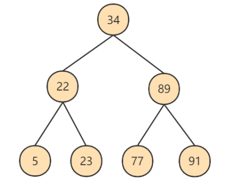

BST的生成演示：https://www.cs.usfca.edu/~galles/visualization/BST.html


- 为了加快Col2的查找，可以维护一个右边所示树结构，每个节点分别包含索引键值和一个指向对应数据记录物理地址的指针，这样就可以运用二分查找获取到相应数据，从而快速的检索出符合条件的记录：


**BST的问题**

- 上面演示的实际上是一个特殊的`二叉搜索树`，叫做`平衡 二叉搜索树`，  如果二叉树不平衡，例如左子树全部为空，从形式上看，更像一个单链表，不能发挥BST的优势。
- `解决方案：平衡二叉树(AVL)` 


**平衡二叉树（AVL）**

AVL树全称G.M. `A`delson-`V`elsky和E.M. `L`andis，这是两个人的人名。

平衡二叉树也叫平衡二叉搜索树（Self-balancing binary search tree）又被称为AVL树， 可以保证查询效率较高。

`具有以下特点：`

- 它是一棵空树或它的左右两个子树的高度差的绝对值不超过1
- 并且左右两个子树都是一棵平衡二叉树。


AVL的生成演示：https://www.cs.usfca.edu/~galles/visualization/AVLtree.html


**AVL的问题**

众所周知，IO操作的效率很低，在大量数据存储中，查询时我们不能一下子将所有数据加载到内存中，只能逐节点加载（一个节点一次IO）。如果我们利用二叉树作为索引结构，`那么磁盘的IO次数和索引树的高度是相关的`。平衡二叉树由于树深度过大而造成磁盘IO读写过于频繁，进而导致效率低下。

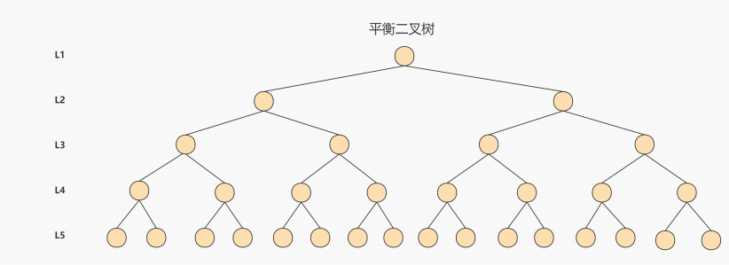

为了提高查询效率，就需要 减少磁盘IO数 。`为了减少磁盘IO的次数，就需要尽量降低树的高度` ，需要把原来“瘦高”的树结构变的“矮胖”，树的每层的分叉越多越好。针对同样的数据，如果我们把二叉树改成 三叉树：


上面的例子中，我们将二叉树变成了三叉树，降低了树的高度。`如果能够在一个节点中存放更多的数据`，我们还可以进一步减少节点的数量，从而进一步降低树的高度。这就是`多叉树`。


### 2.2、B树

- `B-Tree即B树，Balance Tree，多路平衡查找树,B树就是典型的多叉树，它的高度远小于平衡二叉树的高度`。
- `B树的阶：`节点的拥有最多子节点个数。

页/磁盘块：Mysql存储最小单元，默认大小16KB


上图所表示的 B 树就是一棵 3 阶的 B 树。假设一个磁盘块可以存储一个节点的数据。我们可以看下磁盘块 2，里面的关键字为（8，12），它有 3 个孩子 (3，5)，(9，10) 和 (13，15)，你能看到 (3，5) 小于 8，(9，10) 在 8 和 12 之间，而 (13，15)大于 12，三节点的子树的值大小仍然遵守 BST 二叉排序树的规则。


`假设我们想要 查找的数据项是 9 ，那么步骤可以分为以下几步：`

1. 第一次磁盘IO：找到根节点磁盘块1，读入内存，执行二分查找，9 小于 17 ，得到指针 P1； 
2. 第二次磁盘IO：按照指针P1找到磁盘块 2，读入内存，执行二分查找， 9 在 8 和 12 之间，得到指针 P2； 
3. 第三次磁盘IO：按照指针P2找到磁盘块 6，读入内存，执行二分查找， 找到了数据项 9。


你能看出来在 B 树的搜索过程中，我们比较的次数并不少，但如果把数据读取出来然后在内存中进行比较，这个时间就是可以忽略不计的。`而读取磁盘块本身需要进行 I/O 操作，消耗的时间比在内存中进行比较所需要的时间要多，是数据查找用时的重要因素。` B 树相比于平衡二叉树来说磁盘 I/O 操作要少 ，在数据查询中比平衡二叉树效率要高。`所以只要树的高度足够低，IO次数足够少，就可以提高查询性能` 。


**再举例：**

`假设`使用B树作为索引结构，存放MySQL中的数据：

`蓝色`部分表示数据的主键，`黄色`部分表示除主键外的其他数据，`紫色`部分表示指向子节点的指针


## 3、MySQL的索引结构：B+tree

### 3.1、InnoDB中的索引

​	MySQL的索引数据结构对经典的B+Tree进行了优化。在原有的B+Tree的基础上，增加了一个指向相邻叶子节点的链表指针，就形成了带有顺序指针的B+Tree，提高了区间访问性能。

#### 3.1.1、设计索引

index_demo表的简化的行格式示意图如下：


- `record_type：`表示记录的类型， 0是普通记录、 2是最小记录、 3 是最大记录、1是B+树非叶子节点记录。
- `next_record：`表示下一条记录的相对位置，我们用箭头来表明下一条记录。
- `各个列的值：`这里只记录在 index_demo 表中的三个列，分别是 c1 、 c2 和 c3 。 

把一些记录放到页里的示意图就是`（这里一页就是一个磁盘块，代表一次IO）`：


`MySQL InnoDB的默认的页大小是16KB`：

```sql
-- 查看默认页的大小
SHOW GLOBAL STATUS LIKE 'Innodb_page_size';
```


因此数据存储在磁盘中，可能会占用多个数据页。如果各个页中的记录没有规律，我们就不得不依次遍历所有的数据页。`如果我们想快速的定位到需要查找的记录在哪些数据页中`，我们可以这样做 ：

- `下一个数据页中用户记录的主键值必须大于上一个页中用户记录的主键值`
- 给所有的页建立目录项


以`页28`为例，它对应`目录项2` ，这个目录项中包含着该页的`页号28`以及该页中用户记录的`最小主键值 5`。我们只需要把几个目录项在物理存储器上连续存储（比如：数组），就可以实现根据主键值快速查找某条记录的功能了。`比如：查找主键值为 20 的记录，具体查找过程分两步：`

1. 先从目录项中根据二分法快速确定出`主键值为20的记录在目录项3中`（因为 12 ≤ 20 < 209 ），`对应页9`。 
2. 再到页9中根据二分法快速定位到主键值为 20 的用户记录。

至此，针对数据页做的简易目录就搞定了。这个目录有一个别名，称为`索引` 。 


#### 3.1.2、InnoDB中的索引方案

我们新分配一个编号为30的页来专门存储`目录项记录`，页10、28、9、20专门存储`用户记录`： 


`目录项记录和普通的用户记录的不同点：` 

- 目录项记录 的 record_type 值是1，而 普通用户记录 的 record_type 值是0。
- 目录项记录只有主键值和页的编号两个列，而普通的用户记录的列是用户自己定义的，包含很多列，另外还有InnoDB自己添加的隐藏列。

`现在查找主键值为 20 的记录，具体查找过程分两步：`

1. 先到页30中通过二分法快速定位到对应目录项，因为 12 ≤ 20 < 209 ，就是页9。 
2. 再到页9中根据二分法快速定位到主键值为 20 的用户记录。


**更复杂的情况如下：**

我们生成了一个存储更高级目录项的页33 ，这个页中的两条记录分别代表页30和页32，如果用户记录的主键值在 `[1, 320)` 之间，则到页30中查找更详细的目录项记录，如果主键值 不小于320 的话，就到页32中查找更详细的目录项记录。**这个数据结构，它的名称是 B+树 。** 


### 3.2、B树和B+树对比**☆** 

**B+** **树和** **B** **树的差异：**

- B+树中非叶子节点仅用于索引，不保存数据记录，跟记录有关的信息都放在叶子节点中。而B树中， 非叶子节点既保存索引，也保存数据记录 。 

- B+树中所有关键字（key）都在叶子节点出现，叶子节点构成一个有序链表，而且叶子节点本身按照关键字的大小从小到大顺序链接。

- B+树中非叶子节点的关键字也会同时存在于子节点中，并且是在子节点中所有关键字的最小值。


**B+树为什么IO的次数会更少：**

- `真实环境`中一个页存放的记录数量是非常大的（默认16KB），假设指针与键值占大约10字节，数据占 1 kb 的空间：
- 如果B+树只有1层，也就是只有1个用于存放用户记录的节点，则最多能存放 16 条记录。
- 如果B+树有2层，最多能存放约 `1600×16=25600` 条记录。
- 如果B+树有3层，最多能存放约 `1600×1600×16=40960000` 条记录。
- 如果存储千万级别的数据，只需要三层就够了

`B+树的非叶子节点不存储用户记录，只存储目录记录，相对B树每个节点可以存储更多的记录，树的高度会更矮胖，IO次数也会更少。`


### 3.3、索引分类

- 从功能逻辑上划分，索引主要有 4 种，分别是`普通索引、唯一索引、主键索引、全文索引`如下图。

| 分类     | 含义                   | 特点                     | 关键字   |
| -------- | ---------------------- | ------------------------ | -------- |
| 主键索引 | 表中主键创建的索引     | 默认自动创建，只能有一个 | Primary  |
| 唯一索引 | 避免表中某列数据值重复 | 可以有多个               | Unique   |
| 普通索引 | 快速查询特定的数据     | 可以有多个               | Key      |
| 全文索引 | 查找文本中关键字       | 可以有多个               | FullText |

- 按照物理实现方式划分 ，索引可以分为 2 种，分别是`聚簇索引和非聚簇索引（二级索引）`

| 分类       | 含义                                                     | 特点             |
| ---------- | -------------------------------------------------------- | ---------------- |
| 聚簇索引   | 将数据与索引存放在一起，所以结构的叶子节点保存行数据     | 必须有且只有一个 |
| 非聚簇索引 | 将数据与索引分开存储，索引结构的叶子节点管理的数据的主键 | 可以存在多个     |

- 按照作用字段个数划分，索引可以分为`单列索引和联合索引`。

### 3.3、聚簇索引VS非聚簇索引


#### 3.3.1、聚簇索引**☆** 

**特点：** 

- `索引和数据保存在同一个B+树中`

- `页内的记录`是按照`主键`的大小顺序排成一个`单向链表` 。
- `页和页之间`也是根据页中记录的`主键`的大小顺序排成一个`双向链表` 。
- 非叶子节点存储的是记录的`主键+页号`。
- 叶子节点存储的是`完整的用户记录`。

**优点：**

- 数据访问更快 ，因为`索引和数据保存在同一个B+树中`，因此从聚簇索引中获取数据比非聚簇索引更快。
- 聚簇索引对于主键的`排序查找`和`范围查找`速度非常快。
- 按照聚簇索引排列顺序，查询显示一定范围数据的时候，由于`数据都是紧密相连`，数据库可以从更少的数据块中提取数据，`节省了大量的IO操作` 。

**缺点：**

- 插入速度严重依赖于插入顺序 ，按照主键的顺序插入是最快的方式，否则将会出现页分裂，严重影响性能。因此，对于InnoDB表，我们一般都会定义一个`自增的ID列为主键`。
- 更新主键的代价很高 ，因为将会导致被更新的行移动。因此，对于InnoDB表，我们一般定义`主键为不可更新`。

**限制：**

- 只有InnoDB引擎支持聚簇索引，`MyISAM不支持聚簇索引`。
- 由于数据的物理存储排序方式只能有一种，所以`每个MySQL的表只能有一个聚簇索引`。
- 如果没有为表定义主键，InnoDB会选择`非空的唯一索引列代替`。如果没有这样的列，InnoDB会`隐式的定义一个主键`作为聚簇索引。
- 为了充分利用聚簇索引的聚簇特性，InnoDB中表的`主键应选择有序的id`，不建议使用无序的id，比如UUID、MD5、HASH、字符串作为主键，无法保证数据的顺序增长。

#### 3.3.2、非聚簇索引**☆** 

**（二级索引、辅助索引）**

`聚簇索引`，只能在搜索条件是`主键值`时才发挥作用，因为B+树中的数据都是按照主键进行排序的，如果我们想以别的列作为搜索条件，那么需要创建`非聚簇索引`。

**例如，**`以c2列作为搜索条件`，那么需要使`用c2列创建一棵B+树`，如下所示：


**这个B+树与聚簇索引有几处不同：**

- `页内的记录`是按照从`普通列`的大小顺序排成一个`单向链表` 。
- `页和页之间`也是根据页中记录的`普通列`的大小顺序排成一个`双向链表` 。

- 非叶子节点存储的是记录的`普通列值+页号`。
- 叶子节点存储的并不是完整的用户记录，而只是`普通列值+主键`这两个列的值。


**例如：**根据c2列的值查找c2=4的记录，查找过程如下：

1. 根据`根页面44`定位到`页42`（因为`2 ≤  4 < 9`）
2. 由于`c2列没有唯一性约束`，所以c2=4的记录可能分布在多个数据页中，又因为 `2 ≤ 4  ≤ 4`，所以确定实际存储用户记录的页在`页34和页35`中。
3. 在页34和35中`定位到具体的记录`。
4. 但是这个B+树的叶子节点`只存储了c2和c1（主键）`两个列，所以我们必须`再根据主键值去聚簇索引中再查找`一遍完整的用户记录。


**概念：回表** 

我们根据这个以c2列大小排序的B+树只能确定我们要查找记录的主键值，所以如果我们想根据c2列的值查找到完整的用户记录的话，仍然需要到聚簇索引中再查一遍，这个过程称为回表 。也就是根据c2列的值查询一条完整的用户记录需要`使用到 2棵B+树`！

**问题：**

为什么我们还需要一次回表操作呢？直接把完整的用户记录放到叶子节点不OK吗？

**回答：**
如果把完整的用户记录放到叶子节点是可以不用回表。但是`太占地方`了，相当于每建立一棵B+树都需要把所有的用户记录再都拷贝一遍，这就有点太浪费存储空间了。

**一张表可以有多个非聚簇索引：**


### 3.4、覆盖索引**☆** 

如果能通过读取索引就可以得到想要的数据，那就不需要读取用户记录，或者`不用再做回表`操作了。`一个索引包含了满足查询结果的数据就叫做覆盖索引。` 

例如，如果为前面例子中的数据库表创建c2列索引，则如下SQL会使用覆盖索引

```sql
SELECT c1, c2 from index_demo;
```


### 3.5、联合索引

`为c2和c3列建立联合索引：`

- 各个页中的记录按照`c2`列进行排序。

- 在记录的`c2`列相同的情况下，采用`c3`列进行排序
- B+树叶子节点处的记录由`c2列、c3列和主键c1列组成`
- 本质上也是二级索引


### 3.6、MyISAM中的索引**☆** 

MyISAM 引擎使用 B+Tree 作为索引结构，`叶子节点的data域存放的是数据记录的地址` 。 

下图是MyISAM索引的原理图`（索引和数据分开存储，是非聚簇索引）`： 

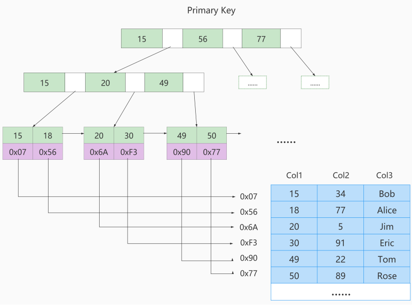


如果我们在Col2上建立一个二级索引，则此索引的结构如下图所示`（是非聚簇索引）`：


### 3.7、MyISAM与InnoDB对比**☆** 

- InnoDB的数据文件本身就是索引文件，而MyISAM索引文件和数据文件是分离的：
  - InnoDB的表在磁盘上存储在以下文件中： `.ibd（表结构、索引和数据都存在一起,MySQL5.7表结构放在.frm中）`
  - MyISAM的表在磁盘上存储在以下文件中：  `*.sdi（描述表结构，MySQL5.7是.frm）`、`*.MYD（数据）`，`*.MYI（索引）`

- InnoDB中主键索引是聚簇索引，叶子节点中存储完整的数据记录；其他索引是非聚簇索引，存储相应记录主键的值 。
- InnoDB要求表必须有主键 （ MyISAM可以没有 ）。如果没有显式指定，则MySQL系统会自动选择一个可以`非空且唯一`标识数据记录的列作为主键。如果不存在这种列，则MySQL自动为InnoDB表生成一个隐含字段作为主键。
- MyISAM中无论是主键索引还是非主键索引都是非聚簇的，叶子节点记录的是数据的地址。

- `MyISAM的回表操作是十分快速的`，因为是拿着地址偏移量直接到文件中取数据的，反观InnoDB是通过获取主键之后再去聚簇索引里找记录，虽然说也不慢，但还是比不上直接用地址去访问。


## 4、索引操作

### 4.1、创建索引

- 随表一起创建索引：

```sql
CREATE TABLE customer (
    
  id INT UNSIGNED AUTO_INCREMENT,
  customer_no VARCHAR(200),
  customer_name VARCHAR(200),
    
  PRIMARY KEY(id), -- 主键索引：列设定为主键后会自动建立索引，唯一且不能为空。
  UNIQUE INDEX uk_no (customer_no), -- 唯一索引：索引列值必须唯一，允许有NULL值，且NULL可以出现多次。
  KEY idx_name (customer_name), -- 普通索引：既不是主键，列值也不需要唯一，单纯的为了提高查询速度而创建。
  KEY idx_no_name (customer_no,customer_name) -- 复合索引：即一个索引包含多个列。
);
```


- 单独建创索引：

```sql
CREATE TABLE customer1 (
  id INT UNSIGNED,
  customer_no VARCHAR(200),
  customer_name VARCHAR(200)
);

-- 建表后创建索引
ALTER TABLE customer1 ADD PRIMARY KEY customer1(id); -- 主键索引

CREATE UNIQUE INDEX uk_no ON customer1(customer_no); -- 唯一索引
CREATE INDEX idx_name ON customer1(customer_name);  -- 普通索引
CREATE INDEX idx_no_name ON customer1(customer_no,customer_name); -- 复合索引

ALTER TABLE customer1 MODIFY id INT UNSIGNED AUTO_INCREMENT, ADD PRIMARY KEY customer1(id); --创建自增的主键索引
```


- 使用ALTER命令：

```sql
ALTER TABLE customer1 ADD PRIMARY KEY (id); -- 主键索引
ALTER TABLE customer1 ADD UNIQUE INDEX uk_no (customer_no); -- 唯一索引
ALTER TABLE customer1 ADD INDEX idx_name (customer_name);   -- 普通索引
ALTER TABLE customer1 ADD INDEX idx_no_name (customer_no,customer_name);  -- 复合索引
```


### 4.2、查看索引

```sql
SHOW INDEX FROM customer;
```


### 4.3、删除索引

```sql
DROP INDEX idx_name ON customer; -- 删除单值、唯一、复合索引

ALTER TABLE customer MODIFY id INT UNSIGNED, DROP PRIMARY KEY; -- 删除主键索引(有主键自增)
ALTER TABLE customer1 DROP PRIMARY KEY;  -- 删除主键索引(没有主键自增)
```


## 5、索引的使用场景**☆** 

**哪些情况适合创建索引：**

- 频繁作为WHERE查询条件的字段
- 经常GROUP BY 和 ORDER BY的列

- 字段的值有唯一性的限制
- DISTINCT字段需要创建索引
- 多表JOIN时，对连接字段创建索引

- 使用字符串前缀创建索引
  - `例如`一个字段 address varchar（120），我们可以创建索引的长度为（12）个字符，节省索引空间
- 区分度高的列（重复的数据少）适合作为索引
- 使用频繁的列，放到联合索引的左侧


**哪些情况不要创建索引：**

- WHERE里用不到的字段不创建索引
- 表的数据记录太少
- 有大量重复数据的列上
- 避免对经常增删改的表创建索引
- 不要定义冗余或重复的索引


# 第06章 索引优化

## 1、数据库优化方案

**问题：**

哪些方法可以进行数据库调优？

**解决方案：**

- 索引失效，没有充分利用到索引：`索引建立`
- 关联查询太多JOIN（设计缺陷或不得已的需求）：`SQL优化`
- 数据过多：分库分表

- 服务器调优及各个参数设置（缓冲、线程数等）：调整my.cnf


## 2、性能分析（EXPLAIN）

### 2.1、EXPLAIN是什么

查看SQL执行计划：使用EXPLAIN关键字可以`模拟优化器执行SQL查询语句`，从而知道MySQL是如何处理你的SQL语句的。`分析你的查询语句或是表结构的性能瓶颈`。

**用法：**

```sql
EXPLAIN + SQL语句
```

- 表的读取顺序
- 数据读取的操作类型
- 哪些索引可以使用
- **哪些索引实际被使用**  
- 表之间的引用
- **每张表有多少行被优化器查询**

### 2.2、数据准备

```sql
create database atguigudb2;
USE atguigudb2;
 
CREATE TABLE t1(id INT(10) AUTO_INCREMENT, content VARCHAR(100) NULL, PRIMARY KEY (id));
CREATE TABLE t2(id INT(10) AUTO_INCREMENT, content VARCHAR(100) NULL, PRIMARY KEY (id));
CREATE TABLE t3(id INT(10) AUTO_INCREMENT, content VARCHAR(100) NULL, PRIMARY KEY (id));
CREATE TABLE t4(id INT(10) AUTO_INCREMENT, content1 VARCHAR(100) NULL, content2 VARCHAR(100) NULL, PRIMARY KEY (id));

CREATE INDEX idx_content1 ON t4(content1);  -- 创建普通索引

# 以下新增sql多执行几次，以便演示
INSERT INTO t1(content) VALUES(CONCAT('t1_',FLOOR(1+RAND()*1000)));
INSERT INTO t2(content) VALUES(CONCAT('t2_',FLOOR(1+RAND()*1000)));
INSERT INTO t3(content) VALUES(CONCAT('t3_',FLOOR(1+RAND()*1000)));
INSERT INTO t4(content1, content2) VALUES(CONCAT('t4_',FLOOR(1+RAND()*1000)), CONCAT('t4_',FLOOR(1+RAND()*1000)));

```


### 2.3、各字段解释

#### 2.3.1、table

- **单表：**显示这一行的数据是关于哪张表的

```sql
EXPLAIN SELECT * FROM t1;
```


- **多表：**关联查询中，显示在执行计划第一行的是驱动表，第二行是被驱动表

```sqlite
EXPLAIN SELECT * FROM t1, t2 WHERE t1.id = t2.id;
```


#### 2.3.2、id

在一个完整的查询语句中，每个**SELECT**关键字，都对应一个**唯一的id**。同时通过id也可以知道操作表的顺序。


- **id相同：**一个SELECT，id都是1

```sql
EXPLAIN SELECT * FROM t1, t2, t3;
```

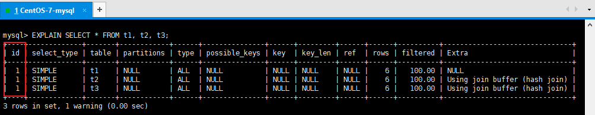


- **id不同：**三个SELECT，id是1、2、3 

```sql
EXPLAIN SELECT t1.id FROM t1 WHERE t1.id =(
  SELECT t2.id FROM t2 WHERE t2.id =(
    SELECT t3.id FROM t3 WHERE t3.content = '000'
  )
);
```


**注意：**如果t3表查询无结果，则table列`t1`和`t2`处为`NULL`

**注意：**查询优化器可能对涉及子查询的语句进行优化，`转为连接查询`

```sql
EXPLAIN SELECT * FROM t1 WHERE content IN (SELECT content FROM t2 WHERE content = 'a');
```


- **id为NULL：**把t1和t2的查询结果合并，并创建名为<union1,2>的临时表，然后对结果去重

```sql
EXPLAIN SELECT * FROM t1 UNION SELECT * FROM t2;
```


因此包含UNION ALL的执行计划中就没有这条记录

```sql
EXPLAIN SELECT * FROM t1 UNION ALL SELECT * FROM t2;
```


**小结：**

- id如果相同，可以认为是一组，`从上往下顺序执行`
- 在所有组中，`id值越大，越先执行`
- 关注点：每个id号码，表示一趟独立的查询, `一个sql的查询趟数越少越好`


#### 2.3.3、select_type

查询的类型，主要是用于区别普通查询、联合查询、子查询等的复杂查询。


- **SIMPLE：**简单查询。查询中不包含子查询或者UNION。

```sql
EXPLAIN SELECT * FROM t1;
```


- **PRIMARY：**主查询。查询中若包含子查询，则最外层查询被标记为PRIMARY。
- **SUBQUERY：**子查询。在SELECT或WHERE列表中包含了子查询。

```sql
EXPLAIN SELECT * FROM t3 WHERE id = ( SELECT id FROM t2 WHERE content= 'a');
```

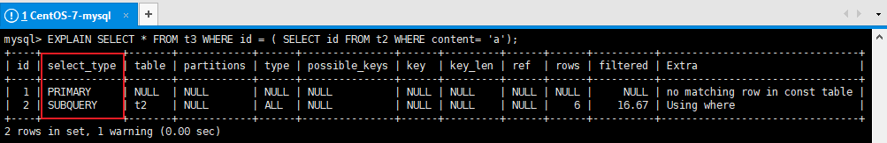


- **DEPENDENT SUBQUREY：**如果包含了子查询，并且查询语句不能被优化器转换为连接查询，并且子查询是`相关子查询（子查询基于外部数据列）`，则子查询就是DEPENDENT SUBQUREY。

```sql
EXPLAIN SELECT * FROM t3 WHERE id = ( SELECT id FROM t2 WHERE content = t3.content);
```


- **UNION：**对于包含UNION或者UNION ALL的查询语句，除了最左边的查询是PRIMARY，其余的查询都是UNION。
- **UNION RESULT：**UNION会对查询结果进行查询去重，MYSQL会使用临时表来完成UNION查询的去重工作，针对这个临时表的查询就是"UNION RESULT"。

```sql
EXPLAIN 
SELECT * FROM t3 WHERE id = 1 
UNION  
SELECT * FROM t2 WHERE id = 1;
```


- **DEPENDENT UNION：**子查询中的UNION或者UNION ALL，除 了最左边的查询是DEPENDENT SUBQUREY，其余的查询都是DEPENDENT UNION。

```sql
 EXPLAIN SELECT * FROM t1 WHERE content IN
 (
 SELECT content FROM t2 
 UNION 
 SELECT content FROM t3
 );
```

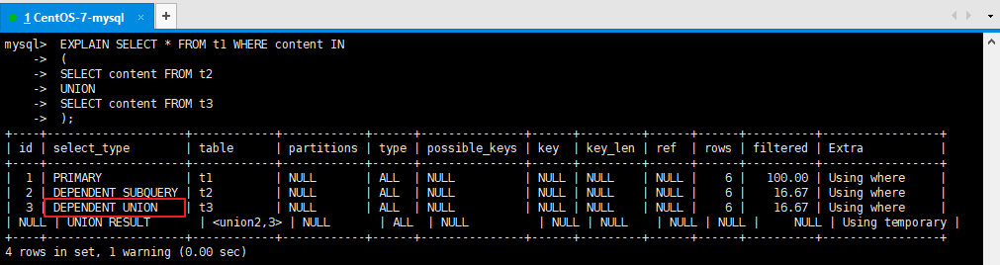


- **DERIVED：**在包含`派生表（子查询在from子句中）`的查询中，MySQL会递归执行这些子查询，把结果放在临时表里。

```sql
EXPLAIN SELECT * FROM (
   SELECT content, COUNT(*) AS c FROM t1 GROUP BY content
) AS derived_t1 WHERE c > 1;
```

这里的`<derived2>`就是在id为2的查询中产生的派生表。


**补充：**MySQL在处理带有派生表的语句时，优先尝试把派生表和外层查询进行合并，如果不行，再把派生表`物化掉`，然后执行查询。下面的例子就是就是将派生表和外层查询进行合并的例子：

```sql
EXPLAIN SELECT * FROM (SELECT * FROM t1 WHERE content = 't1_832') AS derived_t1;
```


`物化`：执行子查询，将结果放入临时表的过程称为物化，默认情况下会建立基于内存的物化表，`并建立哈希索引，如果子查询的结果非常大，超过了系统变量tmp_table_size的设置，会建立基于磁盘的物化表，并建立B+树索引。`（MySQl5.7及之后）

#### 2.3.4、partitions

代表分区表中的命中情况，非分区表，该项为NULL


#### 2.3.5、type **☆** 

表示关联类型或访问类型，即MySQL决定如何查找表中的行。

> **说明：**
>
> 结果值从最好到最坏依次是： 
>
> `system > const > eq_ref > ref` > fulltext > ref_or_null > index_merge > unique_subquery > index_subquery > `range > index > ALL` 
>
> `比较重要的包含：system > const > eq_ref > ref > range > index > ALL`
>
> SQL 性能优化的目标：至少要达到 `range` 级别，要求是 `ref` 级别，最好是 `const`级别。（阿里巴巴
> 开发手册要求）


- **ALL：**全表扫描。Full Table Scan，将遍历全表以找到匹配的行

```sql
EXPLAIN SELECT * FROM t1;
```


- **index：**当使用`覆盖索引`，但需要扫描`全部的索引记录`时

```sql
EXPLAIN SELECT content1 FROM t4;
```


```sql
EXPLAIN SELECT id FROM t1;
```


- **range：**只检索给定范围的行，使用一个索引来选择行。key 列显示使用了哪个索引，一般就是在你的where语句中出现了between、<、>、in等的查询。这种范围扫描索引扫描比全表扫描要好，因为它只需要开始于索引的某一点，而结束于另一点，不用扫描全部索引。

```sql
EXPLAIN SELECT * FROM t1 WHERE id > 2;
```


- **ref：**通过普通二级索引列与常量进行等值匹配时

```sql
EXPLAIN SELECT * FROM t4 WHERE content1 = 'a';
```


- **eq_ref：**连接查询时通过主键或不允许NULL值的唯一二级索引列进行等值匹配时

```sql
EXPLAIN SELECT * FROM t1, t2 WHERE t1.id = t2.id;
```


- **const：**根据 `主键`或者`唯一二级索引`列与`常数`进行匹配时

```sql
EXPLAIN SELECT * FROM t1 WHERE id = 1;
```


- **system：**MyISAM引擎中，当表中只有一条记录时。`（这是所有type的值中性能最高的场景）`

```sql
CREATE TABLE t(i int) Engine=MyISAM;
INSERT INTO t VALUES(1);
EXPLAIN SELECT * FROM t;
```


#### 2.3.6、possible_keys 和 key **☆**

- `possible_keys`表示执行查询时`可能用到的索引`，一个或多个。 查询涉及到的字段上若存在索引，则该索引将被列出，但不一定被查询实际使用。

- `keys`表示`实际使用的索引`。如果为NULL，则没有使用索引。

```sql
EXPLAIN SELECT id FROM t1 WHERE id = 1;
```

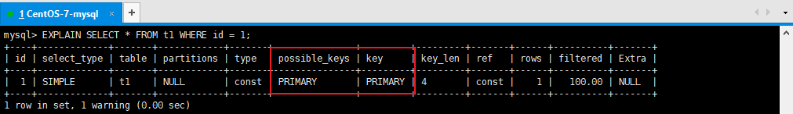


#### 2.3.7、key_len **☆** 

表示MySQL在索引里使用的字节数，根据这个值可以判断索引的使用情况，`检查是否充分利用了索引，针对联合索引值越大越好。`

**如何计算：**

1. 先看索引上字段的类型+长度。比如：int=4 ; varchar(20) =20 ; char(20) =20 
2. 如果是varchar或者char这种字符串字段，视字符集要乘不同的值，比如utf8要乘 3(MySQL5.7)，如果是utf8mb4要乘4，GBK要乘2
3. varchar这种动态字符串要加2个字节
4. 允许为空的字段要加1个字节


| **列类型**                        | **KEY_LEN**        | **备注**                                 |
| --------------------------------- | ------------------ | ---------------------------------------- |
| id int                            | key_len = 4+1 = 5  | 允许NULL，加1字节                        |
| id int not null                   | key_len = 4        | 不允许NULL                               |
| user char(30) utf8mb4             | key_len = 30*4+1   | 允许NULL                                 |
| user varchar(30) not null utf8mb4 | key_len = 30*4+2   | 动态列类型，加2字节                      |
| user varchar(30) utf8mb4          | key_len = 30*4+2+1 | 动态列类型，加2字节；允许NULL，再加1字节 |

```sql
-- 创建索引
CREATE INDEX idx_age_name ON t_emp(age, `name`);
-- 测试1
EXPLAIN SELECT * FROM t_emp WHERE age = 30 AND `name` = 'ab%';
-- 测试2
EXPLAIN SELECT * FROM t_emp WHERE age = 30;
```


#### 2.3.8、ref

显示与key中的索引进行比较的列或常量。

- **const：**  与索引列进行等值比较的东西是啥，const表示一个常数

```sql
EXPLAIN SELECT * FROM t_emp WHERE age = 30;
```


- **ref=atguigudb.t1.id**   关联查询时出现，t2表和t1表的哪一列进行关联

```sql
EXPLAIN SELECT * FROM t1, t2 WHERE t1.id = t2.id;
```

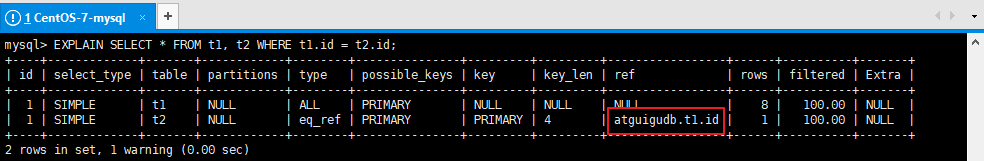


#### 2.3.9、rows **☆**

MySQL认为它执行查询时必须检查的行数。`值越小越好。`

```sql
-- 如果是全表扫描，rows的值就是表中数据的估计行数
EXPLAIN SELECT * FROM t_emp WHERE empno = '100001';

-- 如果是使用索引查询，rows的值就是预计扫描索引记录行数
EXPLAIN SELECT * FROM t_emp WHERE deptId = 1;
```


#### 2.3.10、filtered

最后查询出来的数据占所有服务器端（server）检查行数（rows）的`百分比`。`值越大越好`。

例如上一个例子。


#### 2.3.11、Extra **☆** 

包含不适合在其他列中显示但十分重要的额外信息。通过这些额外信息来`理解MySQL到底将如何执行当前的查询语句`。MySQL提供的额外信息有好几十个，这里只挑比较重要的介绍。

- **Using index：（重要指标）**

`使用了覆盖索引，是性能高的表现`，表示直接访问索引就足够获取到所需要的数据，不需要通过索引回表

```sql
 EXPLAIN SELECT id, content1 FROM t4;
```


- **Using filesort：（重要指标）**

在对查询结果中的记录进行排序时，是可以使用索引的，如下所示：

```sql
EXPLAIN SELECT * FROM t1 ORDER BY id;
```

如如果排序操作无法使用到索引，只能在内存中（记录较少时）或者磁盘中（记录较多时）进行排序（filesort)，**无法利用索引完成的排序**操作称为“文件排序”。如下所示：

```sql
EXPLAIN SELECT * FROM t1 ORDER BY content;
```


- **Using where：(一般重要指标)**

使用了where，但在where上有字段没有创建索引。也可以理解为如果数据从引擎层被返回到server层进行过滤 ，查询的列未被索引覆盖。

```sql
EXPLAIN SELECT * FROM t_emp WHERE `name` = '风清扬';
```


- **Using join buffer：(一般重要指标)**

表明使用了连接缓存，在连接查询时，当`被驱动表（t2）不能有效的利用索引时`，MySQL会提前申请一块内存空间（join buffer）存储被驱动表的数据，来加快查询速度

```sql
EXPLAIN  SELECT * FROM t1, t2 WHERE t1.content = t2.content;
```


下面这个例子就是被驱动表使用了索引，此时Extra中就没有Using join buffer了：

```sql
EXPLAIN SELECT * FROM t_emp, t_dept WHERE t_dept.id = t_emp.deptId;
```

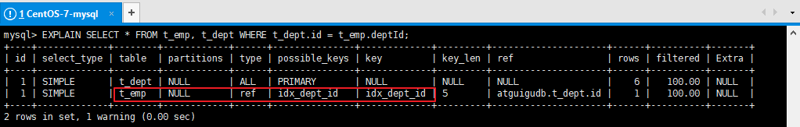

- **Using index condition：(一般重要指标)**

  叫作  `Index Condition Pushdown Optimization （索引下推优化）` 
	[[MySQL索引下推]]
- `如果没有索引下推（ICP）`，那么MySQL在存储引擎层找到满足`content1 > 'z'`条件的第一条二级索引记录。`主键值进行回表`，返回完整的记录给server层，server层再判断其他的搜索条件是否成立。如果成立则保留该记录，否则跳过该记录，然后向存储引擎层要下一条记录。

- `如果使用了索引下推（ICP）`，那么MySQL在存储引擎层找到满足`content1 > 'z'`条件的第一条二级索引记录。`不着急执行回表`，而是在这条记录上先判断一下所有关于`idx_content1`索引中包含的条件是否成立，也就是`content1 > 'z' AND content1 LIKE '%a'`是否成立。如果这些条件不成立，则直接跳过该二级索引记录，去找下一条二级索引记录；如果这些条件成立，则执行回表操作，返回完整的记录给server层。

```sql
-- content1列上有索引idx_content1
EXPLAIN SELECT * FROM t4 WHERE content1 > 'z' AND content1 LIKE '%a';
```


**注意：**如果这里的查询条件`只有content1 > 'z'`，那么找到满足条件的索引后也会进行一次索引下推的操作，判断content1 > 'z'是否成立（这是源码中为了编程方便做的冗余判断）


> `课外阅读：`在没有索引的情况下，为了优化多表连接，减少磁盘IO读取次数和数据遍历次数，MySQL为我们提供了很多不同的连接缓存的优化算法，可参考https://blog.csdn.net/qq_35423190/article/details/120504960
>
> - `Using join buffer (hash join)`**8.0新增：**连接缓存（hash连接） `速度更快`
> - `Using join buffer (Block Nested Loop)`**5.7**：连接缓存（块嵌套循环）


## 3、准备数据

在做优化之前，要准备大量数据。接下来创建两张表，并往员工表里插入50W数据，部门表中插入1W条数据。

怎么快速插入50w条数据呢？ `存储过程`

怎么保证插入的数据不重复？`函数`

**部门表：**

- id：自增长


- deptName：随机字符串，允许重复
- address：随机字符串，允许重复
- CEO：1-50w之间的任意数字

**员工表：**

- id：自增长
- empno：可以使用随机数字，或者`从1开始的自增数字`，不允许重复
- name：随机生成，允许姓名重复
- age：区间随机数
- deptId：1-1w之间随机数

**总结：**需要产生随机字符串和区间随机数的函数。


### 3.1、创建表

```sql
CREATE TABLE `dept` (
	`id` INT(11) NOT NULL AUTO_INCREMENT,
	`deptName` VARCHAR(30) DEFAULT NULL,
	`address` VARCHAR(40) DEFAULT NULL,
	ceo INT NULL ,
	PRIMARY KEY (`id`)
) ENGINE=INNODB AUTO_INCREMENT=1;

CREATE TABLE `emp` (
	`id` INT(11) NOT NULL AUTO_INCREMENT,
	`empno` INT NOT NULL ,
	`name` VARCHAR(20) DEFAULT NULL,
	`age` INT(3) DEFAULT NULL,
	`deptId` INT(11) DEFAULT NULL,
	PRIMARY KEY (`id`)
	#CONSTRAINT `fk_dept_id` FOREIGN KEY (`deptId`) REFERENCES `t_dept` (`id`)
) ENGINE=INNODB AUTO_INCREMENT=1;
```


### 3.2、创建函数

函数，过程编写PL 过程化语言，逻辑，判断，运算等业务逻辑。相当于java中方法

```sql
-- 查看mysql是否允许创建函数：
SHOW VARIABLES LIKE 'log_bin_trust_function_creators';
-- 命令开启：允许创建函数设置：（global-所有session都生效）
SET GLOBAL log_bin_trust_function_creators=1; 
```


```sql
-- 随机产生字符串
DELIMITER $$
CREATE FUNCTION rand_string(n INT) RETURNS VARCHAR(255)
BEGIN    
	DECLARE chars_str VARCHAR(100) DEFAULT 'abcdefghijklmnopqrstuvwxyzABCDEFJHIJKLMNOPQRSTUVWXYZ';
	DECLARE return_str VARCHAR(255) DEFAULT '';
	DECLARE i INT DEFAULT 0;
	WHILE i < n DO  
		SET return_str =CONCAT(return_str,SUBSTRING(chars_str,FLOOR(1+RAND()*52),1));  
		SET i = i + 1;
	END WHILE;
	RETURN return_str;
END $$

-- 假如要删除
-- drop function rand_string;
```


```sql
-- 用于随机产生区间数字
DELIMITER $$
CREATE FUNCTION rand_num (from_num INT ,to_num INT) RETURNS INT(11)
BEGIN   
 DECLARE i INT DEFAULT 0;  
 SET i = FLOOR(from_num +RAND()*(to_num -from_num+1));
RETURN i;  
END$$

-- 假如要删除
-- drop function rand_num;
```


### 3.3、创建存储过程

```sql
-- 插入员工数据
DELIMITER $$
CREATE PROCEDURE  insert_emp(START INT, max_num INT)
BEGIN  
	DECLARE i INT DEFAULT 0;   
	#set autocommit =0 把autocommit设置成0  
	SET autocommit = 0;    
	REPEAT  
		SET i = i + 1;  
		INSERT INTO emp (empno, NAME, age, deptid ) VALUES ((START+i) ,rand_string(6), rand_num(30,50), rand_num(1,10000));  
		UNTIL i = max_num  
	END REPEAT;  
	COMMIT;  
END$$
 
-- 删除
-- DELIMITER ;
-- drop PROCEDURE insert_emp;
```


```sql
-- 插入部门数据
DELIMITER $$
CREATE PROCEDURE insert_dept(max_num INT)
BEGIN  
	DECLARE i INT DEFAULT 0;   
	SET autocommit = 0;    
	REPEAT  
		SET i = i + 1;  
		INSERT INTO dept ( deptname,address,ceo ) VALUES (rand_string(8),rand_string(10),rand_num(1,500000));  
		UNTIL i = max_num  
	END REPEAT;  
	COMMIT;  
END$$
 
-- 删除
-- DELIMITER ;
-- drop PROCEDURE insert_dept;
```


### 3.4、调用存储过程

```sql
-- 执行存储过程，往dept表添加1万条数据
CALL insert_dept(10000); 

-- 执行存储过程，往emp表添加50万条数据，编号从100000开始
CALL insert_emp(100000,500000); 
```


### 3.5、批量删除表索引

```sql
-- 批量删除某个表上的所有索引
DELIMITER $$
CREATE PROCEDURE `proc_drop_index`(dbname VARCHAR(200),tablename VARCHAR(200))
BEGIN
	DECLARE done INT DEFAULT 0;
	DECLARE ct INT DEFAULT 0;
	DECLARE _index VARCHAR(200) DEFAULT '';
	DECLARE _cur CURSOR FOR SELECT index_name FROM information_schema.STATISTICS WHERE table_schema=dbname AND table_name=tablename AND seq_in_index=1 AND index_name <>'PRIMARY'  ;
	DECLARE CONTINUE HANDLER FOR NOT FOUND set done=2 ;      
	OPEN _cur;
		FETCH _cur INTO _index;
		WHILE  _index<>'' DO 
			SET @str = CONCAT("drop index ",_index," on ",tablename ); 
			PREPARE sql_str FROM @str ;
			EXECUTE sql_str;
			DEALLOCATE PREPARE sql_str;
			SET _index=''; 
			FETCH _cur INTO _index; 
		END WHILE;
	CLOSE _cur;
END$$
```


```sql
-- 执行批量删除：dbname 库名称, tablename 表名称
CALL proc_drop_index("dbname","tablename"); 
```


### 3.6、开启SQL执行时间的显示

`为了方便后面的测试中随时查看SQL运行的时间，测试索引优化后的效果，我们开启profiling`

```sql
-- 显示sql语句执行时间
SET profiling = 1;
SHOW VARIABLES  LIKE '%profiling%';
SHOW PROFILES;
```


## 4、单表索引失效案例
[[MySQL索引失效]]
#单表索引失效案例

MySQL中`提高性能`的一个最有效的方式是对数据表`设计合理的索引`。索引提供了高效访问数据的方法，并且加快查询的速度，因此索引对查询的速度有着至关重要的影响。

**我们创建索引后，用不用索引，最终是优化器说了算。`优化器会基于开销（CPU，IO）选择索引，怎么开销小就怎么来。`不是基于规则，也不是基于语义。**

**另外SQL语句是否使用索引，和数据库的版本、数据量、数据选择度（查询中选择的列数）运行环境都有关系。**

```sql
-- 创建索引
CREATE INDEX idx_name ON emp(`name`);
```

### 4.1、计算、函数导致索引失效

```sql
-- 显示查询分析
EXPLAIN SELECT * FROM emp WHERE emp.name  LIKE 'abc%';
EXPLAIN SELECT * FROM emp WHERE LEFT(emp.name,3) = 'abc'; --索引失效
```


### 4.2、LIKE以%开头索引失效

```sql
EXPLAIN SELECT * FROM emp WHERE name LIKE '%ab%'; --索引失效
```


> **拓展：Alibaba《Java开发手册》**
>
> 【强制】页面搜索严禁左模糊或者全模糊，如果需要请走搜索引擎来解决。


### 4.3、不等于(!= 或者<>)索引失效

```sql
EXPLAIN SELECT * FROM emp WHERE emp.name = 'abc' ;
EXPLAIN SELECT * FROM emp WHERE emp.name <> 'abc' ; --索引失效
```


### 4.4、IS NOT NULL 和 IS NULL

```sql
EXPLAIN SELECT * FROM emp WHERE emp.name IS NULL;
EXPLAIN SELECT * FROM emp WHERE emp.name IS NOT NULL; --索引失效
```


**注意：**当数据库中的数据的索引列的`NULL值达到比较高的比例的时候`，即使在IS NOT NULL 的情况下 MySQL的查询优化器会选择使用索引，`此时type的值是range（范围查询）`

```sql
-- 将 id>20000 的数据的 name 值改为 NULL
UPDATE emp SET `name` = NULL WHERE `id` > 20000;

-- 执行查询分析，可以发现 IS NOT NULL 使用了索引
-- 具体多少条记录的值为NULL可以使索引在IS NOT NULL的情况下生效，由查询优化器的算法决定
EXPLAIN SELECT * FROM emp WHERE emp.name IS NOT NULL;
```


**测试完将name的值改回来**

```sql
UPDATE emp SET `name` = rand_string(6) WHERE `id` > 20000;
```


### 4.5、类型转换导致索引失效

```sql
EXPLAIN SELECT * FROM emp WHERE name='123'; 
EXPLAIN SELECT * FROM emp WHERE name= 123; --索引失效
```


### 4.6、全值匹配我最爱

**准备：**

```sql
-- 首先删除之前创建的索引
CALL proc_drop_index("atguigudb","emp");
```

**问题：**为以下查询语句创建哪种索引效率最高

```sql
-- 查询分析
EXPLAIN SELECT * FROM emp WHERE emp.age = 30 and deptid = 4 AND emp.name = 'abcd';
-- 执行SQL
SELECT * FROM emp WHERE emp.age = 30 and deptid = 4 AND emp.name = 'abcd';
-- 查看执行时间
SHOW PROFILES;
```

**创建索引并重新执行以上测试：**

```sql
-- 创建索引：分别创建以下三种索引的一种，并分别进行以上查询分析
CREATE INDEX idx_age ON emp(age);
CREATE INDEX idx_age_deptid ON emp(age,deptid);
CREATE INDEX idx_age_deptid_name ON emp(age,deptid,`name`);
```

**结论：**可以发现最高效的查询应用了联合索引 `idx_age_deptid_name` 


### 4.7、最佳左前缀法则

带头大哥不能死，中间小弟不能断

**准备：**

```sql
-- 首先删除之前创建的索引
CALL proc_drop_index("atguigudb","emp");
-- 创建索引
CREATE INDEX idx_age_deptid_name ON emp(age,deptid,`name`);
```

**问题：**以下这些SQL语句能否命中 `idx_age_deptid_name` 索引，可以匹配多少个索引字段

**测试：**

- 如果索引了多列，要遵守最左前缀法则。即查询从`索引的最左前列`开始并且不跳过索引中的列。
- 过滤条件要使用索引，必须按照`索引建立时的顺序，依次满足`，一旦跳过某个字段，索引后面的字段都无法被使用。

```sql
EXPLAIN SELECT * FROM emp WHERE emp.age=30 AND emp.name = 'abcd' ;
-- EXPLAIN结果：
-- key_len：5 只使用了age索引
-- 索引查找的顺序为 age、deptid、name，查询条件中不包含deptid，无法使用deptid和name索引

EXPLAIN SELECT * FROM emp WHERE emp.deptid=1 AND emp.name = 'abcd';
-- EXPLAIN结果：
-- type： ALL， 执行了全表扫描
-- key_len： NULL， 索引失效
-- 索引查找的顺序为 age、deptid、name，查询条件中不包含age，无法使用整个索引

EXPLAIN SELECT * FROM emp WHERE emp.age = 30 AND emp.deptid=1 AND emp.name = 'abcd';
-- EXPLAIN结果：
-- 索引查找的顺序为 age、deptid、name，匹配所有索引字段

EXPLAIN SELECT * FROM emp WHERE emp.deptid=1 AND emp.name = 'abcd' AND emp.age = 30;
-- EXPLAIN结果：
-- 索引查找的顺序为 age、deptid、name，匹配所有索引字段

```


### 4.8、索引中范围条件右边的列失效 

**准备：**

```sql
-- 首先删除之前创建的索引
CALL proc_drop_index("atguigudb","emp");
```

**问题：**为以下查询语句创建哪种索引效率最高

```sql
EXPLAIN SELECT * FROM emp WHERE emp.age=30 AND emp.deptId>1000 AND emp.name = 'abc'; 
```

**测试1：**

```sql
-- 创建索引并执行以上SQL语句的EXPLAIN
CREATE INDEX idx_age_deptid_name ON emp(age,deptid,`name`);
-- key_len：10， 只是用了 age 和 deptid索引，name失效
```

**注意：**当我们修改deptId的范围条件的时候，例如deptId>100，那么整个索引失效，MySQL的优化器基于成本计算后认为没必要使用索引了，所以就进行了全表扫描。`（注意：因为表中的数据是随机生成的，因此实际测试中根据具体数据的不同测试的结果也会不一样，最终是否使用索引由优化器决定）`


**测试2：**

```sql
-- 创建索引并执行以上SQL语句的EXPLAIN（将deptid索引的放在最后）
CREATE INDEX idx_age_name_deptid ON emp(age,`name`,deptid);
-- 使用了完整的索引
```


**补充：**以上两个索引都存在的时候，MySQL优化器会自动选择最好的方案


### 4.9、小结

一般性建议：

- 对于单例索引，尽量选择针对当前query过滤性更好的索引
- 在选择组合索引的时候，当前query中过滤性最好的字段在索引顺序汇中，位置越靠前越好
- 在选择组合索引的时候，尽量选择能够包含当前query中的where子句中更多字段的索引
- 在选择组合索引的时候，如果某个字段可能出现范围查询时，尽量把这个字段放在索引次序的最后面

**总之，书写SQL语句时，尽量避免造成索引失效的情况**。

## 5、关联查询优化

### 5.1、数据准备

创建两张表，并分插入16条和20条数据：

```sql
-- 分类
CREATE TABLE IF NOT EXISTS `class` (
`id` INT(10) UNSIGNED NOT NULL AUTO_INCREMENT,
`card` INT(10) UNSIGNED NOT NULL,
PRIMARY KEY (`id`)
);
-- 图书
CREATE TABLE IF NOT EXISTS `book` (
`bookid` INT(10) UNSIGNED NOT NULL AUTO_INCREMENT,
`card` INT(10) UNSIGNED NOT NULL,
PRIMARY KEY (`bookid`)
);
 
-- 插入16条记录
INSERT INTO class(card) VALUES(FLOOR(1 + (RAND() * 20)));
INSERT INTO class(card) VALUES(FLOOR(1 + (RAND() * 20)));
INSERT INTO class(card) VALUES(FLOOR(1 + (RAND() * 20)));
INSERT INTO class(card) VALUES(FLOOR(1 + (RAND() * 20)));
INSERT INTO class(card) VALUES(FLOOR(1 + (RAND() * 20)));
INSERT INTO class(card) VALUES(FLOOR(1 + (RAND() * 20)));
INSERT INTO class(card) VALUES(FLOOR(1 + (RAND() * 20)));
INSERT INTO class(card) VALUES(FLOOR(1 + (RAND() * 20)));
INSERT INTO class(card) VALUES(FLOOR(1 + (RAND() * 20)));
INSERT INTO class(card) VALUES(FLOOR(1 + (RAND() * 20)));
INSERT INTO class(card) VALUES(FLOOR(1 + (RAND() * 20)));
INSERT INTO class(card) VALUES(FLOOR(1 + (RAND() * 20)));
INSERT INTO class(card) VALUES(FLOOR(1 + (RAND() * 20)));
INSERT INTO class(card) VALUES(FLOOR(1 + (RAND() * 20)));
INSERT INTO class(card) VALUES(FLOOR(1 + (RAND() * 20)));
INSERT INTO class(card) VALUES(FLOOR(1 + (RAND() * 20)));
 
-- 插入20条记录
INSERT INTO book(card) VALUES(FLOOR(1 + (RAND() * 20)));
INSERT INTO book(card) VALUES(FLOOR(1 + (RAND() * 20)));
INSERT INTO book(card) VALUES(FLOOR(1 + (RAND() * 20)));
INSERT INTO book(card) VALUES(FLOOR(1 + (RAND() * 20)));
INSERT INTO book(card) VALUES(FLOOR(1 + (RAND() * 20)));
INSERT INTO book(card) VALUES(FLOOR(1 + (RAND() * 20)));
INSERT INTO book(card) VALUES(FLOOR(1 + (RAND() * 20)));
INSERT INTO book(card) VALUES(FLOOR(1 + (RAND() * 20)));
INSERT INTO book(card) VALUES(FLOOR(1 + (RAND() * 20)));
INSERT INTO book(card) VALUES(FLOOR(1 + (RAND() * 20)));
INSERT INTO book(card) VALUES(FLOOR(1 + (RAND() * 20)));
INSERT INTO book(card) VALUES(FLOOR(1 + (RAND() * 20)));
INSERT INTO book(card) VALUES(FLOOR(1 + (RAND() * 20)));
INSERT INTO book(card) VALUES(FLOOR(1 + (RAND() * 20)));
INSERT INTO book(card) VALUES(FLOOR(1 + (RAND() * 20)));
INSERT INTO book(card) VALUES(FLOOR(1 + (RAND() * 20)));
INSERT INTO book(card) VALUES(FLOOR(1 + (RAND() * 20)));
INSERT INTO book(card) VALUES(FLOOR(1 + (RAND() * 20)));
INSERT INTO book(card) VALUES(FLOOR(1 + (RAND() * 20)));
INSERT INTO book(card) VALUES(FLOOR(1 + (RAND() * 20)));
```


### 5.2、左外连接

**没有创建索引前的测试：**进行了`全表扫描`，查询次数为`16*20`

```sql
EXPLAIN SELECT * FROM class LEFT JOIN book ON class.card = book.card;
-- 左表class：驱动表、右表book：被驱动表
```


**测试1：**在驱动表上创建索引：进行了`全索引扫描`，查询次数是`16*20`

```sql
-- 创建索引
CREATE INDEX idx_class_card ON class(card);
```


**测试2：**在被驱动表上创建索引：可以避免全表扫描，查询次数是`16*1`

```sql
-- 首先删除之前创建的索引
CALL proc_drop_index("atguigudb","class");
-- 创建索引
CREATE INDEX idx_book_card ON book(card);
```


**测试3：**同时给两张表添加索引：充分利用了索引，查询次数是`16*1`

```sql
-- 已经有了book索引
CREATE INDEX idx_class_card ON class(card);
```


> **结论：**
>
> 针对两张表的连接条件涉及的列，索引要创建在被驱动表上，驱动表尽量是小表
>
> - 如果驱动表上没有where过滤条件
>   - 当驱动表的连接条件没有索引时，驱动表是全表扫描
>   - 当针对驱动表的连接条件建立索引时，驱动表依然要进行全索引扫描
>   - 因此，此时建立在驱动表上的连接条件上的索引是没有太大意义的
>
> - 如果驱动表上有where过滤条件，那么针对过滤条件创建的索引是有必要的


### 5.3、内连接

**测试：**将前面外连接中的LEFT JOIN 变成 INNER JOIN

```sql
-- 换成inner join
EXPLAIN SELECT * FROM class INNER JOIN book ON class.card=book.card;
-- 交换class和book的位置
EXPLAIN SELECT * FROM book INNER JOIN class ON class.card=book.card;
```

**都有索引的情况下：**查询优化器自动选择数据量小的表做为驱动表


**class表有索引的情况下：**book表是驱动表


**book表有索引的情况下：**class表是驱动表


**都没有索引的情况下：**选择数据量小的表做为驱动表


> **结论：**发现即使交换表的位置，MySQL优化器也会自动选择驱动表，自动选择驱动表的原则是：索引创建在被驱动表上，驱动表是小表。


### 5.4、扩展掌门人的练习

```sql
-- 首先删除之前创建的索引
CALL proc_drop_index("atguigudb","emp");
CALL proc_drop_index("atguigudb","dept");
```


**1.三表左连接方式:**

```sql
-- 员工表(t_emp)、部门表(t_dept)、ceo(t_emp)表 关联查询
EXPLAIN SELECT emp.name, ceo.name AS ceoname 
FROM emp
LEFT JOIN dept ON emp.deptid = dept.id 
LEFT JOIN emp ceo ON dept.ceo = ceo.id;
```

一趟查询，用到了主键索引，`效果最佳`


**2.子查询方式：**

```sql
EXPLAIN SELECT emp.name,
(SELECT emp.name FROM emp WHERE emp.id = dept.ceo) AS ceoname
FROM emp 
LEFT JOIN dept ON emp.deptid = dept.id;
```

两趟查询，用到了主键索引，`跟第一种比，效果稍微差点`。


**3.临时表连接方式**

```sql
EXPLAIN SELECT emp_with_ceo_id.name, emp.name AS ceoname 
FROM 
( 
SELECT emp.name, dept.ceo 
FROM emp 
LEFT JOIN dept ON emp.deptid = dept.id 
) emp_with_ceo_id
LEFT JOIN emp ON emp_with_ceo_id.ceo = emp.id;
```

查询一趟，`MySQL查询优化器将衍生表查询转换成了连接表查询`，速度堪比第一种方式


**MySQL5.5查询结果：**两趟查询，先查询a,b产生衍生表ab,衍生表作为驱动表，c作为被驱动表，使用到c表主键。效果比后面一种要好一点。


**4、临时表连接方式2**

```sql
EXPLAIN SELECT emp.name, ceo.ceoname FROM emp LEFT JOIN
( 
SELECT emp.deptId AS deptId, emp.name AS ceoname 
FROM emp 
INNER JOIN dept ON emp.id = dept.ceo 
) ceo
ON emp.deptId = ceo.deptId;
```

查询一趟，`MySQL查询优化器将衍生表查询转换成了连接表查询`，但是只有一个表使用了索引，数据检索的次数稍多，`性能最差`。


**MySQL5.5查询结果：**两趟查询，先查询b, a产生衍生表ab,衍生表作为被驱动表，衍生表无法建立索引，也就无法优化; 所以，这种语句是性能最差的。


### 5.5、总结

- 保证被驱动表的JOIN字段已经创建了索引
- 需要JOIN 的字段，数据类型保持绝对一致。
- LEFT JOIN 时，选择小表作为驱动表，大表作为被驱动表 。减少外层循环的次数。
- INNER JOIN 时，MySQL会自动将小结果集的表选为驱动表 。选择相信MySQL优化策略。
- 能够直接多表关联的尽量直接关联，不用子查询。(减少查询的趟数)
- **关联表之间编码一定要相同**


## 6、子查询优化

**查询非掌门人**

```sql
-- 不推荐
-- 查询员工，这些员工的id没在（掌门人id列表中）
SELECT * FROM t_emp emp WHERE emp.id NOT IN 
(SELECT dept.ceo FROM t_dept dept WHERE dept.ceo IS NOT NULL);

```


```sql
-- 推荐
-- 按照集合查询
SELECT emp.* FROM t_emp emp 
LEFT JOIN t_dept dept ON emp.id = dept.ceo WHERE dept.id IS NULL;
```


也可以为ceo添加一个索引字段


> **结论：**尽量不要使用NOT IN 或者 NOT EXISTS，用LEFT JOIN xxx ON xx = xx WHERE xx IS NULL替代


## 7、排序优化

### 7.1、[[MySQL索引失效]]的情况
#MySQL索引失效
> **以下三种情况不走索引：**
>
> 1. 无过滤，不索引
>
> 2. 顺序错，不索引
>
> 3. 方向反，不索引

**准备：**

```sql
-- 删除现有索引
CALL proc_drop_index("atguigudb","emp");
-- 创建索引
CREATE INDEX idx_age_deptid_name ON emp (age,deptid,`name`);
```

**无过滤，不索引：**

```sql
-- 没有使用索引：
EXPLAIN SELECT * FROM emp ORDER BY age,deptid;

-- 使用了索引：order by想使用索引，必须有过滤条件，索引才能生效，limit也可以看作是过滤条件
EXPLAIN SELECT * FROM emp ORDER BY age,deptid LIMIT 10; 
```

**顺序错，不索引：**

```sql
-- 排序使用了索引：
-- 注意：key_len = 5是where语句使用age索引的标记，order by语句使用索引不在key_len中体现。
EXPLAIN SELECT * FROM emp WHERE age=45 ORDER BY deptid;

-- 排序使用了索引：
EXPLAIN SELECT * FROM emp WHERE age=45 ORDER BY deptid, `name`; 

-- 排序没有使用索引：因为索引列中不存在empno
EXPLAIN SELECT * FROM emp WHERE age=45 ORDER BY deptid, empno;

-- 排序没有使用索引：order by 后的排序条件的顺序，与索引顺序不一致
EXPLAIN SELECT * FROM emp WHERE age=45 ORDER BY `name`, deptid;

-- 排序没有使用索引：出现的顺序要和复合索引中的列的顺序一致！
EXPLAIN SELECT * FROM emp WHERE deptid=45 ORDER BY age;
```

**方向反，不索引：**

```sql
-- 排序使用了索引：排序条件和索引一致，并方向相同，可以使用索引
EXPLAIN SELECT * FROM emp WHERE age=45 ORDER BY deptid ASC, `name` DESC;

-- 没有使用索引：两个排序条件方向相反
EXPLAIN SELECT * FROM emp WHERE age=45 ORDER BY deptid DESC, `name` DESC;

```


### 7.2、索引优化案例

> 排序优化的目的是，去掉 Extra 中的 using filesort（手工排序）

**准备：**

```sql
-- 删除现有索引
CALL proc_drop_index("atguigudb","emp");
-- 这个例子结合 show profiles; 查看运行时间
SET profiling = 1;
```

**需求：**查询 年龄为30岁的，且员工编号小于101000的用户，按用户名称排序 

**测试1：**很显然，type 是 ALL，即最坏的情况。Extra 里还出现了 Using filesort,也是最坏的情况。优化是必须的。

```sql
EXPLAIN SELECT * FROM emp WHERE age =30 AND empno <101000 ORDER BY `name`;
-- 然后查看一下SQL的执行时间
```

`性能测试：`


**优化思路：** 尽量让where的过滤条件和排序使用上索引

**step1：** 我们建一个三个字段的组合索引可否？ 

```sql
CREATE INDEX idx_age_empno_name ON emp (age,empno,`name`);
```

最后的name索引没有用到，出现了Using filesort。原因是，因为empno是一个范围过滤，所以索引后面的字段不会再使用索引了。所以我们建一个3值索引是没有意义的 

`性能测试：`


**step2：**那么我们先删掉这个索引：

```sql
DROP INDEX idx_age_empno_name ON emp;
```

为了去掉filesort我们可以把索引建成，也就是说empno 和name这个两个字段我只能二选其一。

```sql
CREATE INDEX idx_age_name ON emp(age,`name`);
```

这样我们优化掉了 using filesort。但是经过测试，性能反而下降

`性能测试：`


**step3：**如果我们选择那个范围过滤，而放弃排序上的索引呢?

```sql
DROP INDEX idx_age_name ON emp;
CREATE INDEX idx_age_empno ON emp(age,empno);
```

执行原始的sql语句，查看性能，结果竟然有 filesort的 sql 运行速度，超过了已经优化掉 filesort的 sql，而且快了好多倍。何故？

`性能测试：`


**原因：**所有的排序都是在条件过滤之后才执行的，所以，如果条件过滤掉大部分数据的话，剩下几百几千条数据进行排序其实并不是很消耗性能，即使索引优化了排序，但实际提升性能很有限。 相对的 `empno<101000` 这个条件，如果没有用到索引的话，要对几万条的数据进行扫描，这是非常消耗性能的，所以索引放在这个字段上性价比最高，是最优选择。

> **结论：**当【范围条件】和【group by 或者 order by】的字段出现二选一时，优先观察条件字段的过滤数量，如果过滤的数据足够多，而需要排序的数据并不多时，优先把索引放在范围字段上。反之，亦然。
>
> 也可以将选择权交给MySQL：索引同时存在，mysql自动选择最优的方案：（对于这个例子，mysql选择idx_age_empno），但是，随着数据量的变化，选择的索引也会随之变化的。

## 8、分组优化

- `group by 使用索引的原则几乎跟order by一致`。但是group by 即使没有过滤条件用到索引，也可以直接使用索引（Order By 必须有过滤条件才能使用上索引）
- 减少使用order by等，和业务沟通能不排序就不排序，或将排序放到程序端去做。Order by、group by、distinct这些语句较为耗费CPU，数据库的CPU资源是极其宝贵的。
- 包含了order by、group by、distinct这些查询的语句，where条件过滤出来的结果集请保持在1000行以内，否则SQL会很慢。


## 9、覆盖索引优化

> **总结**
>
> - 禁止使用select *，禁止查询与业务无关字段
> - 尽量利用覆盖索引


# 第07章 慢查询日志
#MySQL慢查询日志

## 1、是什么

一种日志记录，查看哪些SQL超出了我们的最大忍耐时间值。


## 2、开启慢查询日志参数

### 2.1、开启slow_query_log

默认情况下，MySQL数据库没有开启慢查询日志，需要我们手动来设置这个参数。当然，如果不是调优需要的话，一般不建议启动该参数，因为开启慢查询日志会或多或少带来一定的性能影响。

```sql
SET GLOBAL slow_query_log=1; 
```

然后我们再来查看下慢查询日志是否开启，以及慢查询日志文件的位置：

```sql
SHOW VARIABLES LIKE '%slow_query_log%'; 
```


### 2.2、修改long_query_time阈值

```sql
SHOW VARIABLES LIKE '%long_query_time%'; -- 查看值：默认10秒
SET GLOBAL long_query_time=0.1; -- 设置一个比较短的时间，便于测试
```

**注意：**

- **需要重新登录客户端**使上面的设置生效
- 假如运行时间正好等于long_query_time的情况，并不会被记录下来。
- 也就是说，在mysql源码里是判断大于long_query_time，而非大于等于。


### 2.3、日志分析工具

**执行耗时sql：**

```
SELECT * FROM emp;
SELECT * FROM emp WHERE deptid > 1;
```

**查询慢查询记录数：**

```sql
SHOW GLOBAL STATUS LIKE '%Slow_queries%'; 
```

**查询日志：**

```shell
vim /var/lib/mysql/atguigu-slow.log
```

**mysqldumpslow：**

在生产环境中，如果要手工分析日志，查找、分析SQL，显然是个体力活，MySQL提供了日志分析工具mysqldumpslow。退出mysql命令行，执行以下命令：

```sql
-- 查看mysqldumpslow的帮助信息
mysqldumpslow --help

-- 工作常用参考
-- 1.得到返回记录集最多的10个SQL
mysqldumpslow -s r -t 10 /var/lib/mysql/atguigu-slow.log
-- 2.得到访问次数最多的10个SQL
mysqldumpslow -s c -t 10 /var/lib/mysql/atguigu-slow.log
-- 3.得到按照时间排序的前10条里面含有左连接的查询语句
mysqldumpslow -s t -t 10 -g "left join" /var/lib/mysql/atguigu-slow.log
-- 4.另外建议在使用这些命令时结合 | 和more 使用 ，否则有可能出现爆屏情况
mysqldumpslow -s r -t 10 /var/lib/mysql/atguigu-slow.log | more
```

- -a: 不将数字抽象成N，字符串抽象成S

- -s: 是表示按照何种方式排序；
- c: 访问次数
  - l: 锁定时间
  - r: 返回记录
  - t: 查询时间

- al:平均锁定时间
  -  ar:平均返回记录数
  -  at:平均查询时间

- -t: 即为返回前面多少条的数据；

- -g: 后边搭配一个正则匹配模式，大小写不敏感的；

# 第08章 View视图
#View视图
## 1、是什么

- 将一段查询sql封装为一个虚拟的表。 
- 这个虚拟表只保存了sql逻辑，不会保存任何查询结果。


## 2、作用

- 封装复杂sql语句，提高复用性
- 逻辑放在数据库上面，更新不需要发布程序，面对频繁的需求变更更灵活


## 3、适用场景

- 共用查询结果
- 报表

## 4、语法

### 4.1、创建

```sql
-- 语法
CREATE VIEW view_name 
AS SELECT column_name(s) FROM table_name WHERE condition;

-- 例如：求所有人物对应的掌门名称
CREATE VIEW v_ceo AS
SELECT emp.name, ceo.name AS ceoname 
FROM t_emp emp
LEFT JOIN t_dept dept ON emp.deptid = dept.id 
LEFT JOIN t_emp ceo ON dept.ceo = ceo.id;
```


### 4.2、使用

**查询**

```sql
-- 语法
SELECT * FROM view_name; 

-- 例如：
SELECT * FROM v_ceo; 
```

**更新**

```sql
-- 语法
CREATE OR REPLACE VIEW view_name 
AS SELECT column_name(s) FROM table_name WHERE condition

-- 建议直接删除重新创建
```

**删除**

```sql
DROP VIEW view_name;

-- 例如：
DROP VIEW v_ceo;
```

