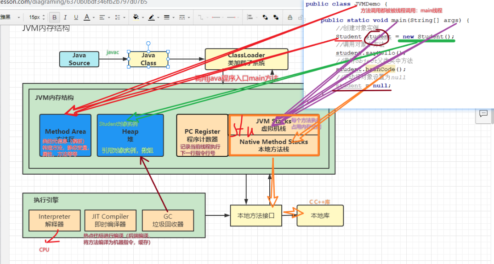
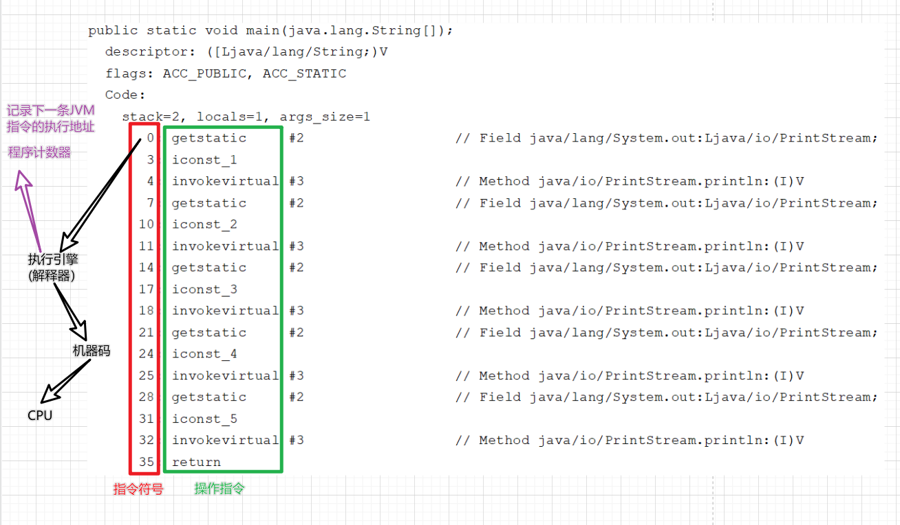

课件1: #ShardingSphere

能在一个微服务完成就不要跨服务
能在一个表完成的就不要做关联查询

什么是广播表?
#广播表
	指所有的分片数据源中都存在的表，表结构及其数据在每个数据库中均完全一致。 适用于数据量不大且需要与海量数据的表进行关联查询的场景，例如：字典表。

广播具有以下特性：

（1）插入、更新操作会实时在所有节点上执行，保持各个分片的数据一致性

（2）查询操作，只从一个节点获取

（3）可以跟任何一个表进行 JOIN 操作


课件2: [[JavaEE_JVM]]

什么是JVM?
	Java虚拟机 (java程序-二进制字节码运行环境)
好处: 
	一次编写,到处运行

什么是永久代
什么是元空间

方法区
堆
程序计数器
虚拟机栈
本地方法栈
执行引擎
及时编译器
GC
本地方法接口
本地库

作用
画一画


类加载器子系统 ClassLoader
工具 javap
这个工具主要是对字节码文件进行返汇编 得到类的信息(由类加载器加载后存入方法区)
使用方式: javap -v *.class 详细信息
直接把class文件拖到idea下面的terminall
 javap -v *.class > 文件名.txt

类的加载过程: 三个阶段
阶段一: 加载: 类是懒加载的
	在内存中生成一个代表这个类的java.lang.Class对象
阶段二: 链接
 * 验证: 验证class文件是否合法
 * 准备: 
	   为静态变量赋初值
	   示例变量创建对象的时候完成赋值
	   final修饰的常量在编译时会自动分配 
	-- 通过反汇编结果 类信息中静态变量没有值(进行赋初值操作)
 * 解析: 将符号引用替换为直接引用
阶段三: 初始化(调用类的静态方法块完成初始化)
	静态变量在类初始化方法(静态方法块中)完成赋值操作
JHSDB 工具


双亲委派模式
沙箱模式
什么是沙箱 什么是沙盒

PC寄存器(程序计数器)


1.垃圾回收是否涉及栈内存？
	垃圾回收不会也不需要回收栈内存,因为栈帧会在方法执行结束后弹出栈,也就是自动释放了内存
2.栈内存分配越大越好吗？
	栈内存不是分配的越大越好,栈内存分配的大能增加递归调用的次数,但是会减少并发线程数,就比如内存是500M,栈内存分配1M,可以有500个并发线程;如果栈内存分配5M,就只能有100个并发线程了!
3.方法内的局部变量是否线程安全？
	方法内的局部变量是每个线程私有的,是线程安全的; 但是如果在这个局部变量引用了对象,并且逃出了该方法的作用范围,比如将该变量作为此方法的返回值,再比如在这个方法内新开一个线程,在新开线程中操作这个变量, 此时这个变量就不是线程安全的了.


#哈希冲突 

#intern

如果那8G指的是-Xmx 8G，那么256M不在其中。但是永久代/方法区也属于GC Heap的一部分。

另外，**方法区（method area）**只是**JVM规范**中定义的一个概念，用于存储类信息、常量池、静态变量、JIT编译后的代码等数据，具体放在哪里，不同的实现可以放在不同的地方。而**永久代**是**Hotspot**虚拟机特有的概念，是方法区的一种实现，别的JVM都没有这个东西。

  
  
作者：毛海山  
链接：https://www.zhihu.com/question/49044988/answer/113961406  
来源：知乎  
著作权归作者所有。商业转载请联系作者获得授权，非商业转载请注明出处。


**一、为什么叫元空间Metaspace? **

是因为这里面存储的是类的元数据信息。

元数据（Meta Date），关于数据的数据或者叫做用来描述数据的数据或者叫做信息的信息。

这些定义都很是抽象，我们可以把元数据简单的理解成，最小的数据单位。元数据可以为数据说明其元素或属性（名称、大小、数据类型、等），或其结构（长度、字段、数据列），或其相关数据（位于何处、如何联系、拥有者）。


1. 请谈谈你对JVM 的理解？Java8 的虚拟机有什么更新？
   (1)JVM : Java Virtual Machine (Java虚拟机)
   JRE是由JVM和一些核心类库组成的, JDK是由JRE和一些开发工具组成的,Java代码想要运行,首先要编译成字节码文件.class,然后运行在JVM上, JVM包含方法区,堆,虚拟机栈,本地方法栈,程序计数器五部分.
   (2) JDK8 方法区的实现方式由永久代改成了元空间, JDK8之前方法区是占用的堆的一部分内存,方法区回收的效率很低, 在是在full GC的时候才会回收,所以这种实现方式被称为永久代. JDK8之后废弃了永久代, 方法区使用的是本地内存, 存储的是元数据,所以这种实现方式被称为元空间.

   
2. 什么是OOM ？什么是StackOverflowError？有哪些方法分析？
	(1)OOM: Out Of Memory 内存溢出, 当JVM因为没有足够的内存来为对象分配空间,并且卡及回收器也没有可以回收的空间时,就会抛出这个Error, 
	为什么会OOM: 1. 分配的少了; 2. 应用用的太多
	(2) StackOverflowError 栈内存溢出 虚拟机栈没有足够的空间为方法入栈提供空间, 默认1M, 一般造成栈内存溢出是因为递归出口设置有误.
	分析方法: ???????????????????????????????????????????????????????????????????


3. JVM 的常用参数调优你知道哪些？
	????????????????????????????????????????????????????????

4. 内存快照抓取和MAT分析DUMP文件知道吗？
	????????????????????????????????????????????????????????????

5. 谈谈JVM中，对类加载器你的认识？
	启动类加载器(引导类加载器 Bootstrap ClassLoader)
	扩展类加载器 （Extension ClassLoader）
	应用程序类加载器 （系统类加载器，AppClassLoader）
	用户自定义类加载器
	






```
JVM-day01
什么是JVM？Java虚拟机（java程序-二进制字节码运行环境）
好处：
一次编写，到处运行的基石 在windows，linux，mac系统运行，平台无关。
自动内存管理机制，提供垃圾回收功能（大大减少程序员的工作量）
真正实现数组。java中如果下标越界-抛异常。覆盖元素（内存）--C语言
多态，面向对象编程

JVM是运行在操作系统之上的，它与硬件没有直接的交互
JVM：Java虚拟机
JRE：JVM+基础类库
JDK：JVM+基础类库+编译工具


javap 对字节码文件class文件进行反汇编 得到类的信息（由类加载器加载后存入方法区）
使用： javap -v *.class  > 文件名称.txt  将反汇编信息存入TXT文件中


类加载的过程：三个阶段
***阶段一：加载:类是懒加载
***阶段二：链接
   **验证：验证class文件是否合法
   **准备：静态变量赋初值，final修饰的常量在编译的时候会分配.实例变量创建对象的时候完成赋值
   ***********通过反汇编结果 类信息中静态变量没有值（进行赋初值操作）
   **解析: 将符号引用替换为直接引用
***阶段三：初始化（调用类的静态方法块完成初始化）
   ************静态变量在类初始化方法（静态方法块中）完成赋值操作：所有类变量赋值动作和静态语句块合并
   调用clinit方法（jvm虚拟机）


JHSDB使用：https://www.tqwba.com/x_d/jishu/391164.html
使用工具JHSDB测试类加载：
在命令行中进入到 D:\develop\Java\jdk1.8.0_31\lib   目录下
输入命令打开指定工具：
java -cp .\sa-jdi.jar sun.jvm.hotspot.HSDB
如何查询本地java进程：通过命令行中执行命令：jps  得到java进程ID


类的双亲委派过程：
当一个类加载器收到了类加载请求，它首先不会自己尝试加载，而是将请求委托到上级类加载器进行加载，依次往上。如果上级类加载器不加载再回下方加载权利依次向下。如果到了系统类加载器依然加载失败，报异常ClassNotFound
好处：防止内存中出现同样的字节码文件，这种机制也成为沙箱安全机制。

执行引擎：Execution Engine**执行引擎负责解释命令，提交操作系统执行

方法区：是JVM规范中定义一块内存，用来存储类元数据（模板信息），方法字节码
1.8以前 方法区实现：永久代 Permanent
1.8以后 方法区实现：元空间 MataSpace
存在OOM：java.lang.OutOfMemoryError: Metaspace


栈：先进后出，后进先出
虚拟机栈：每个线程运行所需要的内存每个栈由多个栈帧（调用方法）组成，对应每次方法调用占用内存每个线程只能有一个活动栈帧，对应是正在执行方法


```


