### 一、工作中的用到的工具


#### 阿里云ECS  

* 没有账号，自己可以申请一个账号

* 弹性计算服务

  

##### 	国内使用的各种云排名

* 阿里云
* 腾讯云
* 华为云
* 青云
* 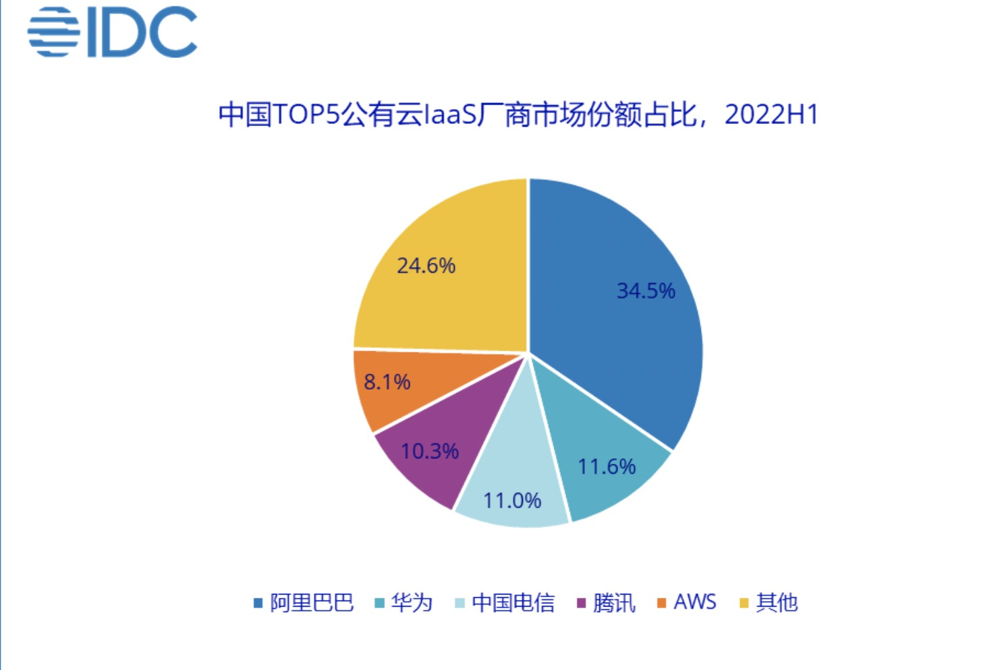


##### ECS购买


##### 安全组


#### 阿里云RDS


##### RDS

* 阿里云关系型数据库： 提供容灾、备份、恢复、监控全套方案


##### RDS购买


##### <mark>慢查询sql</mark>

* 开启慢查询设置

  * slow_query_log 开启慢查询日志功能  默认是on 开启

  * long_query_time 配置慢查询sql响应时间  大于这个时间的算慢sql

    

* 怎么获取慢日志文件

  * 运维人员(DBA)导出excel文件，文件里面都是慢查询sql，发到专门的一个钉钉群（解决公司慢查询sql群）
  * 主力开发去找我们相应的业务线的sql，我们再测试环境去处理（explain）

* 优化sql

  * 通过explain
  * 
  * 解决办法加索引：alter table test_slow_query add index idx_name(name)
    * 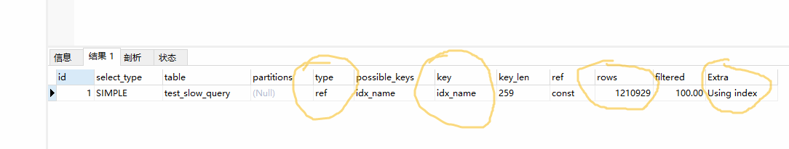

* 提交sql审批

  * 钉钉审批 
  * yearning平台审批
  * 最终由DBA到阿里云后台去执行sql

  

#### GitLab 

##### 注册一个账号

* 公司私服
  * 运维人员搭建一个gitlab服务

* 关联邮箱
  * 去登录我们的gitlab网站


##### 创建项目

* 技术主管 或者 启动新项目的开发主力
* 

##### 本地项目关联我们远端仓库项目

* 初始化
  * git init

* 关联远端仓库
  * git remote add origin + git@gitlab.com:JuYongChen/0620.git （ gitlab项目仓库地址）
  * 

* 添加本地项目到远端仓库
  *   git add ./  把本地文件存储在暂存区域
  *   git commit -m 'init'  把暂存区域代码发布到git本地仓库  （.git隐藏目录中）
  *   git push origin master  把本地代码推送到gitlab远端仓库


##### Invite members

* 邀请成员加入项目
* 


##### ssh Key

* 为什么要用ssh key拉去代码?
  * 有些公司禁止使用https去拉去 克隆代码， 出去安全考虑
* 克隆代码提示没有权限怎么处理？
  * 
* 执行ssh-keygen.exe
  * /c/Users/admin/.ssh两个文件：
* 配置公钥和私钥
  * 私钥id_rsa 公钥 id_rsa.pub
* 我们把公钥放在ssh key位置即可
  * 
* 配置成功，拉取代码
  * 


##### tag使用

​	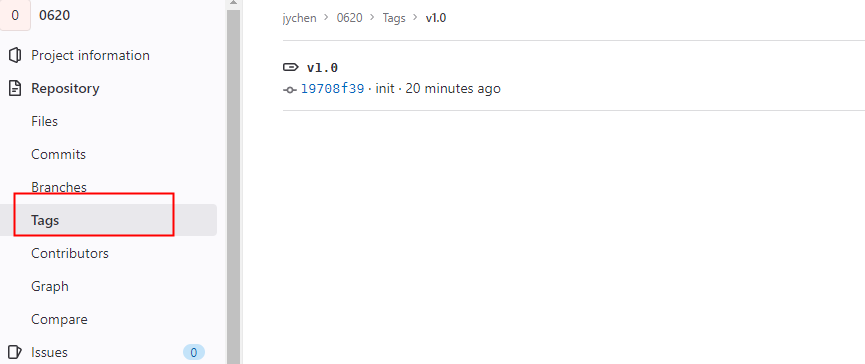

* 每个公司情况不同，根据tag做上线和回滚代码
* 创建一个tag,主要来源是主干分支
  * master 线上分支
  * test/prod   预发分支
  * dev   测试分支

* 通过jenkins上线我们的代码


##### 改变默认分支 删除main分支

* 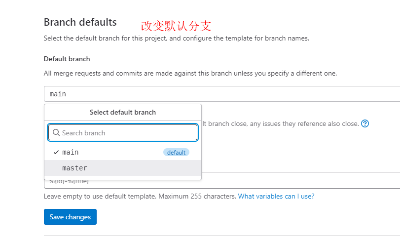

​	


##### 线上分支禁止推送代码

* master分支不允许通过 git push 操作推送代码 （规定）
* 


##### Merge Request

* 主干分支禁止使用push操作之后，可以通过merge request进行代码合并

​	


#### <mark>Git</mark>

##### git文件的三种状态

* 已修改
  * 没有和git关联

* 已暂存
  * git add ./操作把文件变成已暂存状态

* 已提交
  * git commit -m '商品详情功能'
  * 提交到本地的一个git仓库


##### git别名

* 我们日后去公司工作，建议使用git命令操作代码

* 配置别名 cat /etc/gitconfig

  * [alias]
        df = diff
        st = status
        co = checkout
        ci = commit
        br = branch
        lga = log --graph --decorate --oneline --simplify-by-decoration --all
        lg = log --color --graph --pretty=format:'%Cred%h%Creset -%C(yellow)%d%Creset %s %Cgreen(%cr) %C(bold blue)<%an>%Creset' --abbrev-commit

  

##### git常用命令以及使用场景

```
开发一个新功能流程: （单点登录模块）
git clone 项目
git co -b + 新分支名称（sso-func）    新建分支并且切换到新建分支上
git ci -am '单点登录功能'  等于 （git add ./  +  git commit -m '单点登录功能'）
git status 查看文件状态（习惯操作 ）
git co dev 切换到dev分支
git merge sso-func
git lg 查看当前提交的记录（习惯操作 ）
git push origin dev
同步部署平台（jenkins,  ci cd）


使用场景：咱们是主力开发了，你手上的项目不止一个。可以先暂存我们目前开发的项目代码，去解决线上其他紧急的问题。
	git stash save ''  暂存我们不想提交到版本记录的代码
	git stash list     查看暂存文件中的内容 （存储结构- 队列）
	git stash pop      弹出你暂存的文件        


  git clean -fd 清楚已修改的文件或者目录(用不好的先暂时不用)
  git diff 查看文件不同
  git log -p  查看代码提交的版本记录
  git branch   查看本地分支
  git branch -a 查看本地和远程所有分支


git revert
git reset
git rebase


```


#### 中午作业

* gitlab 账号申请一个
* git常用命令以及使用场景
* 慢查询sql 从来到没得过程（要会说）


##### 常见面试题 

* git revert 和 git reset 

  * 都可以作为代码回退操作

  * git reset + 版本id  ---  回退版本id之后所有提交的版本记录（删除版本id所有记录）

  * git revert + 版本id --- 回退当前版本id的提交记录，生成一个新的版本记录id（当前版本id逆向操作）

    

    

  * revert 使用

    * 
    * 

  * git reset禁止回退远端代码

    * 会把本地的最新提交版本记录删除，这样的话 本地版本记录落后于远端代码
    * 这样通过reset回退代码之后，git push origin dev会报错误，提示本地代码落后于远端，先要pull代码。


* git rebase

  * 变基操作- 改变基底

  * 禁止在主干分支使用rebase命令：污染我们的主干分支

    * 测试分支
    * 预发分支
    * 线上分支
    * 原来master
      * 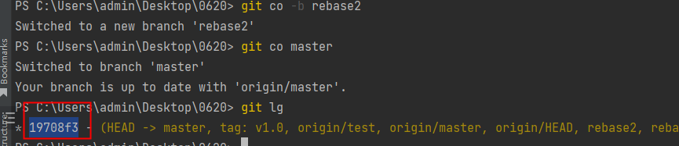

    * rebase1提交进来的master
      * 

    * rebase2分支版本记录
      * 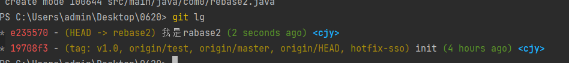

    * rebase2提交进来的master
      * 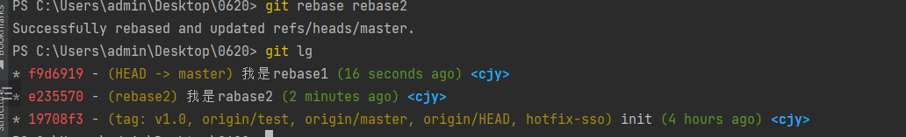

    * 最后的master分支
      * 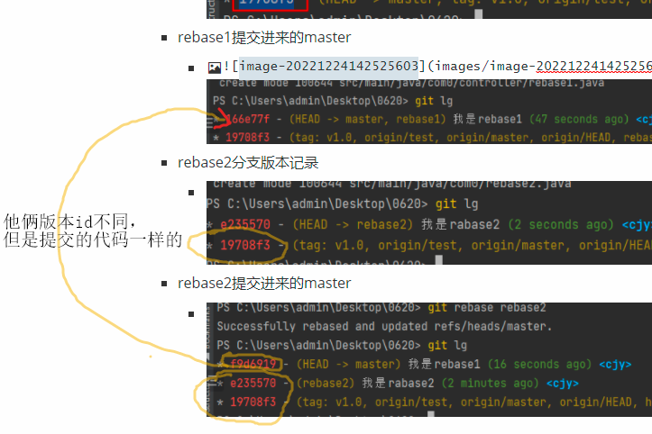
      * 在master分支执行 git rebase rebase2发生了什么？
        * 找master分支找rebase2分支的基底（19708f3）
        * 在基底的上面放入rebase2分支提交的版本记录
        * 把rebase2分支提交的版本记录的上面的所有提交版本记录删除，并且生成新的提交版本记录

    

  

* Git 冲突解决

  * 
  * 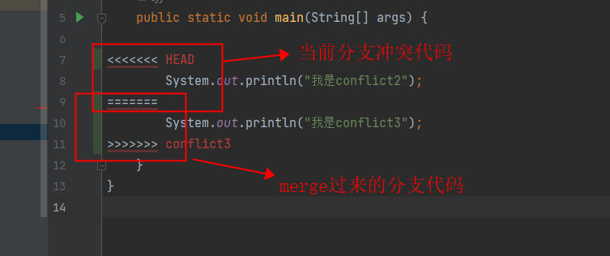
  * 冲突解决：
    * 首先遇到错误，我们通过git status查看冲突代码都有哪些
    * 和冲突代码的当事人，我们该了相同的代码，商量之后，把<<Head  == >>>删除掉，并且修改原有的代码。
    * 冲突解决之后，git commit -m '冲突解决', 最后提交代码：git push origin dev


#### Potainer 

##### 介绍

* 可视化docker操作工具，可以不用写docker命令实现容器的管理


##### 创建镜像


##### 创建容器


#### docker基本操作

* docker pull 拉去镜像

* docker images 查看镜像

* docker ps  查看容器

* docker logs 

* docker run -d 后台运行   -p 端口映射 80:80  --restart=always -v  /etc/mysql/conf:/usr/local/conf 数据卷挂在  -name mysql 设置新的容器的名称 mysql:8.0

* docker start 

* docker stop

  


#### grafana

* 线上监控平台： 接口的响应时间和接口的响应次数

* 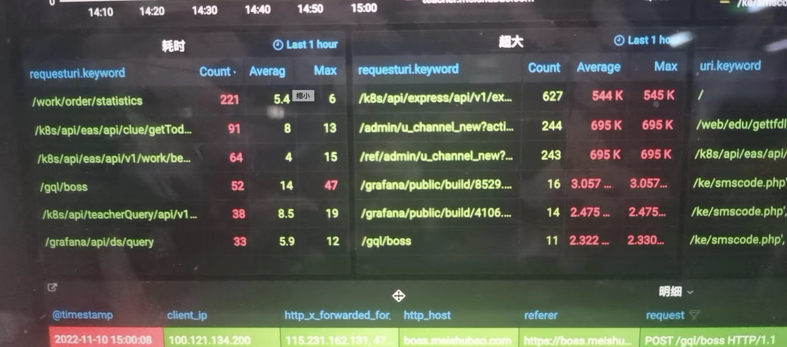

  


#### bug平台

* 较新：Jira  gitee

* 老牌：禅道  mantis

  


#### Github,baidu, google 

* 工作中一直都用的，善于使用这些免费的工具

* Github 号称全球最大的交友网站

* 科学上网：https://github.com/bannedbook/fanqiang

* 要善于总结

  

  

### 二、工作流程

#### 产品提需求

* Prd  producet requirement document 产品需求文档


#### 评审会

* 钉钉通知大家开会  - 人员都有哪些？
  * 后端主力java
  * 前端妹子
  * 测试妹子
  * ui小姐姐
  * 产品经理

* 产品目的？
  * 产品排期：什么时候上测试、预发、线上

* 开完评审会不要着急给排期，一般什么时候给排期？
  * 2周以内的开发时间，当天下班前给到排期。
  * 大型项目 -一个月以上开发时间，建议2天左右在给排期。


#### 开发

* 后端：
  * 设计数据结构 -  字段定义规范
  * 设计接口文档 --  一定好设计好，尽量不要返工
  * model 映射表结构 和vo 输出给前端定义字段
  * controller ,  interface, impl实现类写假接口，测试用例
  * 写具体的业务逻辑

* 前端：
  *  静态页面
  *  根据接口文档写js(操作dom)

* 测试:
  * 冒烟测试用例 - 满足需求的基本功能跑通

* UI: 美化页面
* 合作：
  * 前后端联调代码
  * 我们要跑通冒烟测试用例才能提测代码


#### 代码审查

* 谁来做代码审查？

  * 技术主管code review代码
  * 组员内互相review 

  

#### 提测 

* 提测分支？

  * dev

  * test

  * master  线上无bug

* 谁来测试代码质量？

  * 测试和产品经理

  


#### 上线&监控

* kibana 查看线上日志
* 阿里云平台
* grafana

​	


#### 线上有bug，二次上线

* 新建hotfix-sso分支

* 最终提交审批上线


### 三、电商项目架构	

#### 1、技术栈

* Springboot

  * 脚手架 简化我们的开发流程、自动配置、版本控制
  * 常用注解有哪些
    * @SpringBootApplication
    * @ComponentScan
    * @SpringBootConfiguration
      @EnableAutoConfiguration


* Springcloud：依托于springboot使用

  * 组件有哪些？

    * openFegin 远程服务调用
    * nacos 注册中心和配置中心
    * ,sentinel,  限流、降级 熔断
    * getway 网关 过滤器 鉴权

    

* Mybatis-plus  

  * 持久层框架
  * 动态sql标签?    where if foreach 
  * 支持单表的增删改查

  

* redis：非关系型数据库

  * 支持多种数据类型？
    * string list set zset hash

  * 持久化?
    * rdb
    * aof


* rabbitmq

  * 作用是啥？

    * 流量肖锋
    * 异步解耦

    

* mysql

  * 关系型数据库，默认用什么存储引擎？ InnoDB
  * Caused by: com.mysql.cj.exceptions.CJCommunicationsException: Communications link failure  什么错误？
    * 典型的mysql连接不上
    * 可以问同事，我们本地跑项目的时候，用的mysql连接是什么配置


  * 面试题： mysql(a,b,c)联合索引
    * 1、where a = 1 and b=1 and c=1
    * 2、where a =1 and c = 1
    * 3、where b=1 and c =1
    * 4、 where b=1 and a=1 and c=1


* ELK

  * elasticsearch 搜索引擎
  * logstash 日志收集
  * kibana 图形化界面
  * es-head 测试环境


* docker

  * docker pull 拉去镜像
  * docker images 查看镜像
  * docker ps  查看容器
  * docker logs 
  * docker run -d 后台运行   -p 端口映射 80:80  --restart=always -v  /etc/mysql/conf:/usr/local/conf 数据卷挂在  -name mysql 设置新的容器的名称 mysql:8.0
  * docker start 
  * docker stop

* k8s集群 线上环境


#### 2、项目结构

gmall-parent（名字随便起）

​	common 公用基础模块  - 一般是不需要大家自己手写的

​    seveice-client openfeign服务调用模块

​	gateway 模块 网管模块

​    sevice

​		service-product  后台商品管理模块

​		service-item		商品详情模块

​		service-list		首页

​		service-user	单点登录模块

​		service-cart 	购物车模块

​		service-order	订单模块

​		service-payment	支付模块

​		service-activity	秒杀模块

​		service-mq 	测试mq模块

web

​	web-all  前端模块

​         

#### <mark>晚自习作业</mark>

##### git使用

##### gitlab使用

##### 今天讲的内容大家最好过一遍

##### 复习电商项目

​	

​	


​				

#### 3、微服务组件使用

##### Nacos

* 作用
  * 配置中心

  * 注册中心

* 使用
  * 启动nacos服务
  * 引入依赖
    * 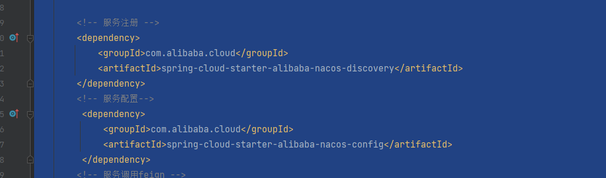
  * 配置文件
    * 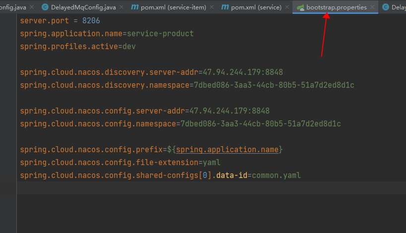
  * 添加启动类注解：@EnableDiscoveryClient


##### gateway

* 作用

  * 网管  跨域   鉴权  全局过滤器   

* 使用

  * 引入依赖

    * 

    * ```
      <dependency>
          <groupId>org.springframework.cloud</groupId>
          <artifactId>spring-cloud-starter-gateway</artifactId>
      </dependency>
      ```

  * 配置文件 开启路由功能

  * 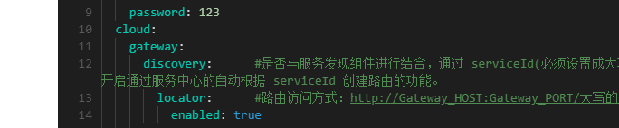

##### openFeign

* 作用

  * 远程调用


* 使用

  * 引入依赖

  * ```
    <dependency>
        <groupId>org.springframework.cloud</groupId>
        <artifactId>spring-cloud-starter-openfeign</artifactId>
    </dependency>
    ```

  

  * 调用方

    ```
    @EnableFeignClients(basePackages = "com.atguigu.gmall")
    ```

  * 使用方

  * ```
    @FeignClient(value = "service-product",fallback = ProductDegradeFeignClient.class)
    ```

  


##### sentinel

* 作用

  * 熔断 降级 限流

* 使用

  * 配合openfeign
  * fallback = ProductDegradeFeignClient.class

  


​	


### 四、后台商品管理模块（练习写代码基本功）

#### 三级分类

* 需求文档
  * 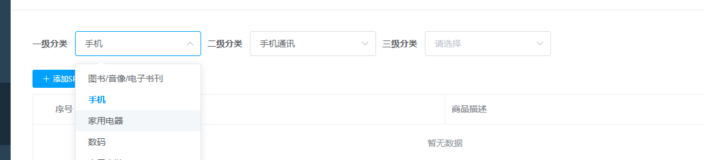


* 表设计结构 

  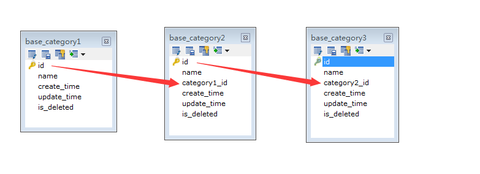

  

* 具体接口实现

  * 我们项目中用了3个接口实现

  * 以后公司中完全可以用一个接口实现


* 面试问了一个问题？

  * 三级分类你们用几张表？  3张。 

  * 用一张表行不行？ 可以

  * 一张表怎么做呢？  

    * pid
    * level  1一级分类  2、二级分类  3、三级分类

    

#### 品牌

* 需求文档
  * 品牌列表
  * 分类和品牌关系


* 表设计结构

* 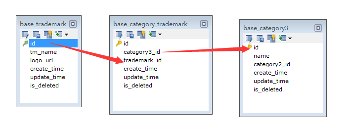

* <mark>为什么要有中间表</mark>

  * 多对多的关系要有中间表


* 具体接口实现

  * 


​	


#### 平台属性和平台属性值

* 需求文档

​		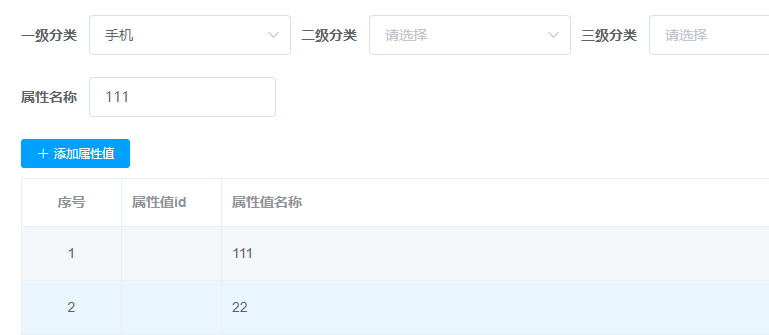

* 表设计结构

  * base_attr_info 

  * base_attr_value


* 具体接口实现


#### spu和sku

* Spu  standard product unit     标准化产品单元
* sku  stock keeping unit      库存量单位


#### spu销售属性和销售属性值

* 销售属性表 spu_sale_attr
* 销售属性值表  spu_sale_attr_value


#### spu基本信息表

spu_info


#### sku基本信息表

sku_info


#### sku关联平台属性表

sku_attr_value


#### sku的销售属性值表

sku_sale_attr_value


#### sku图片

sku_image


#### spu图片 spu海报 

spu_image

spu_poster


#### Spu sku业务实现

* 需求文档

​	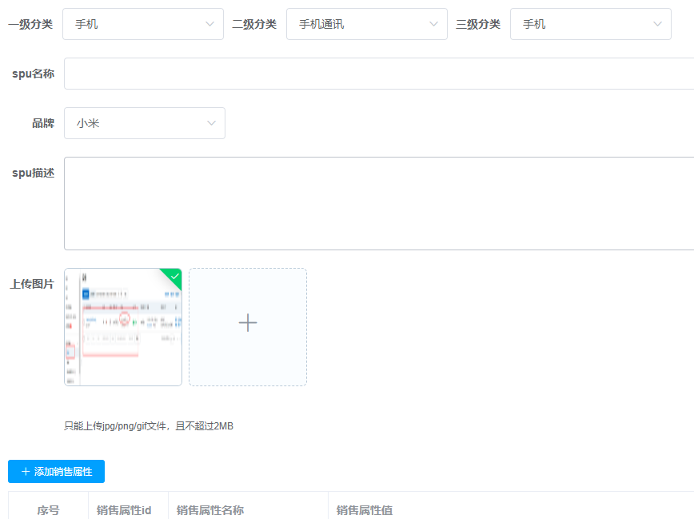

* 表设计结构

  

* 具体接口实现

  * 按照优化代码的思路去实现


#### 商品管理相关表结构
 


#### 商品上架和下架 

* Sku_info表有一个字段？  is_sale 
* 数据怎么同步到es的goods？
  * 发送消息


#### 引进Rabbitmq

##### 作用

* 流量肖锋
* 异步解耦

​	

##### mq有哪些 

* rocket mq   java  万级吞吐量
* kafka    java    十万级吞吐量 ： 搭建spark集群   hadoop集群  去百度自己查查
* rabbitmq  erlang 万级吞吐量
* active mq   java 万级吞吐量

* qps: 每秒处理请求的数量
* tps: 每秒处理事务的请求数量
* 吞吐量（qps/tps）  单位时间内请求的数量


##### rabbitmq组成结构

* 简单画个图？
* 
* 组成部分？
  * 生产者
  * 消费者
  * 交换机
  * 队列
  * routing key
  * binding
  * broker 服务


##### rabbitmq消息模型

* 简单模型 : 一对一 。  一个生产者  ---  队列  --- 一个消费者


* 工作模型： 一对多  一个生产者  ---  队列  --- 多个消费者


* 发布订阅模型：

  * 路由模型 fanout

    * 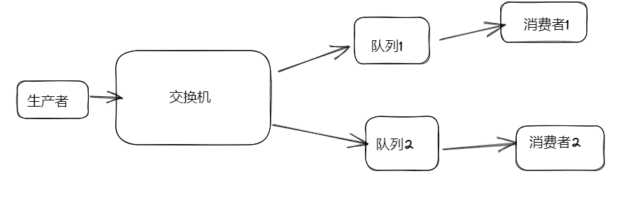

  * 定向投递  direct

    * 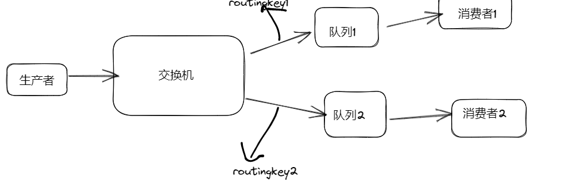

  * 通配投递 topic

    


#### 面试题

###### 防止消息的重复消费

* 幂等性？ 就是用户对于同一操作发起的一次请求或者多次请求的结果是一致的。

* set和setnx区别

  * 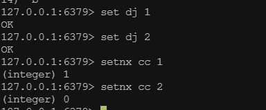

* 怎么保证幂等性？

  * setnx可以 set不可以
  * redisson框架
  * 用mysql设置一个唯一值 （夯筑: 代码有问题导致大量请求落到mysql, 导致MySQL夯筑了）

  


###### 怎么保证消息不丢失（怎么保证消息的准确性）

* 生产者把消息投递到交换机，交换机把消息投递到队列，都可能引发消息丢失

  * 解决：生产者到交换机应答机制，交换机到队列的应答机制

* 服务端：消息是存储在内存中，如果服务挂了，消息就没了。

  * 解决：持久化    交换机和队列配置参数：durable = "true"

* 消费者：消息默认自动签收，只要消费者一监听，消息就出队了。

  * 解决：
    * 配置手动签收方式
    * basicAck

  

* 具体案例实现：

  * 生产者到交换机开启应答机制： publisher-confirm-type: correlated

    * publisher-confirm-type三种类型：

      * None 默认参数（不开启应答机制）
      * Simple  串行化 (同步)
      * correlated 异步

    * 重写了一个confrim方法 （生产者到交换机消息发送成功或者失败都调用重写方法）

      * 回调参数 ack 如果参数值是1 代表消息到达了交换机，如果是0代码没有到达交换机

        

  * 交换机到队列开启应答机制：

    * publisher-returns: true 

    * mandary:true

      * ```
        if (mandatory) {
          messageProperties.getHeaders().put(PublisherCallbackChannel.RETURN_LISTENER_CORRELATION_KEY, this.uuid);
        }
        ```

    * 重写了一个returnMessage方法（交换机到队列，失败回调）

    * 源码publisherCallbackChannelImpl方法handleReturn

    

    

  * 服务端broker

    * 交换机和队列配置  durable = true

    

    

  * 消费者

    * 配置手动签收方式
    * basicAck
    * channel.basicAck(message.getMessageProperties().getDeliveryTag(),false);

    

    

​	

### 五、商品详情模块

http://sph-item.atguigu.cn/7.html

#### 数据展示字段信息

* sku_info  名称 价格 重要  描述 图片  销售属性  销售属性值   平台属性 平台属性值
* spu_info   海报 销售属性  销售属性值 


#### 商品详情页特点

* 访问量大


#### 商品详情页优化方案

##### 根据什么指标了解到需要优化？

​	监控平台 grafana  阿里云平台  kibana

##### 商品详情页优化手段：

###### 异步编排技术 + 线程池

* completableFuture

  * allof

  * join

  * supplyAsync
    thenAcceptAsync

    

* 线程池7大参数

  * 


​	

###### redis缓存技术

* redis三大问题

  * 缓存雪崩：大量key同一时刻失效

    * 解决办法？过期时间随机


​    

  * 缓存穿透：一个key缓存没有命中，查询数据库也没有查到，这样key如果量已达造成数据库压力过大（恶意攻击）

    * 解决办法？

      * 简单方式：对空值进行缓存

      * 最终方案：布隆过滤器(redisson)

        * 创建一个布隆过滤器

          * 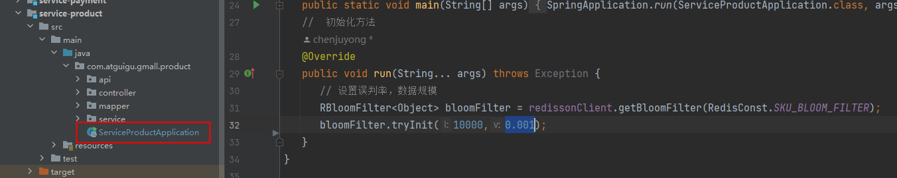

        * 生成有效数据的时候，往不隆过滤器里面添加对应sku_id

          * 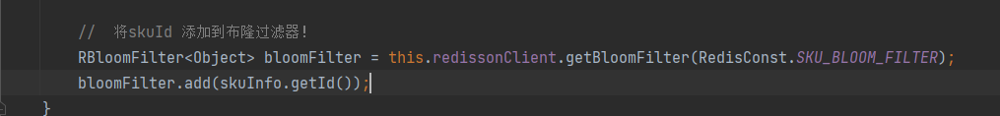

        * 判断传进来的数据是否在布隆过滤器中

          * 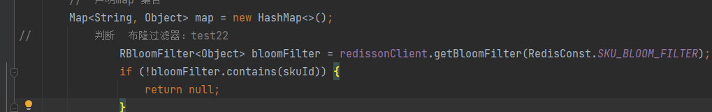

          

  * 缓存击穿:热点key失效问题

    * 第一种：锁 （synchrinozed  lock）==> 本地jvm锁     native方法调用c语言方法 --不可以

    * 第二种：redis实现分布式锁  -- 调研的第二种方案（高并发 多线程情景）

      * 加锁  setnx  k  uuid  ttl

        * 问题一：死锁处理 ： 加一个过期时间

        * 问题二： 删除不是自己的那把锁  -   加唯一标识 uuid

      * 释放锁

        * 首先判断这个把是不是自己持有的，uuid 和redis的值是否一样，一样话才删除，有没有问题？
          * 再还没来得及删除时候，这把锁可能会过期。

          * 删除了别人的锁

          * 解决办法：保证2条命令的原子性 ： lua脚本

          * 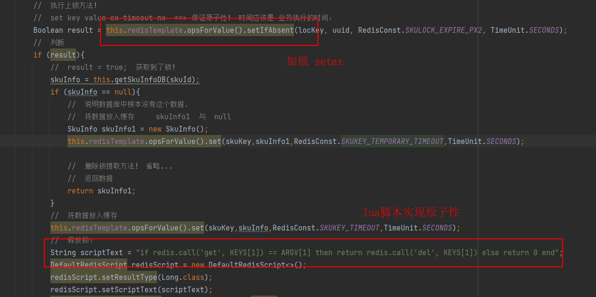

      


      * 第三种：redisson框架实现分布式锁

        * 加锁
        * 释放锁
        * 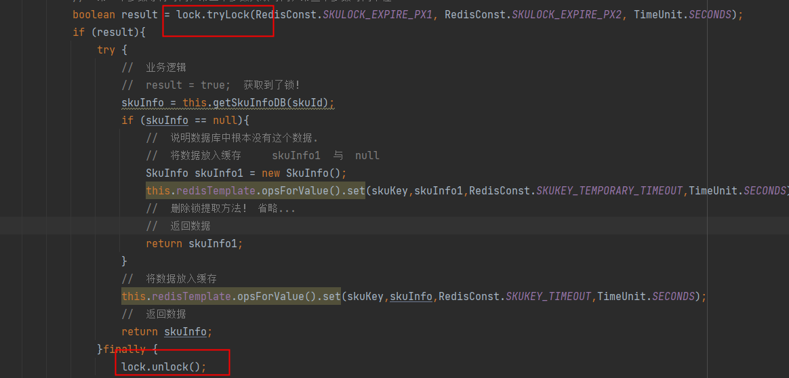

        

      * 第四种：终极方案： aop+redis/redisson

        * 为什么要用这种方式？

          * 解决代码复用

          * 降低偶尔，便于后期维护

        * 怎么实现的？

          * 自定义一个注解@GmallCache  通过@interface实现

          * 定义一个切面类 通过@Aspect

          * 通过@annotation绑定

          * @Around 环绕通知  环绕增强

          * ProceedingJoinPoint 配合around使用

          * joinPoint.proceed 调用此方法 之后执行原来的方法

            


### 六、首页


#### 首页特点

* 访问量大
* 展示商品变化不大，比较固定


#### 页面静态化

* 事先把需要的数据查询出来写死，生成一个静态页面，这样就不需要和后端再次交互了


#### Thymeleaf技术

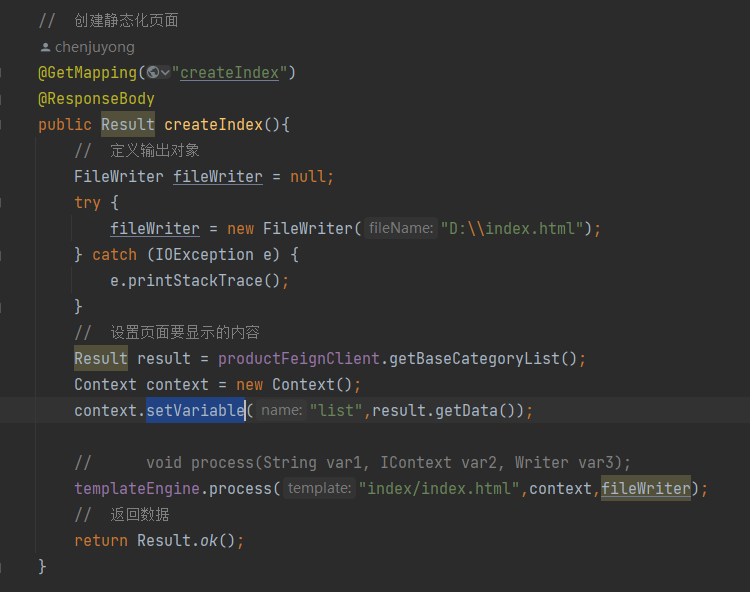


#### 使用静态化的好处

* 访问速度快 （只需要请求一次后端接口，后续就不需要和后端交互）
* 解决高并发 nginx实现静态化，进行静态资源部署
* 有哪些方式可以实现页面静态化
  * Thymeleaf
  * nginx
  * <mark>定时脚本，按照公司的需求去定时生成一个静态页面输出到nginx指定的位置，把老的页面替换掉即可</mark>
  * @Scheduled 实现定时脚本注解
  * java 定时任务：秒分时日月星期
  * linux定时任务： 分时日月星期


### 七、搜索 

#### 什么是ES

* 文档数据库，进行关键字查询
* ELK  
  * elasticsearch 搜索引擎
  * logstash 日志收集
  * kibana 图形化操作es界面

* es-head使用  测试环境使用


#### ES基本概念

* 对比mysql画图

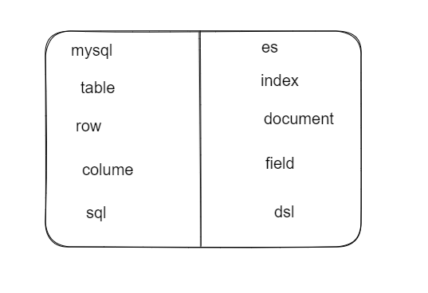


#### 业务实现 

* 引入依赖

  

* 创建mapping （我们自己定义一个结构）

  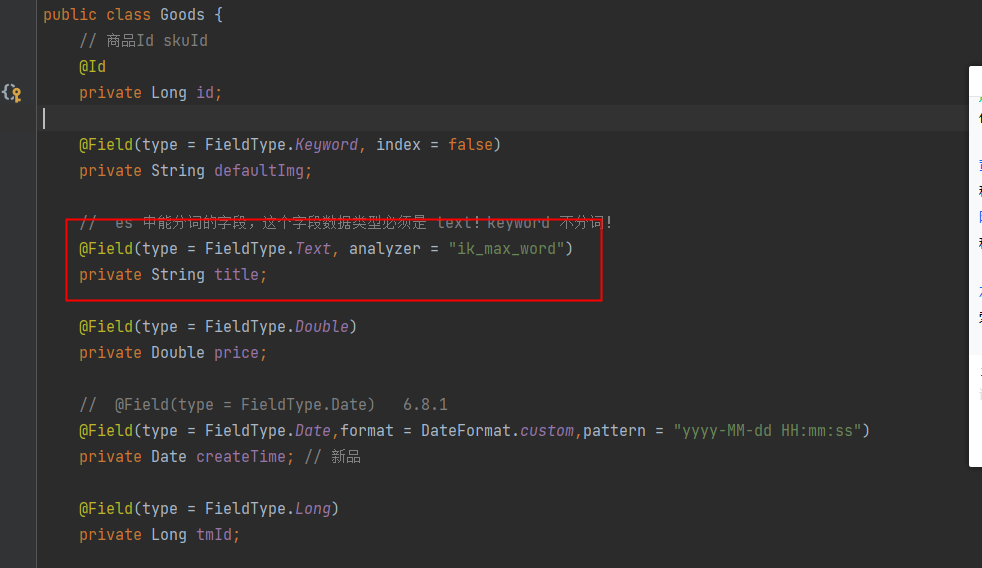

* 创建index

  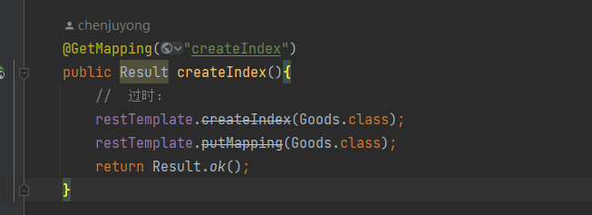

* 创建数据（数据是怎么来滴 ）

  上下架

  

* 展示数据

  


#### 热点数据的更新

* 商品详情页点击一次 热度就加一，频率很高，如果每一次我们就去更新一下es压力很大

* goods中商品的热度字段更新方式？
  * redis数据类型存储热度字段：zset
  * 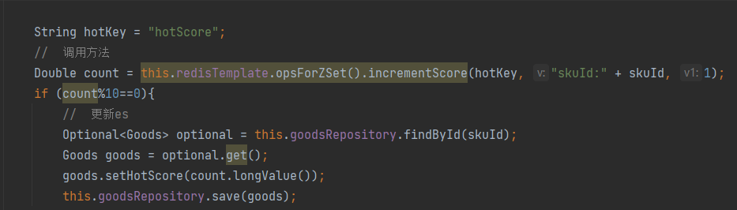


#### 常见的面试题

##### elasticsearch版本 

* 8.1


##### es倒排索引

* 什么是正排索引

  * 以文本作为key,以分词作为values, 通过文本去查分词

* 什么是倒排索引 #倒排索引 

  * 以分词作为key,以文本作为values, 通过分词去查文本

  

  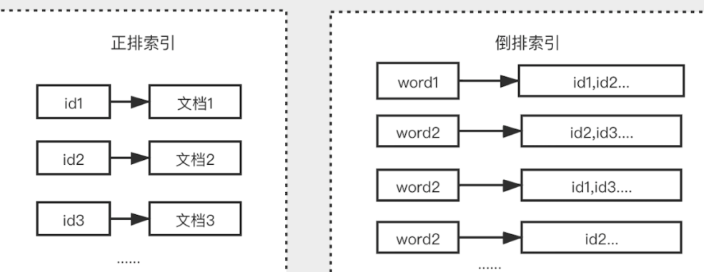

  


##### 怎么保证数据库和es的一致性

* 实时性: mq发送消息 

  * 业务中实现：
    * 我们项目中上下架 功能用到了，使用了mq技术
    * 偶尔业务

  * 非业务中实现：
    * 监听binlog日志 （运维同事 一般使用go python 把binlog日志同步到kafka/rabbitmq）
    * java工程师单独的开发一个微服务模块 binlog-consumer，消费新消息同步到es


* 非实时性：数据报表、统计面板、 季度 年度报告 年终报告

  * 怎么实现？

    * logstash + mysql ==> 同步到es

    * 输入
 ```
        input {
        
            #ai课基础数据
            jdbc {
                type => "jdbc"
                jdbc_connection_string => "${jdbc_connection_string}"
                jdbc_user => "${jdbc_user}"
                jdbc_password => "${jdbc_password}"
                jdbc_driver_library => "${jdbc_driver_library}"
                jdbc_default_timezone => "Asia/Shanghai"
                jdbc_driver_class => "${jdbc_driver_class}"
                connection_retry_attempts => "3"
                jdbc_validate_connection => "true"
                jdbc_validation_timeout => "3600"
                jdbc_paging_enabled => "true"
                jdbc_page_size => "100000"
        
                statement => "
                    select
                        ai.id,
                        ai.uid user_id,
                        uu.username user_name,
                        uu.mobile,
                        uu.master master_id,
                        ua.username master_name,
                        ai.course_no,
                        substring_index(ai.course_no, 'L', 1) a_k_u,
                        substring_index(substring_index(ai.course_no, 'A', -1), 'K', 1) subject_id,
                        substring_index(substring_index(ai.course_no, 'K', -1), 'U', 1) special_id,
                        substring_index(substring_index(ai.course_no, 'U', -1), 'L', 1) unit,
                        substring_index(ai.course_no, 'Lesson', -1) lesson,
                        kaic.title course_name,
                        kais.title subject_name,
                        ai.status course_status,
                        ai.ctime open_time,
                        ai.attend_time,
                        ai.complete_time
                    from
                      u_lesson_ai ai
                    left join
                       k_ai_courseware kaic
                    on
                       ai.course_id = kaic.id
                    left join
                       k_ai_system kais
                    on
                       ai.subject_id = kais.id
                    left join
                       u_userinfo uu
                    on
                       uu.id = ai.uid
                    left join
                       u_admin ua
                    on
                       uu.master = ua.id
                "
        
                lowercase_column_names => false
                sql_log_level => warn
                schedule => "* * * * *"
            }
            }
 ```
  -  输出  
```
        output {
            elasticsearch {
                hosts => ["${elasticsearch_host}"]
                index => "course_ai"
                document_id => "%{id}"
                user=> "${elasticsearch_user}"
                password=> "${elasticsearch_password}"
                action => update
                doc_as_upsert => true
            }
        }
```


### 八、单点登录 
#### 登录业务

##### 登录过程

##### 登录流程图

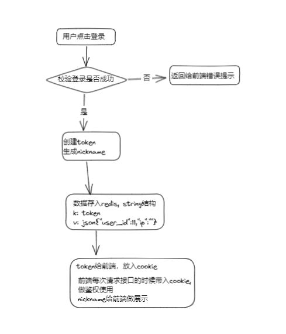


#### 跨域

* 跨域是什么：浏览器不能执行不同网站的脚本（js）,这是同源策略造成的。
* 同源三个条件： 域名(一级域名/二级域名)、协议（http/https）、端口(80/8080)相同
* 怎么解决跨域：Gateway网关里面webFilter过滤器解决跨域问题
* 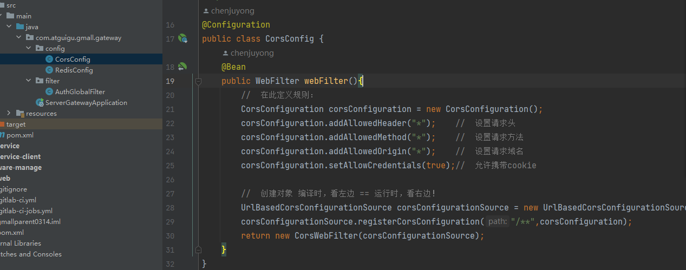


#### 认证业务

GlobalFilter全局过滤器实现：所有的url请求首先找到我们的gateway 进而找到GlobalFilter,做一些校验功能，之后进行路由转发。

##### 认证流程

* 获取url请求
* 判断 inner内部接口
* 获取用户id和临时用户id ， 判断是否登录，鉴权  ip地址判断防止 token伪造
* 判断auth接口
* 判断白名单页面
* 将用户id和临时用户放入到header里面
  * 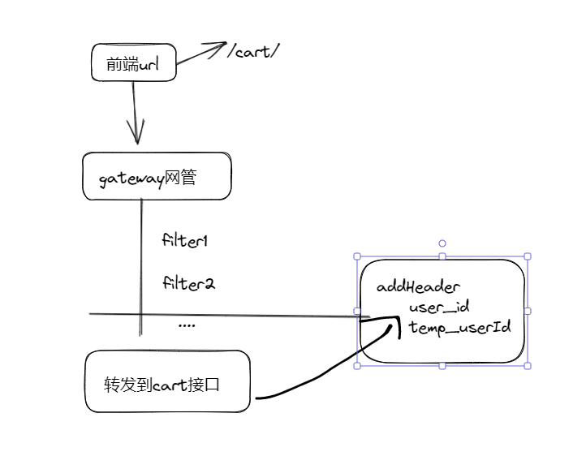

​	

### 九、购物车 

#### 购物车存储

* redis存储数据结构？
  * hash  
    *  k    user_id  11
    *  filed  sku_id 7
    *  v  商品信息 

* 临时用户id什么时候生成的？
  * 未登录时添加购物车
  * 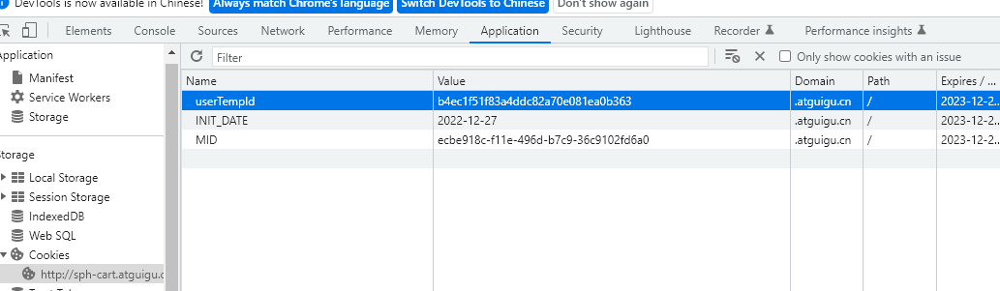
  * 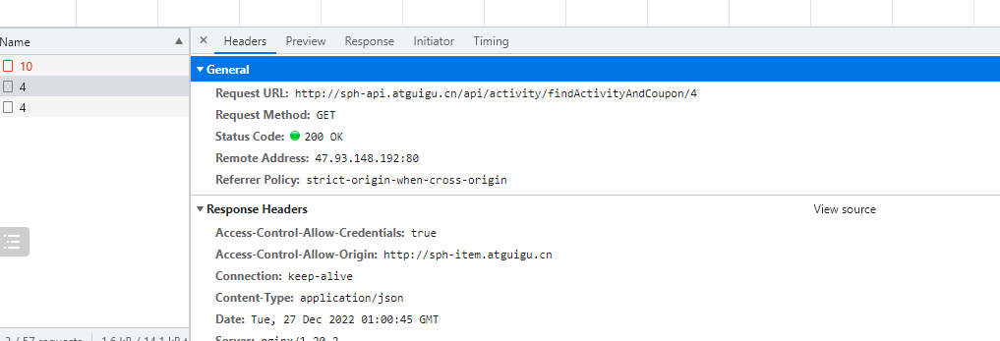

* 我们怎么接收的这个临时用户id
  * gateway网关
  * 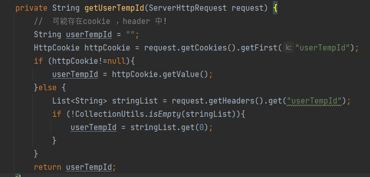


#### 添加购物车

##### 购物车流程


##### 购物车流程图

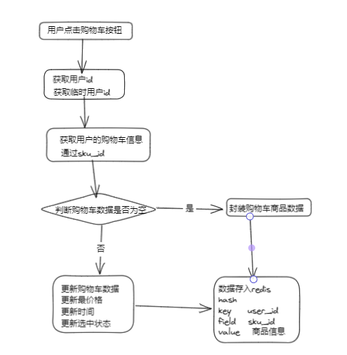


#### 合并购物车、购物车展示

* 合并购物车流程
* 合并购物车流程图
* 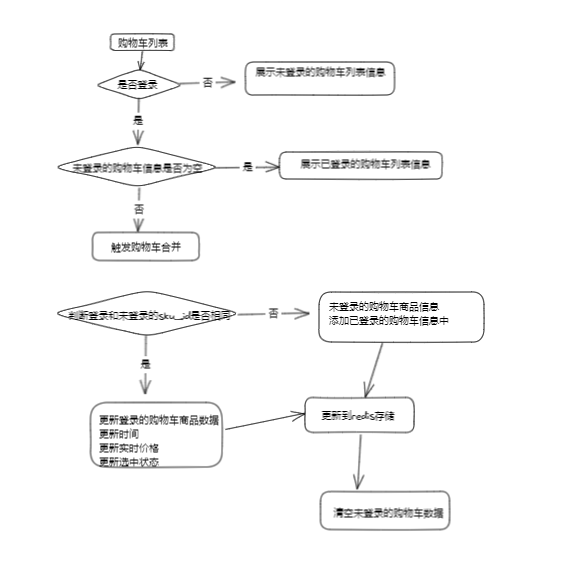


### 十、订单

#### 结算页数据展示

##### 结算页接口数据展示

* 收货地址信息
* 总金额
* 总数量
* 流水号（隐藏表单）
* 商品信息（redis购物车数据）


##### 流水号作用

* 防止无刷新回退订单的提交


#### 保存下单

* 校验一个流水号

* 校验库存

* 校验价格

* 保存订单信息 order_info

  * order_id

  * user_id

  * total_amount 总价格

  * order_status订单状态

  * out_trade_no

    

* 保存订单详情表  oder_detail

  * sku_id
  * sku_price
  * sku_num
  * order_id


#### 关单

##### 关单的业务逻辑

* 先判断订单状态是不是未支付的，是才去关闭订单处理，不是不处理。
* 判断有没有支付信息记录，查询支付信息表（payment_info）, 没有这个表说明没有调用支付接口，直接关闭订单
* 有payment_info， 调用支付宝接口，查询支付宝那边接口交易记录，没有关闭订单
* 支付宝那边接口有数据，调用支付宝关闭交易接口，关闭我们业务的订单记录和支付信息表记录


##### <mark>采用延迟消息进行关单</mark>

###### 实现方式:

* 死信队列

  * 消费方拒绝签收消息，并且设置了不能重回队列

  * 队列消息中设置了存活时间（ttl）,到了时间还没有消费 （常用方式）

  * 消息队列满了，队列头的消息自动出队

    

* 延迟插件

  * rabbitmq安装了一个插件，插件内部就是一个小型数据库。发送消息通过交换机，先把这个消息放到我们的数据库中，到了时间再把消息放到队列中进行转发。

    

* 死信队列和延迟插件实现延迟消息区别？

  * 时序问题：死信队列要求队列里面的过期时间一致。
    * 同一个队列：第一个消息进来它的ttl 设置了一天过期时间（86400）， 第二个消息秒杀信息，设置1个小时ttl(3600), 第二个消息即使过期了也要一直等待第一个消息消费完之后才能消费。

* 死信队列流程图

  * 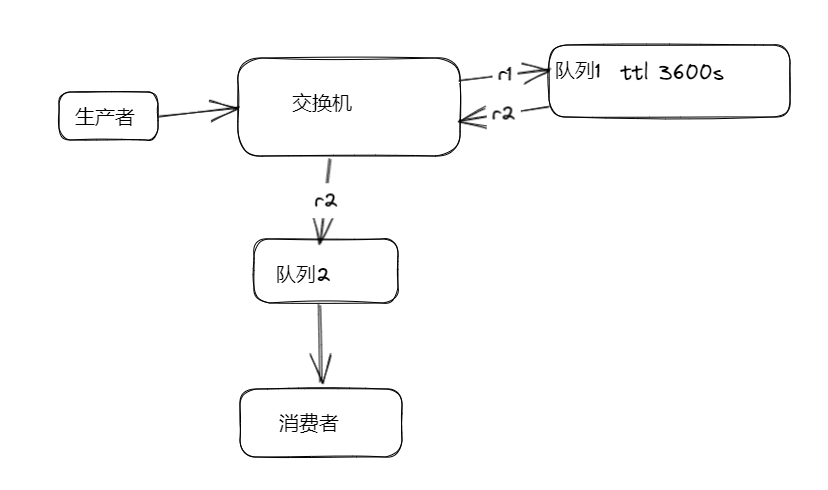


​	

* 延迟插件流程图
* 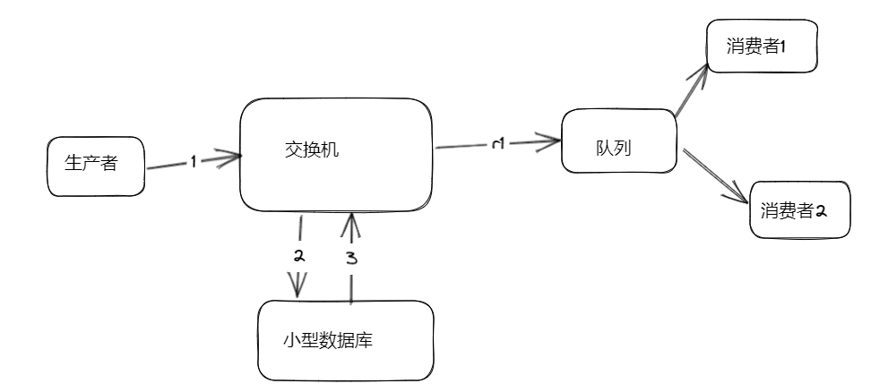

​	


### 十二、支付

#### 支付方式

* 微信

* 支付宝

* 银联

* 快钱支付  -  万达 - 京东并购

  


#### 支付宝使用

* 看官网(电商用的pc支付)： https://opendocs.alipay.com/open/028wob


#### 支付接口

* 封装公共参数 

  * appid   支付成功url地址   同步回调地址  异步回调地址

* 判断订单状态

* 封装必填参数

  * ```
    JSONObject jsonObject = new JSONObject();
    //  商户订单号
    jsonObject.put("out_trade_no",orderInfo.getOutTradeNo());
    jsonObject.put("total_amount",0.01);
    jsonObject.put("subject",orderInfo.getTradeBody());
    jsonObject.put("product_code", "QUICK_WAP_WAY"); // 手机网站
    ```

* 调用支付宝支付接口

#### 同步回调

* 支付宝有一个3s或者5s之后跳转到我们电商一个url地址
  * http://api.gmall.com/api/payment/alipay/callback/return
* 支付回调地址作用：重定向到我们自己的支付成功页面


#### <mark>异步回调</mark>

* SDK验证签名

* 判断支付信息表是否存在

* 判断金额是否相等

* 幂等性校验

* 更新支付表信息

  * trade_no  交易编号  支付宝那边传过来的

  * 更新支付状态 -- 变成已支付

  * 更新支付时间

  * 返回sucess标志 最终一个支付成功

    

#### 异步回调


#### 退款接口

* 根据订单id查询订单信息 
* 订单如果关闭不处理
* 根据第三方交易编号和订单总金额 去调用支付宝退款接口


#### 支付宝关闭校验和交易查询接口	

* 定时关单业务校验使用：
  * 查看支付宝交易记录
  * 查看payment_info记录


#### 面试问支付我们要知道哪些

* 支付宝支付接口传了哪些参数（必传的）
  * 总金额
  * 标题
  * 第三方交易标号

* 公共参数有哪些： 
  * 最重要的app_id  
  * 同步回调地址   
  * 异步回调地址 
  * 支付成功地址

* 同步和异步回调接口 
* 退款接口


### 十三、秒杀


#### 作用

* 电商秒杀- 促销
* 提升购买率， 饥饿营销


#### 三大限制

* 库存限制
* 购买时间限制
* 购买数量限制


#### 秒杀流程

##### 准备工作、数据预热

* 后台添加商品、审核商品到秒杀商品数据表（skill_goods status 0、未审核 1、审核成功）
* 定时任务，发送一个mq,通知秒杀活动，进行预热
* 秒杀服务按照一定的条件把skill_goods 预热，预热了哪些数据并且存入到了哪里？
  * 存入redis 
  * redis数据结构 ？
    * 商品：hash   key:常量  field:sku_id  value:商品信息
    * 商品库存 商品是7库存量是5   list  key： 7  value [7,7,7,7,7]

* 发布频道，消息为7:1  ->  最终存入静态变量 cacheMap （堆中）
* 7:1作用？ 
  * 7:商品id
  * 1:状态位    （标志有没有库存）。 1：有库存  0：没有库存
  * 7：[7,7,7,7,7] 来改变状位标志，如果值为[] 状态位为0

* 为什么要用发布订阅
  * 分布式模块之间的静态变量通知

* 7:1直接扔到redis也可以？
  * 可以
  * 为什么没有扔到redis，而是使用发布订阅+静态变量的方式
    * 从redis拿7:1和从堆中拿7:1哪个快？为什么？
      * 堆中快
      * 堆中拿数据不经过网络传输，redis需要网络传出


* 发布订阅流程图

  


##### 展示秒杀商品列表

* 直接从redis拿数据即可


##### 展示秒杀商品详情

* 根据sku_id 从redis拿数据即可


##### 秒杀按钮控制

* 前端：时间没有到，按钮不显示
* 后端： 通过抢购码，生成规则：使用userId通过MD5加密.


##### 生成抢购码

```
//  抢购码：
@GetMapping("auth/getSeckillSkuIdStr/{skuId}")
public Result getSeckillSkuIdStr(@PathVariable Long skuId, HttpServletRequest request){
    //  MD5(userId)
    String userId = AuthContextHolder.getUserId(request);
    //  在秒杀开始以后，结束之前
    SeckillGoods seckillGoods = this.seckillGoodsService.getSeckillGoods(skuId);
    if (seckillGoods!=null){
        //  判断
        Date currentTime = new Date();
        if (DateUtil.dateCompare(seckillGoods.getStartTime(),currentTime) && DateUtil.dateCompare(currentTime,seckillGoods.getEndTime())){
            //  生成抢购码
            String skuIdStr = MD5.encrypt(userId);
            //  返回抢购码
            return Result.ok(skuIdStr);
        }
    }
    return Result.fail().message("生成抢购码失败.");
}
```


##### 预下单

* 校验抢购码

* 商品状态位  --  间接去判断库存

* 发送消息 进行真正下单

  

##### 真正下单

* 校验秒杀状态位
* 幂等性(redis -> setnx)  判断用户是否购买过
* 减库存 ===>  list -> rightPop
* 将用户的商品信息保存到redis --  判断用户是否秒杀成功过这个商品
* 发送mq 扣减我们秒杀商品的库存 -- 解耦


##### 用户付款（支付模块去操作，脱离了我们秒杀的业务）

* 如果支付成功，秒杀流程game over

* 没有支付，时间到了取消订单（一般时间较短，自动关单），库存数量回滚

* 典型例子：抢火车票

  


##### 当天活动结束，清除redis购买数据

* 秒杀活动维持7天，一个人只能买一个，这种情况就不需要删除了
* 秒杀活动维持7天，一个人每天都可以买一个，需要删除redis购物记录


#### 上面说的三大限制，我们电商是怎么处理的

* 库存限制
  * redis的list数据结构  7：[7,7,7,7,7,7]  配合 发布订阅功能+静态变量存储状态位
* 购买时间限制
  * 前端：控制购买按钮显示和隐藏
  * 后端：抢购码 mD5加密形式
* 购买数量限制
  * redis缓存用户购买秒杀商品记录，当天每个用户只能购买一次


#### 秒杀流程图

​	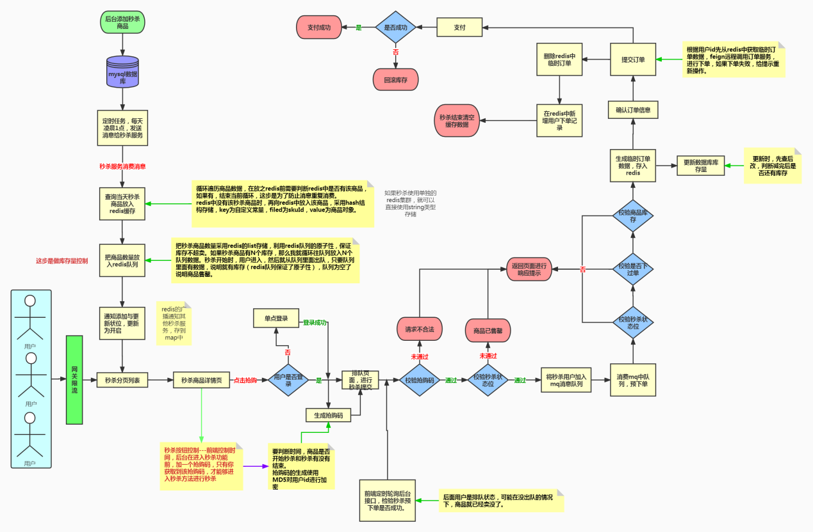


​	


